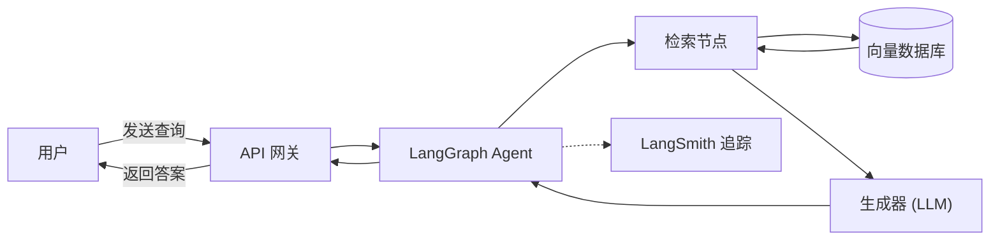

# 方向C · 动力装备知识库与智能体 — 信息同步

> 信息快照时间：2026-04-09

---

## 一、项目全貌

**目标**：基于 **LangGraph**（流程编排）+ **LangSmith**（前端可视化/调试）+ 开源问答 API，构建一套 **Agentic RAG** 系统。
核心能力是：用户输入自然语言查询 → 向量检索 Top-K → LLM 生成回答（附来源引用）。



---

## 二、当前进度

| 阶段 | 状态 | 说明 |
|------|------|------|
| 数据采集与清洗 | ✅ **已完成** | 郭老师团队已做好文本识别工具，产出为 **JSON 文件** |
| 文档分块与向量化 | 🔜 **第一步（当前）** | 多个 JSON 汇聚 → 向量化 → 存入向量数据库 |
| 向量数据库部署 | 🔜 **第一步（当前）** | 暂定 **Chroma**（轻量嵌入式，开发阶段最简） |
| 检索/重排/RAG 后端 | ⏳ 第二步 | 相似度检索、Top-K 召回、重排序、Agentic RAG 流水线 |
| 物理约束知识图谱 | ⏳ 研究阶段 | 后续研究性任务 |

---

## 三、第一步：JSON → 向量化 → Chroma 入库

这是**周四对齐**需要完成的核心工作。拆解为以下子任务：

### 3.1 JSON 汇聚
- 理解识别产出 JSON 的格式（字段结构、嵌套层级）
- 编写脚本：遍历多个 JSON 文件 → 统一解析 → 合并为标准化文档列表
- 需要确定 **分块策略**（按段落？按固定 token 长度？按语义边界？）

### 3.2 向量化（Embedding）
- **开发阶段**：使用 `BAAI/bge-m3` 的网络 API 调用
- **本地部署阶段**：本地运行 `BAAI/bge-m3`
- 每个文档块转为高维向量

### 3.3 Chroma 入库
- 安装 Chroma：`pip install chromadb`
- 创建 Collection，将 (文本块, 向量, 元数据) 写入
- 元数据应包含：来源文件名、页码/位置、原始文本等

### 3.4 验证
- 简单的相似度查询测试：输入一个查询，看 Top-K 返回是否合理

---

## 四、技术方案关键决策（来自文档）

### 向量数据库选型

| 名称 | 类型 | 适用场景 | 部署难度 |
|------|------|----------|----------|
| **Chroma** ← 暂定 | 嵌入式 Python 库 | 小规模开发、快速原型 | ⭐ 极简 |
| Qdrant | 开源/托管 | 生产级、支持过滤 | ⭐⭐ 简便 |
| Milvus | 开源/托管 | 亿级高性能 | ⭐⭐⭐ 复杂 |

> [!TIP]
> 文档推荐优先级为 Qdrant > Chroma > pgvector > LanceDB > Milvus。当前选 Chroma 作为开发阶段方案合理——**零运维、纯 Python、即装即用**。后续可平滑迁移到 Qdrant。

### Embedding 模型

- **BAAI/bge-m3**：支持多语言、多粒度检索（dense + sparse + colbert），是目前中文场景的主流选择

### LLM 问答 API

| 接口 | 模型 | 特点 |
|------|------|------|
| 智谱 AI | ChatGLM-4/5 | 中英文、多轮对话、函数调用 |
| 千问 Qwen | qwen-plus | 阿里云全生态、OpenAI 兼容格式 |

---

## 五、第二步及后续路线（供参考）

```
第一阶段（当前）
  ├── JSON 汇聚 + 向量化 + Chroma 入库
  └── 基础相似度检索验证

第二阶段
  ├── 相似度检索 + Top-K 召回 + 重排序（L2 Distance）
  ├── LangGraph 工作流编排（decide → retrieve → grade → answer/rewrite）
  ├── 集成智谱/千问 API 做问答生成
  └── LangSmith 前端集成与可视化调试

第三阶段（研究）
  ├── 物理约束知识图谱
  ├── 多轮对话 & Agent 决策
  ├── 性能优化 & 缓存降级
  └── CI/CD & 容器化部署
```

---

## 六、给 Java龙 和 Ricebal🍋 的 Action Items

> [!IMPORTANT]
> **周四前**请完成以下准备，以便快速对齐并推进第一步：

1. **通读本文档**，了解整体技术架构和第一步的定位
2. **获取样本 JSON 文件**，理解文本识别后的输出格式（字段、结构）
3. **搭建本地 Python 环境**，安装：
   ```bash
   pip install chromadb langchain sentence-transformers
   ```
4. 思考以下问题，周四讨论：
   - JSON 中的文本需要怎样的清洗/预处理？
   - 分块策略：固定长度 vs 语义分块？
   - 元数据字段设计（便于后续过滤和溯源）
