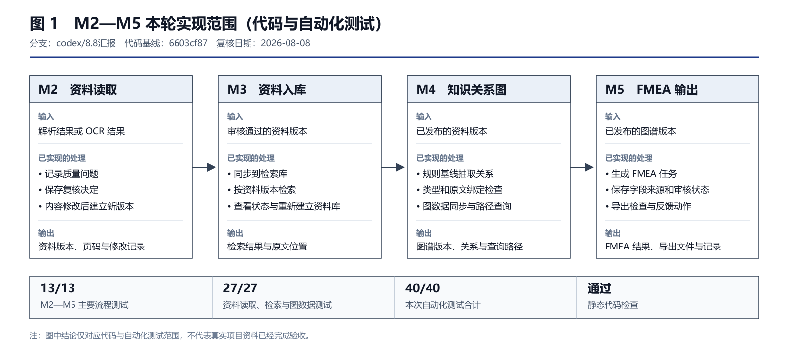
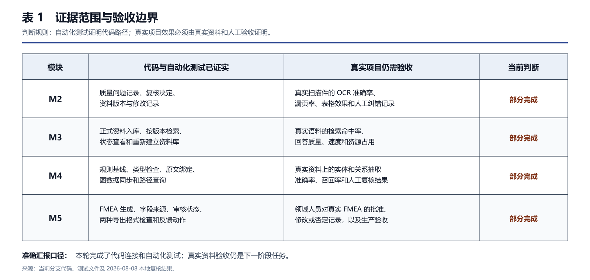

# GraphRAG M2—M5 两周开发进度汇报

> 日期：2026-08-08　｜　分支：`codex/8.8汇报`　｜　代码：`6603cf87`

## 一、之前要求做什么

依据 [原始任务清单 v1.0](<../../GraphRAG模块任务清单与初步分工_v1.0(1).md>)，纪文龙参与 M2—M5：

| 模块 | 原要求 |
|---|---|
| **M2 解析与标注** | 解析文件和 OCR，恢复结构，发现质量问题，支持人工复核并保留记录 |
| **M3 资料库构建** | 将审核资料正式入库，支持检索、引用、更新、重建和版本回滚 |
| **M4 GraphRAG** | 抽取实体关系并绑定原文，建立图谱、路径查询及普通 RAG 回退 |
| **M5 任务输出** | 生成带原文依据的 FMEA，支持审核、修改、导出和问题回流 |

目标主线：

```text
资料 → 解析/OCR → 质检复核 → 正式资料库 → GraphRAG → FMEA → 问题回流
```

## 二、已经做了什么

已完成部分核心代码连接和自动化测试，原清单尚未全部完成。



_图 1　代码和自动化测试已经覆盖的范围。_

| 模块 | 已证实的代码能力 | 状态 |
|---|---|---|
| **M2** | 接收解析/OCR 结果，记录问题和复核决定，内容修改后建立新版本 | 部分完成 |
| **M3** | 正式资料入库、按版本检索、查看状态和重建检索库 | 部分完成 |
| **M4** | 规则抽取、关系检查、原文绑定、图数据同步和路径查询 | 部分完成 |
| **M5** | FMEA 生成、字段来源、审核状态、导出检查和部分反馈动作 | 部分完成 |

验证结果：

- M2—M5 主要流程：**13/13 通过**
- 资料读取、检索和图数据：**27/27 通过**
- 合计：**40/40 通过**；静态代码检查通过

以上测试包含程序生成文件和合成样例，只能证明代码路径可以运行，不能代替真实资料验收。

## 三、正在做什么

当前正在整理 **原任务清单—代码—测试—验收证据** 的对应关系，并完善汇报材料。

真实资料验收尚待启动，主要包括：

1. 选定真实 PDF、扫描件、Word 和图片，逐页抽检 OCR。
2. 用真实问题评测检索效果。
3. 用人工标注样本评测图谱抽取准确率和召回率。
4. 请领域人员审核真实 FMEA 结果。
5. 补充性能、权限、备份恢复和用户验收。



_表 1　代码测试与真实资料验收的边界。_

## 四、汇报口径

> 原任务要求我们参与 M2 到 M5，从资料解析、正式入库和 GraphRAG 构建做到 FMEA 输出与问题回流。这两周完成了部分核心代码连接，重新执行的 40 项自动化测试全部通过。目前正在核对任务和验收证据；真实资料的 OCR、检索、图谱抽取和 FMEA 领域验收尚待开展。

验证入口：[自动化验证脚本](../scripts/run_governed_delivery_demo.py) ｜ [完整流程说明](GOVERNED_DELIVERY_WORKFLOW.md)
