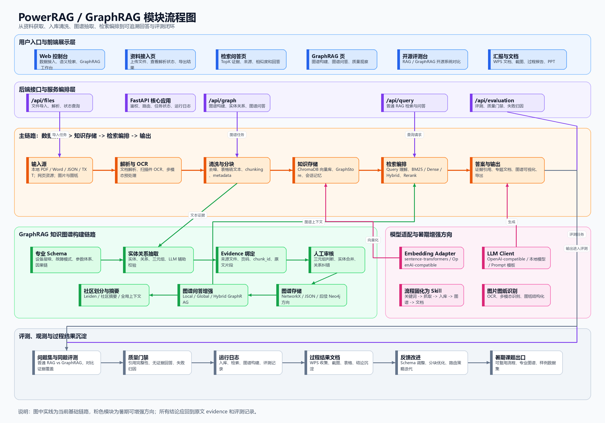

# PowerRAG / GraphRAG 过程结果收集补充稿

日期：2026-07-06  
用途：补充到“GraphRAG过程结果收集”文档，作为文龙课程汇报版本之后的阶段成果、流程固化方向和暑期实践课题整理。

## 一、阶段定位

上次课程汇报版本已经形成了一个较好的基础基座：从资料接入、OCR / 文档解析、文本清洗、分块入库、语义检索，到实体关系抽取、evidence 绑定、图谱构建和 GraphRAG 问答探索，已经打通了知识库系统的主链路。

当前阶段的价值不是单点页面或单个算法，而是形成了一个可以继续迭代的工程闭环：

```text
资料来源 -> 文件接入 -> OCR / 解析 -> 清洗分块 -> 向量入库
        -> 语义检索 -> 实体/关系抽取 -> evidence 绑定
        -> 图谱构建 -> GraphRAG 问答 / 质量观察 / 结果汇报
```

### 模块流程图



这张图把当前系统拆成六层：用户入口与前端展示层、后端接口与服务编排层、数据治理到检索输出的主链路、GraphRAG 知识图谱构建链路、模型适配与暑期增强方向、评测观测与过程结果沉淀。后续补材料时，可以按这六层分别补截图、日志、样例数据和阶段结论。

后续暑期工作可以在这个基座上继续做三类增强：一是流程固化，二是专业图谱增强，三是图片和图纸等多模态资料的专业识别。

## 二、已有过程结果

### 1. 知识库入库与处理链路

已有系统支持本地资料接入、文件或文件夹导入、解析状态展示、分块入库、集合管理和导出备份。这个部分构成普通 RAG 的基础能力，后续可以继续固化为稳定的资料处理 pipeline。

过程结果可收集内容包括：

- 资料接入页面截图。
- 文件解析、OCR、分块、入库的运行日志。
- ChromaDB 集合状态、文档数量、chunk 数量、存储大小等统计。
- 成功、失败、待处理文件的状态记录。
- 导出的知识库 ZIP 或运行报告。

### 2. 普通 RAG 检索链路

普通 RAG 链路已经具备向量召回、TopK 证据片段返回、来源文件和片段信息展示等能力。它为后续 GraphRAG 提供了可对比的 baseline。

过程结果可收集内容包括：

- 典型问题的检索结果截图。
- 返回片段、页码、来源文件、相似度等证据字段。
- keyword / dense / hybrid 等不同检索方式的对比结果。
- 检索失败案例和失败原因归因。
- 质量观察记录，例如证据覆盖不足、chunk 粒度不合适、术语别名未命中等。

### 3. GraphRAG / 知识图谱 POC

当前已探索实体关系抽取、三元组结构、evidence 绑定、人工审核和图谱问答入口。这个部分是后续从“能检索片段”升级为“能组织专业知识结构”的关键基础。

过程结果可收集内容包括：

- 实体类型、关系类型、三元组样例。
- 每条三元组对应的原文 evidence。
- 三元组人工审核页面或审核记录。
- 图谱构建链路截图。
- GraphRAG 问答时使用的实体、关系、社区摘要或证据链。
- 图谱质量观察，例如关系类型过泛、实体合并不稳定、专业层级不足等。

### 4. 开源系统对比与评测页面

已保留一个静态评测页面，用于对比 RAGFlow、Dify、LlamaIndex、Microsoft GraphRAG 等开源 RAG / GraphRAG 项目的能力画像，也可以作为说明本项目技术路线和差距的展示入口。

过程结果可收集内容包括：

- 开源项目能力维度对比截图。
- 本项目 PowerRAG 与头部开源系统的差距说明。
- 检索、图谱、工程化、本地化、安全性等维度的评分依据。
- 后续需要用真实数据集复测的说明。

### 5. 汇报材料与演示资产

课程汇报版本已经形成了可复用的演示资产，包括本地控制台、静态评测页、汇报 PPT / HTML 页面、图谱 POC 页面和若干过程报告。这些材料可作为暑期实践课题的起点，不需要从零开始。

建议补充到过程文档中的材料类型：

- 系统首页或控制台截图。
- 入库流程截图。
- 检索结果截图。
- 图谱抽取或三元组审核截图。
- 评测页截图。
- 课程汇报中展示技术路线的页面截图。

## 三、技术栈与开源项目关系

当前系统不是直接照搬某个单一开源项目，而是把多个成熟组件和开源思路组合到一个本地化知识库流程中。

主要关系可以概括为：

| 模块 | 使用或借鉴内容 | 在本项目中的作用 |
|---|---|---|
| 向量库 | ChromaDB | 本地向量存储、集合管理、语义检索底座 |
| Embedding 适配 | sentence-transformers / transformers | 支持本地 embedding 模型或兼容模型接入 |
| 关键词检索 | rank-bm25 | 提供 keyword baseline，与 dense retrieval 互补 |
| Web API | FastAPI | 提供本地控制台后端接口、入库、检索、评测和导出能力 |
| 图谱处理 | NetworkX / 图谱算法思路 | 支持实体关系组织、局部关系扩展、图谱质量观察 |
| GraphRAG 思路 | Microsoft GraphRAG 等公开路线 | 借鉴“实体关系、社区摘要、全局/局部检索”的流程思想 |
| 前端展示 | HTML / Vanilla JS | 构建本地知识库控制台和静态汇报展示页 |
| 测试与质量 | Pytest / 评测脚本 | 支持回归测试、检索效果分析和质量门禁 |

需要说明的是：ChromaDB、BM25、FastAPI、GraphRAG 等是公开技术栈或开源思路。本项目的原创性主要体现在面向具体工程资料场景，把资料处理、检索、图谱抽取、evidence 绑定、人工审核、前端控制台和评测说明串成了可运行流程。

## 四、当前不足

当前版本已经能作为基础基座，但还不能直接宣称是完整生产级 GraphRAG 系统。主要不足包括：

- 流程还需要进一步固化，减少手工操作和临时脚本。
- 图谱抽取仍偏通用，专业层级结构和故障模式 schema 注入不足。
- 网页抓取、公开资料爬取和格式清洗链路还不稳定。
- OCR 和图纸识别目前更多依赖通用能力，面向工程图、设备图、故障图片的专业结构化能力还需要增强。
- GraphRAG 对答案质量的提升还需要更多同题对比评测支撑。
- 需要更明确地区分“已跑通能力”“演示能力”“待验证能力”，避免把探索结果包装成最终结论。

## 五、暑期实践方向

### 方向一：把流程固化为系统化 skill

目标是把当前“人工调用工具和脚本”的方式，固化为一个可复用流程。预期效果是：用户提供关键词、一段话或一个主题，系统自动完成网络资源抓取、资料入库、清洗、分块、图谱抽取和结果文档输出。

建议流程：

```text
输入关键词 / 主题描述
-> 网络资源抓取 / 本地资料选择
-> 网页、PDF、Word、图片等格式解析
-> 文本清洗、去重、分块
-> 向量入库与关键词索引
-> 实体关系抽取
-> 专业 schema 校正
-> evidence 绑定和人工审核
-> GraphRAG 问答或专题文档输出
```

可交付成果：

- 一份标准流程说明文档。
- 一组可复用命令或 agent skill。
- 一个最小可运行 demo。
- 一个主题样例，例如“燃气轮机故障模式资料抓取与图谱构建”。

### 方向二：继续融入图谱专业性

目标是在图谱抽取前后注入专业人员形成的层级结构，使图谱不只是“抽到实体和关系”，而是能更好地服务专业问答和故障分析。

建议加入的专业结构：

- 设备层级：系统、设备、部件、子部件。
- 故障模式：故障现象、原因、影响、检测方法、处理措施。
- 参数体系：温度、压力、振动、转速、效率、寿命等。
- 因果链：现象 -> 可能原因 -> 影响范围 -> 处置建议。
- 证据链：每个结构化结论都绑定来源文件、页码、chunk_id 或原文片段。

可交付成果：

- 一版专业 schema。
- 一组标注样例。
- 抽取前 prompt / schema 约束模板。
- 抽取后实体合并、关系校正和 evidence 审核流程。
- RAG vs GraphRAG 同题对比结果。

### 方向三：增强图片和图纸的专业识别能力

多数现有流程基于文本，但工程资料中大量信息来自图片、扫描件、流程图、设备图和图纸。后续可以将 OCR 与多模态模型结合，增强图像资料结构化能力。

可探索任务：

- 扫描 PDF 的 OCR 质量评估和修正。
- 设备图、流程图中的文字、符号和连接关系识别。
- 图纸中的部件名称、编号、方向、管线、连接关系抽取。
- 图片识别结果与文本知识库、图谱实体对齐。
- 多模态证据在 GraphRAG 问答中的引用方式。

可交付成果：

- 一批图片 / 图纸样例数据。
- OCR 与多模态识别结果对比。
- 图像结构化字段设计。
- 图片 evidence 与图谱实体绑定样例。

## 六、可拆分任务与分工建议

| 任务方向 | 主要工作 | 预期交付 |
|---|---|---|
| 文档爬取与清洗 | 抓取网页、PDF、公开资料，处理反爬、乱码、正文抽取和格式统一 | 可复用爬取脚本、清洗样例、失败案例记录 |
| RAG 入库流程 | 文档解析、OCR、分块、向量入库、集合管理和检索验证 | 标准入库流程、样例知识库、入库日志 |
| 图谱抽取 | 定义实体和关系，抽取三元组，绑定 evidence | 三元组结果、evidence 表、审核页面截图 |
| 专业 schema 设计 | 故障模式、设备层级、因果链、参数体系建模 | 专业 schema 文档、抽取模板、标注样例 |
| GraphRAG 问答 | 将图谱结构接入问答，区分 local / global / hybrid 检索 | 同题问答结果、证据链、失败归因 |
| 评测与对比 | 构造问题集，比较普通 RAG 和 GraphRAG 效果 | 评测报告、baseline 对比、改进建议 |
| 图片图纸识别 | OCR、多模态识别、图纸信息结构化 | 图像识别样例、结构化字段、图谱对齐结果 |
| 前端展示 | 展示流程状态、检索证据、图谱结果和过程报告 | 控制台页面、过程截图、汇报材料 |

## 七、近期建议动作

建议先用一个小范围主题跑通闭环，不要一开始追求全量系统。

近期可以按以下顺序推进：

1. 选定一个主题，例如“燃气轮机故障模式”或“锅炉辅机异常诊断”。
2. 收集 5-10 份代表性资料，包含网页、PDF、扫描件和图片。
3. 跑通资料解析、清洗、分块和向量入库。
4. 设计第一版专业 schema，覆盖设备、部件、故障、原因、措施和证据。
5. 抽取三元组并绑定 evidence，人工审核一批样例。
6. 做 10-20 个同题问题，对比普通 RAG 和 GraphRAG 的回答差异。
7. 输出一份“流程固化报告 + 图谱样例 + 问答评测结果”。

## 八、可直接放入 WPS 文档的总结段

本阶段 PowerRAG / GraphRAG 工作已经完成从资料接入、OCR / 文档解析、文本清洗、分块入库、语义检索，到实体关系抽取、evidence 绑定、图谱构建和 GraphRAG 问答探索的基础闭环。该版本可以作为暑期继续推进的基础基座。后续建议重点做三件事：第一，把现有流程固化为系统化 skill，使用户输入关键词或一段描述后，可以自动抓取资料、入库、清洗、抽取图谱并输出专题文档；第二，在图谱抽取前后引入专业人员形成的设备层级、故障模式、因果链和参数体系，提升图谱结构质量和 RAG 增强效果；第三，针对图片、扫描件和工程图纸增强 OCR 与多模态识别能力，将图像证据也纳入知识库和图谱结构中。最终目标是形成一个从资料获取、知识抽取、图谱组织、问答检索到结果评测的可复用实践课题。
