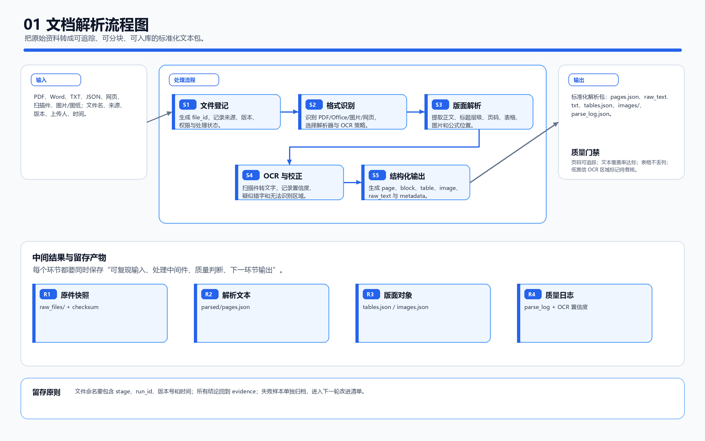
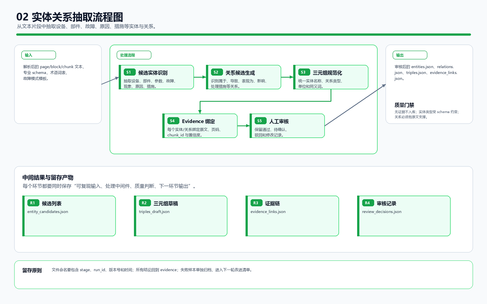
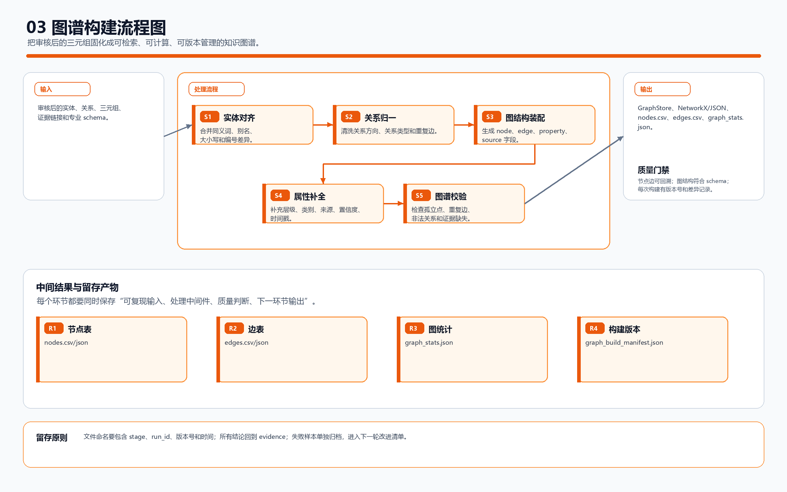
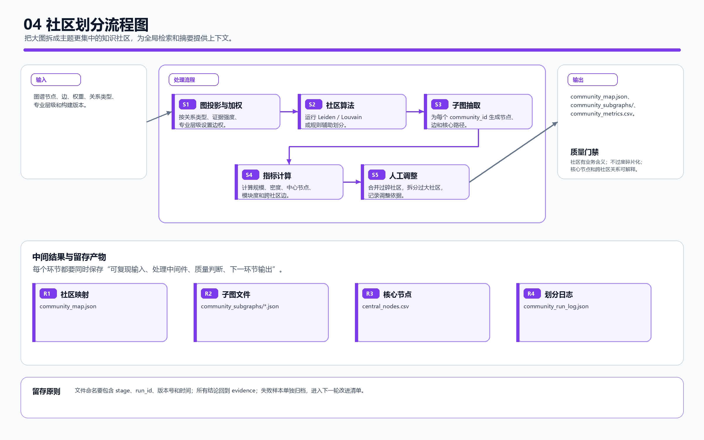
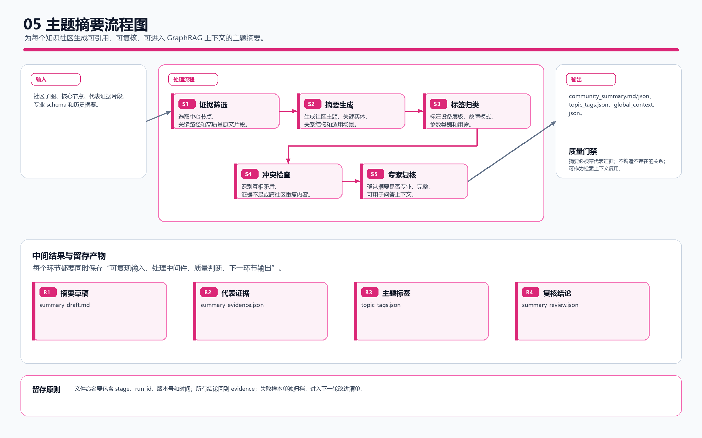
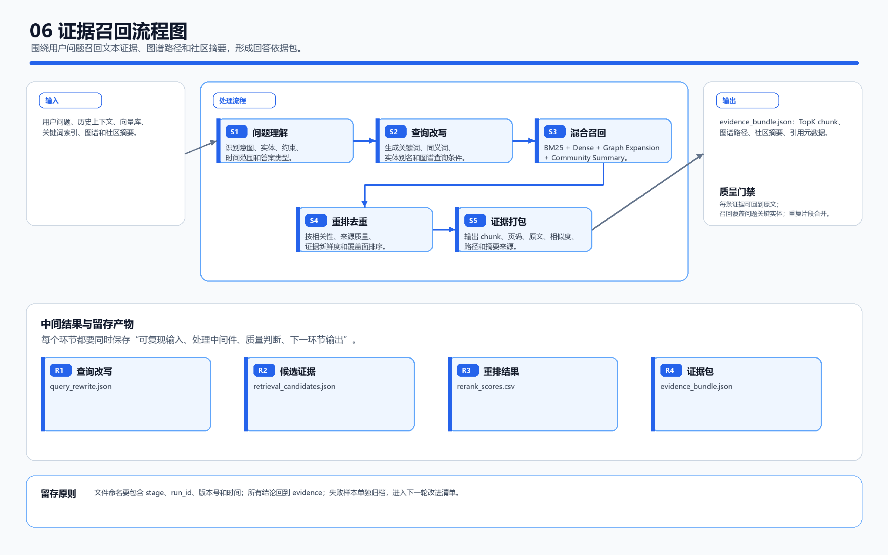
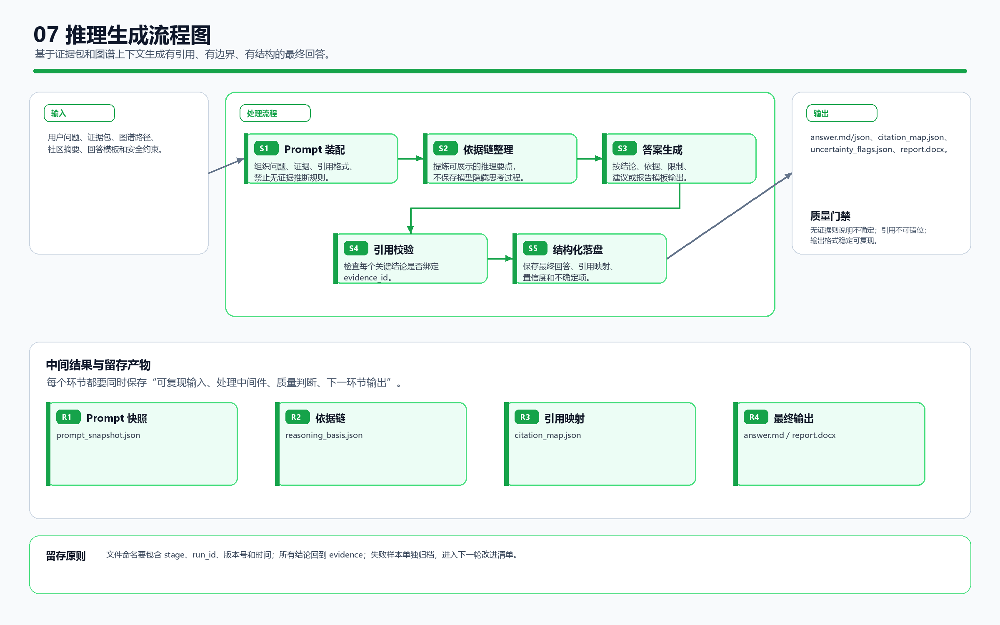
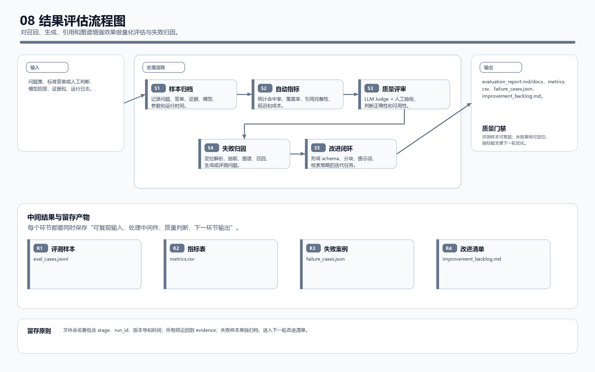

# PowerRAG / GraphRAG 关键环节流程图合集

日期：2026-07-06

用于系统整理和留存文档解析、实体关系抽取、图谱构建、社区划分、主题摘要、证据召回、推理生成和结果评估等关键环节的中间结果与最终输出。

## 1. 01 文档解析流程图

把原始资料转成可追踪、可分块、可入库的标准化文本包。

## 2. 02 实体关系抽取流程图

从文本片段中抽取设备、部件、故障、原因、措施等实体与关系。

## 3. 03 图谱构建流程图

把审核后的三元组固化成可检索、可计算、可版本管理的知识图谱。

## 4. 04 社区划分流程图

把大图拆成主题更集中的知识社区，为全局检索和摘要提供上下文。

## 5. 05 主题摘要流程图

为每个知识社区生成可引用、可复核、可进入 GraphRAG 上下文的主题摘要。

## 6. 06 证据召回流程图

围绕用户问题召回文本证据、图谱路径和社区摘要，形成回答依据包。

## 7. 07 推理生成流程图

基于证据包和图谱上下文生成有引用、有边界、有结构的最终回答。

## 8. 08 结果评估流程图

对召回、生成、引用和图谱增强效果做量化评估与失败归因。

