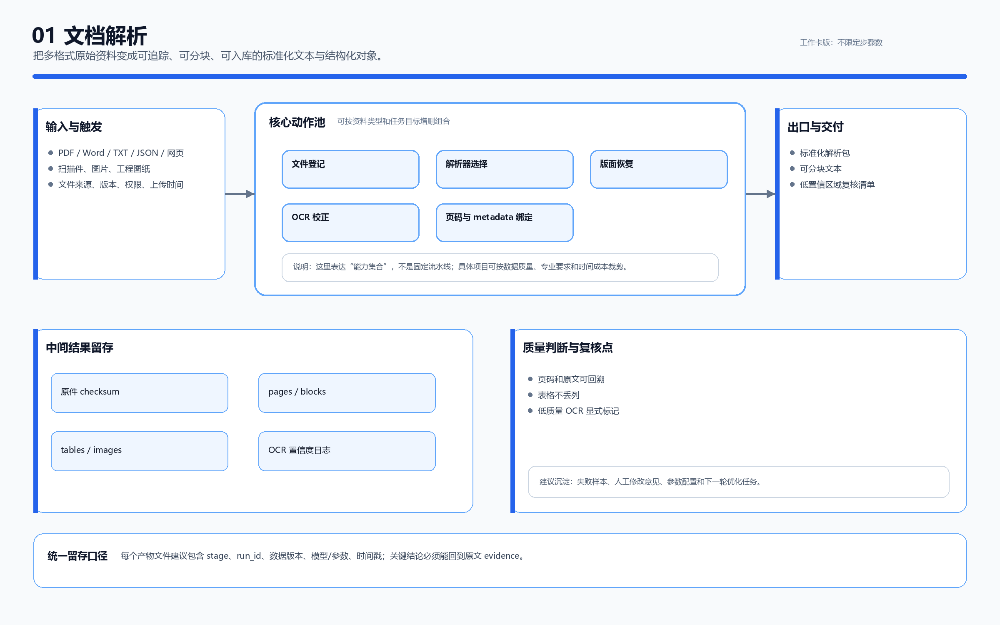
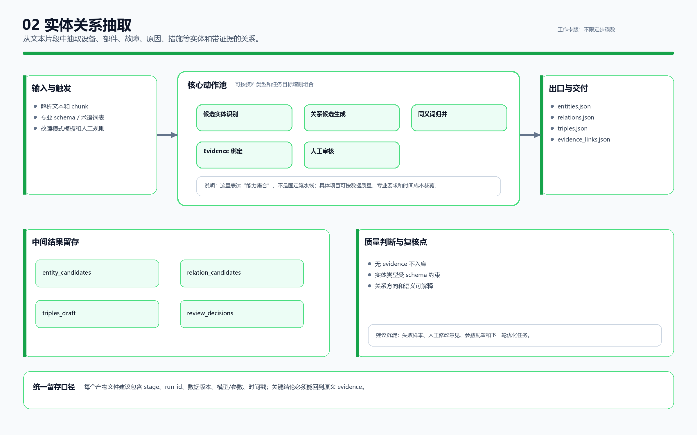
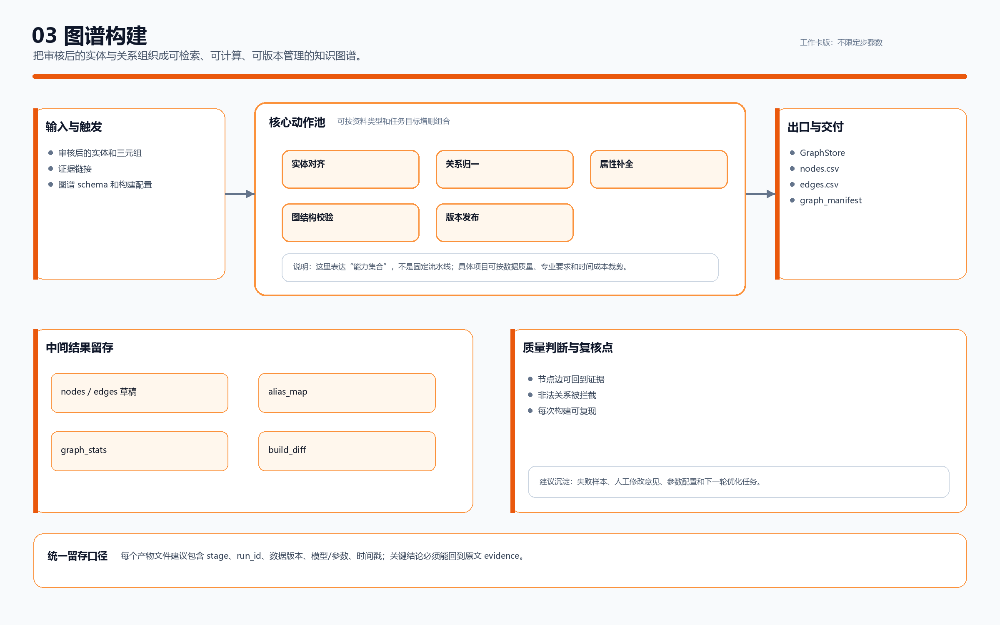
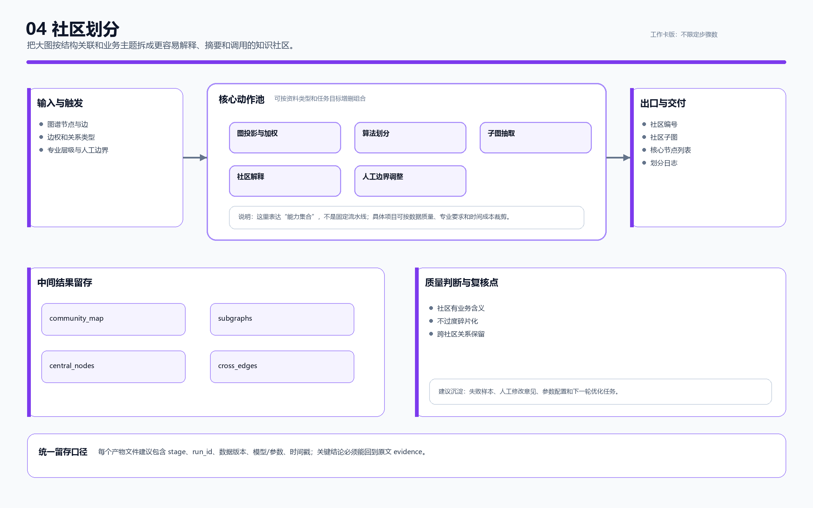
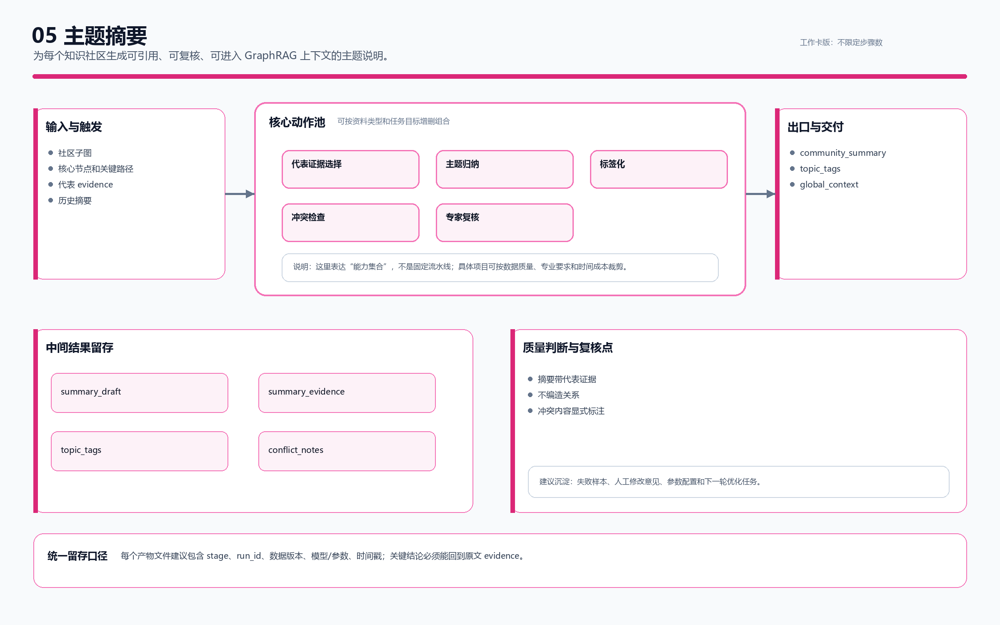
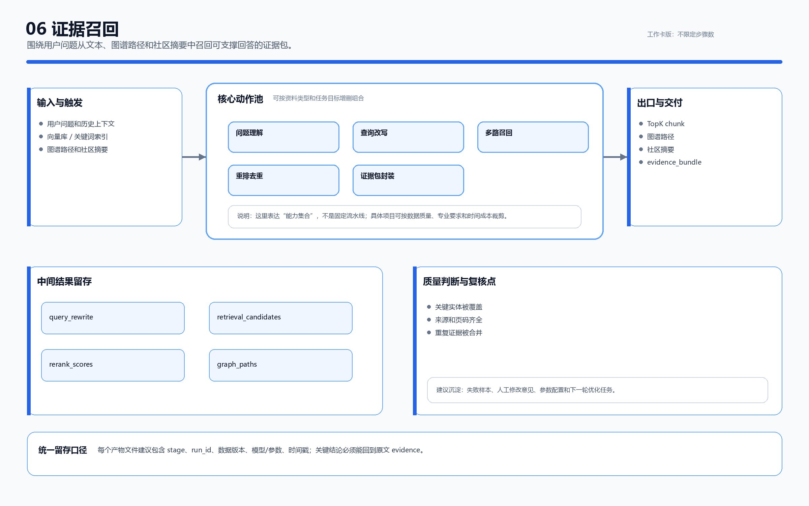
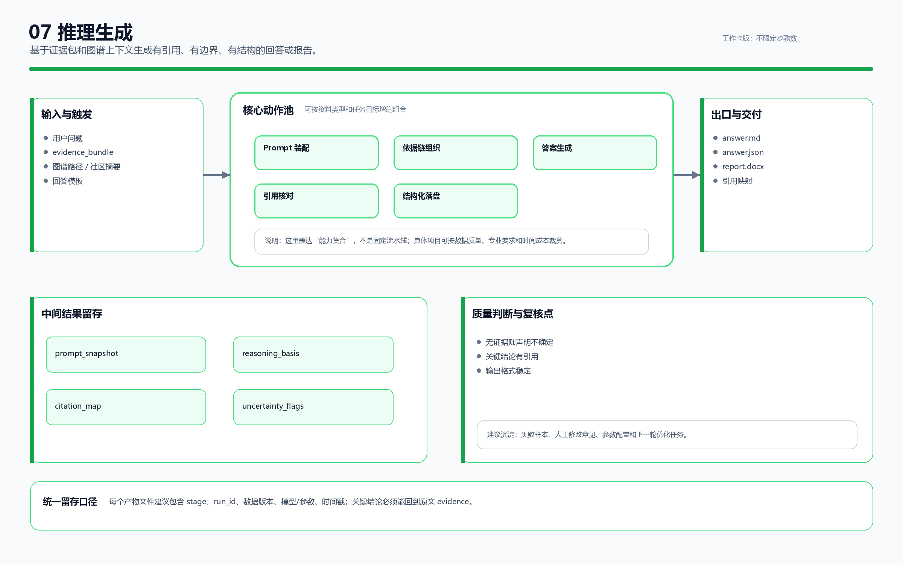
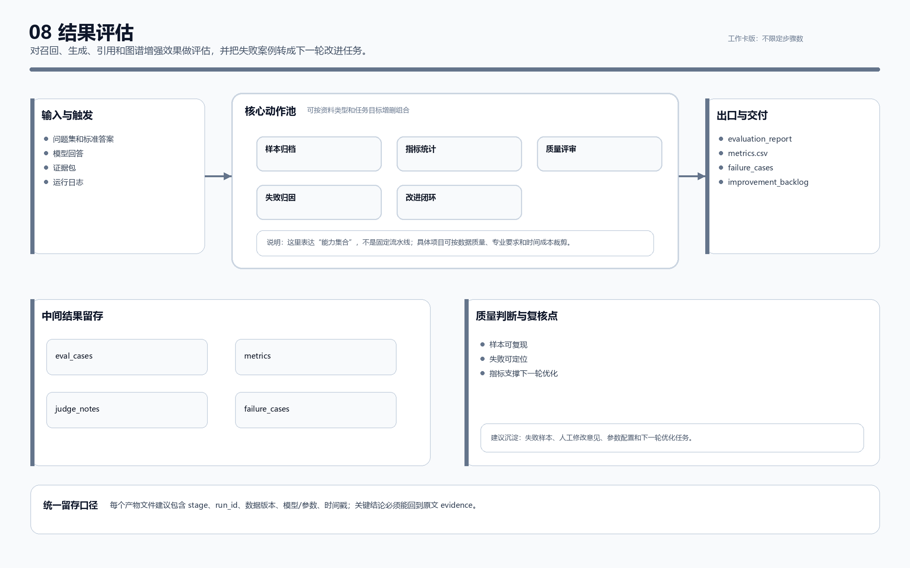

# PowerRAG / GraphRAG 关键环节流程图合集：工作卡版

日期：2026-07-07

本版不再把每个环节固定画成同样数量的流程步骤，而是用“输入与触发、核心动作池、中间结果留存、出口与交付、质量判断与复核点”表达可裁剪的工作方式。

## 1. 01 文档解析

把多格式原始资料变成可追踪、可分块、可入库的标准化文本与结构化对象。

## 2. 02 实体关系抽取

从文本片段中抽取设备、部件、故障、原因、措施等实体和带证据的关系。

## 3. 03 图谱构建

把审核后的实体与关系组织成可检索、可计算、可版本管理的知识图谱。

## 4. 04 社区划分

把大图按结构关联和业务主题拆成更容易解释、摘要和调用的知识社区。

## 5. 05 主题摘要

为每个知识社区生成可引用、可复核、可进入 GraphRAG 上下文的主题说明。

## 6. 06 证据召回

围绕用户问题从文本、图谱路径和社区摘要中召回可支撑回答的证据包。

## 7. 07 推理生成

基于证据包和图谱上下文生成有引用、有边界、有结构的回答或报告。

## 8. 08 结果评估

对召回、生成、引用和图谱增强效果做评估，并把失败案例转成下一轮改进任务。

