# PowerRAG 完整技术栈图谱与核心架构说明

> **Version**: 2.0  
> **Status**: Completed  
> **Target**: Comprehensive mapping of RAG/GraphRAG project architecture, endpoints, algorithms, storage layers, and regression triage engines.

---

## 1. 系统架构图谱 (Architecture Diagram)

```mermaid
flowchart TB
    %% 样式定义
    classDef ui fill:#E1F5FE,stroke:#0288D1,stroke-width:2px,color:#01579B;
    classDef server fill:#EDE7F6,stroke:#5E35B1,stroke-width:2px,color:#311B92;
    classDef pipe fill:#E8F5E9,stroke:#388E3C,stroke-width:2px,color:#1B5E20;
    classDef engine fill:#FFFDE7,stroke:#FBC02D,stroke-width:2px,color:#F57F17;
    classDef storage fill:#FFE0B2,stroke:#F57C00,stroke-width:2px,color:#E65100;
    classDef adapter fill:#FCE4EC,stroke:#C2185B,stroke-width:2px,color:#880E4F;
    classDef eval_style fill:#E0F2F1,stroke:#00897B,stroke-width:2px,color:#004D40;
    
    subgraph UI_Layer ["用户界面与桌面外壳层 (UI & Shell)"]
        Electron["Electron 桌面外壳<br/>(electron/main.cjs)"]
        Preload["IPC 桥接接口<br/>(electron/preload.cjs)"]
        WebConsole["Web 控制台页面<br/>(frontend_app/)"]
        UploadCtrl["文件拖拽上传区"]
        CollectionCtrl["知识库 Collection 管理"]
        OCRCtrl["OCR 引擎切换与预览"]
        GraphViz["D3/SVG 图谱可视化引擎"]
        WeChatDemo["微信私聊一键检测入口"]
        BenchmarkUI["评估看板与 Triage 回归面板"]
    end
    
    subgraph Gateway_Layer ["后端接口服务网关 (FastAPI Gateway)"]
        FastAPI["FastAPI 核心应用<br/>(api_server/server.py)"]
        RouterFiles["文件接口: /api/files"]
        RouterQuery["检索接口: /api/query"]
        RouterGraph["图谱接口: /api/graph"]
        RouterEval["评估接口: /api/evaluation"]
    end
    
    subgraph Data_Pipeline ["数据治理与清洗管线 (Data Ingestion Pipeline)"]
        DocLoaders["文档加载器<br/>(PDF, JSON, DOCX, TXT)"]
        OCRSystem["多级 OCR 系统<br/>(Tesseract.js / PaddleOCR / RapidOCR Server / Baidu Cloud API)"]
        TextFilter["文本噪音清洗器<br/>(configs/public_books_text_filter_rules.yaml)"]
        SemanticChunker["智能分块器<br/>(chunking.py - Title触发/多级标点断点/Overlap)"]
    end
    
    subgraph KG_Pipeline ["GraphRAG 知识图谱构建管线 (KG Ingestion)"]
        SchemaMgr["Schema 定义管理器<br/>(10类实体/15类关系)"]
        KGExtractor["实体关系抽取器<br/>(LLM-based, 自动 schema 校验)"]
        EvidenceBinder["证据绑定器<br/>(将三元组严格绑定至 Page, Snippet, Source)"]
        LeidenClust["Leiden 聚类算法引擎<br/>(社区划分与层级检测)"]
        CommSummary["社区摘要合成器<br/>(基于 LLM 对子网生成概述并索引)"]
    end

    subgraph Retrieval_Engine ["多模态混合检索与编排引擎 (Retrieval & Orchestration)"]
        QueryRouter["查询路由器<br/>(rag_orchestrator/router.py - 意图解析与分类)"]
        HybridRetriever["混合检索引擎<br/>(retrieval_engine/hybrid.py)"]
        DenseRetriever["向量检索模块<br/>(余弦相似度召回)"]
        SparseRetriever["稀疏检索模块<br/>(Jieba 分词 + BM25 算法)"]
        RRF["Reranker 排序融合<br/>(Reciprocal Rank Fusion 倒数排序算法)"]
        GraphRetriever["图谱检索引擎<br/>(retrieval_engine/graph.py)"]
        LocalGraphSearch["局部图检索<br/>(实体一阶/二阶邻域展开)"]
        GlobalGraphSearch["全局图检索<br/>(Leiden 社区摘要相关性过滤)"]
        BatchScanner["全量分区扫描器<br/>(针对联系人级全量会话归因分析)"]
        Orchestrator["RAG/GraphRAG 编排器<br/>(rag_orchestrator/)"]
    end
    
    subgraph Storage_Layer ["持久化持久存储层 (Storage Layer)"]
        ChromaDB["向量数据库 (ChromaDB)<br/>(存储文本 Chunk 及 Embedding 索引)"]
        GraphStore["图数据库存储器<br/>(storage_layer/graph_store.py - NetworkX & JSON)"]
    end
    
    subgraph Model_Adapters ["模型适配器层 (Model Adapters)"]
        LLMClient["统一 LLM 客户端<br/>(OpenAICompatibleLLMClient)"]
        EmbedAdapter["统一向量客户端<br/>(BGE-M3 / OpenAIEmbeddingAdapter)"]
    end

    subgraph Eval_Layer ["系统评估与回归追踪层 (Evaluation & QA Quality)"]
        EvalHarness["回归评估系统<br/>(evaluation/ - 60题多基准自动评估)"]
        QualityProfiles["质量 Profile 网关<br/>(open_source_90 等策略)"]
        TriageAnalytics["错误 Triage 归因分析器<br/>(retrieval空 / graph空 / LLM幻觉 / 路径错误)"]
    end

    %% 连接关系与数据流向
    Electron -->|创建 BrowserWindow| WebConsole
    Electron -->|IPC 桥接通信| Preload
    Preload -->|提供受限文件选择 API| WebConsole
    
    WebConsole -->|上传文件/拖拽操作| UploadCtrl
    WebConsole -->|设置 Collection| CollectionCtrl
    WebConsole -->|预览与设置| OCRCtrl
    WebConsole -->|渲染交互图| GraphViz
    WebConsole -->|启动一键检测| WeChatDemo
    WebConsole -->|查看报告与错题| BenchmarkUI
    
    UploadCtrl -->|POST 请求| RouterFiles
    CollectionCtrl -->|POST/GET| RouterQuery
    OCRCtrl -->|GET Server 状态| RouterFiles
    WeChatDemo -->|POST| RouterGraph
    BenchmarkUI -->|GET 报告与回归状态| RouterEval
    
    RouterFiles --> FastAPI
    RouterQuery --> FastAPI
    RouterGraph --> FastAPI
    RouterEval --> FastAPI
    
    FastAPI -->|1. 触发文档导入| DocLoaders
    DocLoaders -->|文本包含图片或扫描PDF| OCRSystem
    OCRSystem -->|提取文本| TextFilter
    DocLoaders -->|正常文本/JSON| TextFilter
    TextFilter -->|降噪处理| SemanticChunker
    SemanticChunker -->|2. 生成 Chunk 向量| ChromaDB
    SemanticChunker -->|3. 发起实体抽取| KGExtractor
    
    SchemaMgr --> KGExtractor
    KGExtractor -->|4. 三元组 schema 校验| EvidenceBinder
    EvidenceBinder -->|5. 绑定原始 page/snippet 元数据| GraphStore
    GraphStore -->|Leiden 算法分区| LeidenClust
    LeidenClust -->|大模型摘要合成| CommSummary
    CommSummary -->|6. 保存社区索引与摘要| GraphStore
    
    FastAPI -->|7. 用户提问| QueryRouter
    QueryRouter -->|Fact 事实题| HybridRetriever
    QueryRouter -->|Relation 关系题| LocalGraphSearch
    QueryRouter -->|Global 全局汇总| GlobalGraphSearch
    QueryRouter -->|Batch Scan 批量检测| BatchScanner
    
    HybridRetriever --> DenseRetriever
    HybridRetriever --> SparseRetriever
    DenseRetriever -->|向量近邻计算| ChromaDB
    SparseRetriever -->|关键词匹配| ChromaDB
    HybridRetriever --> RRF
    
    LocalGraphSearch -->|拓扑邻域匹配| GraphStore
    GlobalGraphSearch -->|社区摘要相似度匹配| GraphStore
    BatchScanner -->|分区间遍历| GraphStore
    
    RRF --> Orchestrator
    LocalGraphSearch --> Orchestrator
    GlobalGraphSearch --> Orchestrator
    BatchScanner --> Orchestrator
    
    Orchestrator -->|8. 装填上下文拼装 Prompt| LLMClient
    EmbedAdapter --> DenseRetriever
    
    LLMClient -->|完成三元组抽取| KGExtractor
    LLMClient -->|合成社区总结| CommSummary
    LLMClient -->|9. 最终答案生成与证据溯源| Orchestrator
    
    Orchestrator -->|10. 渲染最终回答与 Evidence Links| WebConsole
    
    RouterEval -->|自动压测 60 题| EvalHarness
    EvalHarness --> QualityProfiles
    EvalHarness --> TriageAnalytics
    TriageAnalytics -->|11. 分析错误报告与 Regression 修正| BenchmarkUI

    %% 样式应用
    class Electron,Preload,WebConsole,UploadCtrl,CollectionCtrl,OCRCtrl,GraphViz,WeChatDemo,BenchmarkUI ui;
    class FastAPI,RouterFiles,RouterQuery,RouterGraph,RouterEval server;
    class DocLoaders,OCRSystem,TextFilter,SemanticChunker pipe;
    class SchemaMgr,KGExtractor,EvidenceBinder,LeidenClust,CommSummary pipe;
    class QueryRouter,Orchestrator,HybridRetriever,GraphRetriever,DenseRetriever,SparseRetriever,RRF,LocalGraphSearch,GlobalGraphSearch,BatchScanner engine;
    class ChromaDB,GraphStore storage;
    class LLMClient,EmbedAdapter adapter;
    class EvalHarness,QualityProfiles,TriageAnalytics eval_style;
```



---

## 2. 模块级精细职责表

### 2.1 用户界面与桌面外壳层 (UI & Shell)
* **Electron 桌面外壳 (`electron/main.cjs`)**：
  * 自动检测本地 `localhost:8000` 端口健康状态，必要时自动拉起本地 Python FastAPI 后端。
  * 配置 `max_renderer_memory` 以防在大规模图谱渲染时前端崩溃，并拦截系统原生行为保障沙盒安全。
* **IPC 桥接接口 (`electron/preload.cjs`)**：
  * 暴露出安全的、受限的本地文件选择方法（如 `selectLocalFile`），规避浏览器沙盒环境无法直接访问本地路径的限制。
* **Web 控制台页面与子控件 (`frontend_app/`)**：
  * **文件拖拽上传区**：直接对接前端大文件分段流式读取，展示分片传输状态。
  * **知识库 Collection 管理**：管理不同向量空间隔离，支持一键清空、删除旧索引及重置运行时环境。
  * **OCR 引擎切换区**：供用户在 Tesseract.js（免环境配置）、PaddleOCR（轻量）与 RapidOCR 本地服务 / 百度云 OCR（工业级高精度）间动态切换，并可实时预览 OCR 识别边框。
  * **D3/SVG 图谱可视化引擎**：在图谱关系网过大时，自动执行节点抽样和动态降级策略，避免内存溢出而卡死。
  * **微信私聊一键检测**：专门针对具有分区（联系人、发送方、消息 ID、时间）特性的 JSON 数据流提供一键解析与可视化看板。
  * **评估看板与 Triage 回归面板**：实时查看评估指标（召回率、词覆盖率）、坏回答的归因追溯，以及回归测试的通过曲线。

### 2.2 后端接口服务网关 (FastAPI Gateway)
* **FastAPI 核心应用 (`api_server/current_console/server.py`)**：
  * 承载整个 RAG 实验平台的 HTTP API，核心路由包含：
    * `/api/files`（由 `RouterFiles` 处理）：文档的流式解析、OCR 状态查询及上传队列调度。
    * `/api/query`（由 `RouterQuery` 处理）：负责与路由分发器、混合检索和编排层通信。
    * `/api/graph`（由 `RouterGraph` 处理）：处理三元组抽取、Leiden 图聚类、图谱导出/可视化接口。
    * `/api/evaluation`（由 `RouterEval` 处理）：运行 60 题测试集、调用质量网关及写入 triage 记录文件。

### 2.3 数据治理与清洗管线 (Data Ingestion)
* **文档加载器 (`data_pipeline/document_loaders/`)**：
  * 对 PDF、DOCX、TXT 进行差异化结构树解析，对 JSON 提供层级数据结构保真读取。
* **多级 OCR 系统**：
  * 根据 OCR 控制区的策略，支持将图像送入本地 RapidOCR 进程或调用百度云 OCR SDK，返回携带位置信息（Bounding Box）和置信度分数的文本。
* **文本噪音清洗器 (`configs/public_books_text_filter_rules.yaml`)**：
  * 通过自定义规则过滤页眉、页脚、无意义的 OCR 乱码及格式转换噪声，避免污染召回池。
* **智能分块器 (`chunking.py`)**：
  * 扫描文档大纲（Title），以标题层级作为强边界进行物理分块，对普通长段落应用语义中断点，并且设置 15-20% 的 token 重叠（overlap）来承接段落过渡信息。

### 2.4 GraphRAG 知识图谱构建管线 (KG Ingestion)
* **Schema 定义管理器**：
  * 在构图阶段对大模型进行 Schema 强类型注入，定义核心实体与关系列表，规避大模型自由生成词汇导致关系网稀疏杂乱。
* **实体关系抽取器 & 证据绑定器**：
  * 大模型解析文本段落，按 Schema 输出 JSON 三元组；证据绑定器自动在三元组中注入原文档来源、页码及原始文本片段（Evidence），确保每一条图关系在问答阶段都可以被人类审计追溯。
* **Leiden 聚类与社区摘要合成器**：
  * 将全量图存入 `GraphStore` 后，运行 Leiden 社团发现算法，划分子图网络层级；随后对每个子网（Community）由大模型生成高度概括的摘要，为全局检索提供“全局线索索引”。

### 2.5 多模态混合检索与编排引擎 (Retrieval & Orchestration)
* **查询路由器 (`rag_orchestrator/router.py`)**：
  * 使用大模型进行意图识别，将 Question 归入四大类别：
    1. **Fact（局部事实）**：例如"XX 装备的极限工作温度是多少"，路由至 `HybridRetriever`。
    2. **Relation（实体关系）**：例如"XX 故障由哪些部件损坏引起"，路由至 `LocalGraphSearch`。
    3. **Global（全局汇总）**：例如"这本手册主要讲述了哪几类维护方法"，路由至 `GlobalGraphSearch`。
    4. **Batch Scan（全量批量扫描）**：专门针对联系人、会话层级进行全局归纳扫描，路由至 `BatchScanner`。
* **混合检索引擎**：
  * **向量检索**：调用 `model_adapters/embedding.py` 计算 Query 的 Embedding，在 ChromaDB 中检索 Top-k 向量邻近片段。
  * **稀疏检索**：使用 `Jieba` 分词对 Query 精确切词，在 BM25 索引中检索精准命中词频的文档段落。
  * **RRF 排序融合**：使用倒数排序融合公式，平衡双路排名的分布权重，返回质量最优 of 重排片段。
* **图谱检索引擎**：
  * **局部图检索 (`LocalGraphSearch`)**：定位 Query 中的实体节点，在 `GraphStore` 中查找其一阶、二阶相邻节点与边关系，汇聚实体拓扑上下文。
  * **全局图检索 (`GlobalGraphSearch`)**：将 Query 语义与 Leiden 社区摘要做相似度比对，筛选最关联的若干社区摘要，作为生成全局回答的基础材料。
  * **全量分区扫描器 (`BatchScanner`)**：针对需要全量统计分析的问题，以物理分区（如联系人 `contact_name`）为边界分段加载全部历史证据流，逐区送入大模型处理后汇总，避免普通 Top-k 对整体统计信息的遗漏。
* **RAG/GraphRAG 问答编排器 (`rag_orchestrator/`)**：
  * 从检索层收集事实段落、图拓扑关系以及社区摘要，拼装成携带严格 Grounding 指令的 Prompt，最终解析大模型输出，高亮显示 Evidence Links 溯源链接。

### 2.6 持久化存储层 (Storage Layer)
* **ChromaDB 向量数据库**：
  * 本地部署，保存文本分块后的向量特征，并为多库隔离提供 Collection 支持。
* **图数据库存储器 (`storage_layer/graph_store.py`)**：
  * 基于 NetworkX 在本地维护实体关系拓扑，图结构、Leiden 社区分布及摘要索引均被序列化为结构化 JSON 文件持久化，避免启动图数据库服务的繁琐配置。

### 2.7 模型适配器层 (Model Adapters)
* **统一 LLM 客户端 (`OpenAICompatibleLLMClient`)**：
  * 屏蔽外部接口差异，兼容各类 OpenAI 规范接口，支持多线程请求并发，保障图谱大规模提取及摘要生成的运行速率。
* **统一向量客户端 (`BGE-M3 / OpenAIEmbeddingAdapter`)**：
  * 支持本地部署 BGE 向量模型或在线调用 Embedding API，完成文本向量化工作。

### 2.8 系统评估与回归追踪层 (Evaluation)
* **回归评估系统 (`evaluation/`)**：
  * 自动读取 60 题物理与动力装备专业问答对，向 FastAPI 后端发送批量测试请求，计算检索准确率和生成完整度。
* **错误 Triage 归因分析器 (`TriageAnalytics`)**：
  * 将不合格的测试案例进行自动化分类归因：
    - `retrieval_empty`（检索召回为空）
    - `graph_empty`（知识图谱关系未检索到）
    - `llm_hallucination`（大模型回答偏离召回证据）
    - `router_error`（路由路径判断错误）
  * 归因结果实时回传至前端 `BenchmarkUI` 面板，为下一次迭代优化指明方向。

---

## 3. 核心数据流

### 3.1 文档入库与多路径图索引流程

```text
[文档输入: PDF/JSON] -> [加载与 OCR 提取] -> [清洗噪音] -> [语义分块 Chunker]
                                                                  |
                         +----------------------------------------+---------------------------------------+
                         | (向量路径)                                                                      | (图谱路径)
                         v                                                                                v
               [Embedding 模型计算]                                                            [LLM Schema 强约束提取]
                         |                                                                                |
                         v                                                                                v
                 [ChromaDB 存储]                                                                 [证据绑定器: 绑定源头]
                                                                                                          |
                                                                                                          v
                                                                                                  [GraphStore 拓扑持久化]
                                                                                                          |
                                                                                                          v
                                                                                                  [Leiden 算法分区聚类]
                                                                                                          |
                                                                                                          v
                                                                                                  [大模型合成社团摘要并索引]
```

### 3.2 意图路由与多模态检索问答流程

```text
[用户 Query] -> [Query Router 路由器]
                      |
        +-------------+-------------+---------------------------+---------------------------+
        | (事实题)                  | (关系题)                  | (全局题)                  | (批量分析)
        v                           v                           v                           v
 [Hybrid 混合检索]          [Local 图检索]              [Global 社区检索]           [Batch 分区扫描]
  - Dense Chroma 向量相似度   - 实体节点定位               - Leiden 社区摘要匹配       - 按 contact_name 区分
  - Sparse BM25 关键词匹配    - 一/二阶关系网展开          - 全局社区索引排序           - 遍历各分区历史会话
        |                           |                           |                           |
        +-------------+-------------+---------------------------+---------------------------+
                      |
                      v
             [多源证据汇聚与去重]
                      |
                      v
             [RAG 编排层 Assembly]
                      |
                      v
             [大模型逻辑推理与生成]
                      |
                      v
      [最终答案展示 + 原始 Chunk 引用 + 图关系高亮]
```
