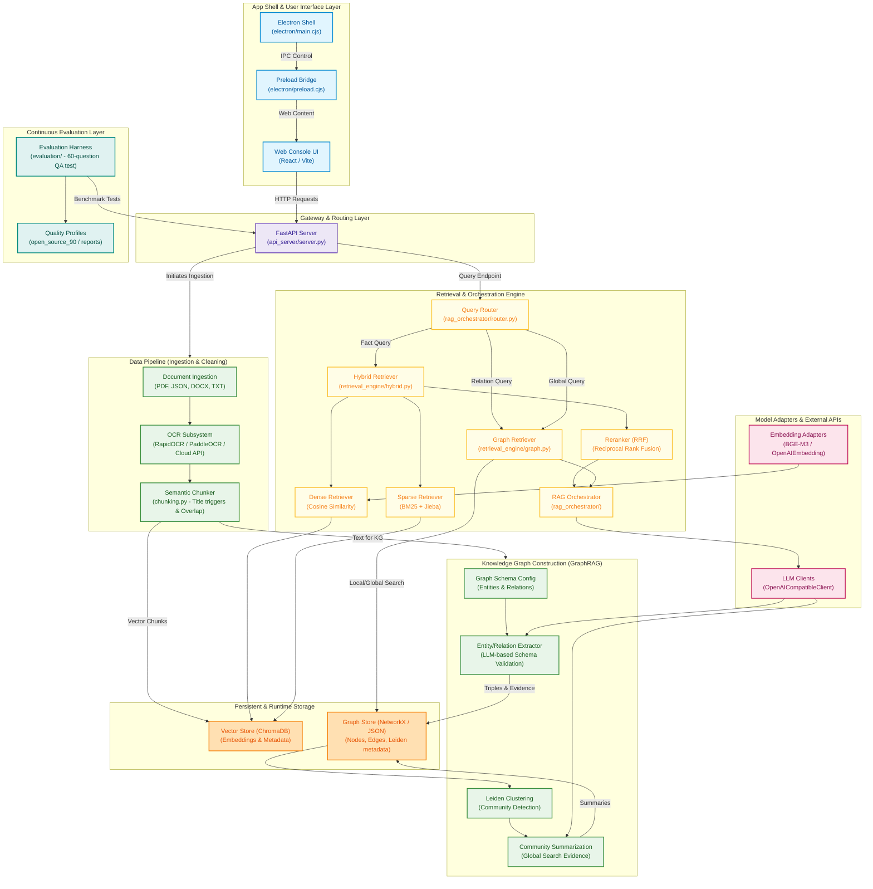

# PowerRAG Technical Stack Knowledge Graph

> **Version**: 1.0  
> **Status**: Completed  
> **Target**: Documentation of system architecture, technology stack, and core data flows.

---

## 1. System Architecture Diagram



---

## 2. Layer & Component Details

### 2.1 App Shell & User Interface Layer
* **Electron Desktop Container (`electron/main.cjs`, `electron/preload.cjs`)**:
  * **Role**: Provides a local-first desktop wrapper around the system. Sets up native IPC handlers, manages application lifetimes, handles a scoped local file picker for documents, and configures expanded memory allocations for high-performance rendering.
* **Web Console UI (`frontend_app/current_console/index.html`)**:
  * **Role**: Standard interface for interacting with the RAG pipeline. Includes UI controls for uploading documents, selecting database collections, running Hybrid/GraphRAG searches, viewing knowledge graph visualizations, and configuring LLM parameters.

### 2.2 Gateway & Routing Layer
* **FastAPI Server (`api_server/current_console/server.py`)**:
  * **Role**: The main backend server, providing HTTP endpoints for files ingestion, database connection, text/graph query execution, Leiden community extraction, and testing harnesses.

### 2.3 Data Pipeline (Ingestion & Cleaning)
* **Document Ingestion (`data_pipeline/`)**:
  * **Role**: Parses heterogeneous inputs: PDF manuals, structured JSON files (e.g. from Label Studio), raw TXT, and DOCX documents.
* **OCR Subsystem**:
  * **Role**: Extracts text from scanned PDFs. Implements a multi-engine fallback strategy: browser-based PaddleOCR/Tesseract.js, a dedicated local RapidOCR server, and Baidu Cloud OCR API for high-precision scenarios.
* **Semantic Chunker (`chunking.py`)**:
  * **Role**: Segments parsed document text into retrieval-ready chunks. Features Title-based split triggers, multi-level semantic punctuation break-points, and overlapping context boundaries to preserve contextual information across chunks.

### 2.4 Knowledge Graph Pipeline (GraphRAG)
* **Graph Schema & Extractor (`kg_pipeline/`)**:
  * **Role**: Instructs the LLM to extract domain-specific entity nodes (e.g. `Equipment`, `Component`, `Fault`, `Method`, `Metric`) and relationship edges from corpus chunks. Each extracted triple is strictly validated against the graph schema and bound to its source document's metadata (original text snippet, page number, file source) as explicit "evidence".
* **Leiden Clustering & Summarization**:
  * **Role**: Partitions the global knowledge graph into hierarchical communities using the Leiden community detection algorithm. For each community, the LLM generates a comprehensive summary, enabling the system to address global, cross-document queries.

### 2.5 Retrieval & Orchestration Engine
* **Query Router (`rag_orchestrator/router.py`)**:
  * **Role**: Categorizes user questions into structural archetypes (e.g., local fact lookup, relational cross-entity queries, or global summaries) and routes them to the appropriate retrieval engine.
* **Hybrid Retriever (`retrieval_engine/hybrid.py`)**:
  * **Role**: Combines dense semantic search (embedding similarity) with sparse exact match (BM25 search using Jieba Chinese tokenization).
* **Reranker (RRF)**:
  * **Role**: Performs Reciprocal Rank Fusion to combine candidate lists from sparse and dense paths, ensuring optimal ranking.
* **Graph Retriever (`retrieval_engine/graph.py`)**:
  * **Role**: Executes local GraphRAG retrieval (entity neighborhood expansions) and global GraphRAG retrieval (querying community summaries).
* **RAG Orchestrator (`rag_orchestrator/`)**:
  * **Role**: Coordinates the entire workflow: query routing, multi-path retrieval, prompt assembly (injecting retrieved text and graph evidence), LLM synthesis, citation parsing, and output formatting.

### 2.6 Persistent & Runtime Storage
* **Vector Store (ChromaDB)**:
  * **Role**: Persists chunk embeddings alongside source document metadata (file names, page numbers, and custom tags).
* **Graph Store (`storage_layer/graph_store.py`)**:
  * **Role**: Stores knowledge graph structures, community partitions, and LLM-generated community summaries in a NetworkX/JSON-based local filesystem format.

### 2.7 Model Adapters
* **LLM Client (`OpenAICompatibleLLMClient`)**:
  * **Role**: Standard client abstraction supporting custom OpenAI-compatible endpoints (supporting models like Qwen, GPT-4, etc.) for extraction, synthesis, and QA.
* **Embedding Adapters (`model_adapters/embedding.py`)**:
  * **Role**: Provides interfaces for computing embeddings using local/remote models (such as BGE-M3).

### 2.8 Continuous Evaluation Layer
* **Evaluation Harness (`evaluation/`)**:
  * **Role**: Runs benchmark evaluations on a curated 60-question university physics/power equipment dataset. Measures metrics like query recall, keyword coverage, and evidence correctness.
* **Quality Profiles (`quality_profiles.py`)**:
  * **Role**: Configures testing profiles (e.g., `open_source_90`) to enforce strict regression gates.

---

## 3. Core Data Flows

### 3.1 Document Ingestion Flow
```text
[Raw Document] -> [OCR / Parser] -> [Semantic Chunker] -> [Text Chunks + Metadata]
                                                                  |
                                      +---------------------------+---------------------------+
                                      |                                                       |
                                      v                                                       v
                            [Vector Ingestion]                                       [KG Extraction]
                         Compute Dense Embeddings                                  Extract Entities & Relations
                                      |                                                       |
                                      v                                                       v
                            [ChromaDB Storage]                                      [GraphStore (Nodes/Edges)]
                                                                                              |
                                                                                              v
                                                                                     [Leiden Clustering]
                                                                                              |
                                                                                              v
                                                                                    [Community Summaries]
```

### 3.2 Query & QA Generation Flow
```text
[User Query] -> [Query Router]
                      |
        +-------------+-------------+
        | (Local Fact)              | (Relational/Global Summary)
        v                           v
 [Hybrid Retriever]         [Graph Retriever]
  - Dense (ChromaDB)         - Local Entity Neighborhood
  - Sparse (BM25)            - Global Community Summaries
        |                           |
        v                           v
  [RRF Reranker]            [Evidence Extraction]
        |                           |
        +-------------+-------------+
                      |
                      v
             [Retrieved Evidence]
                      |
                      v
            [RAG QA Orchestrator]
                      |
                      v
             [LLM Synthesis]
                      |
                      v
      [Answer with Citations & Source Links]
```
