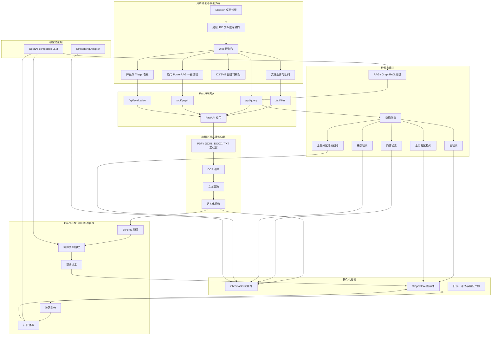

# PowerRAG 技术栈图

```mermaid
flowchart TB
    subgraph UI["用户界面与桌面外壳"]
        Electron["Electron 桌面外壳"]
        Preload["受限 IPC 文件选择接口"]
        WebConsole["Web 控制台"]
        UploadCtrl["文件上传与队列"]
        OneClick["通用 PowerRAG 一键流程"]
        GraphViz["D3/SVG 图谱可视化"]
        EvalUI["评估与 Triage 看板"]
    end

    subgraph Gateway["FastAPI 网关"]
        API["FastAPI 应用"]
        Files["/api/files"]
        Query["/api/query"]
        Graph["/api/graph"]
        Eval["/api/evaluation"]
    end

    subgraph Ingestion["数据治理与清洗链路"]
        Loaders["PDF / JSON / DOCX / TXT 加载器"]
        OCR["OCR 引擎"]
        Filter["文本清洗"]
        Chunker["结构化切分"]
    end

    subgraph KG["GraphRAG 知识图谱管线"]
        Schema["Schema 配置"]
        Extractor["实体关系抽取"]
        Evidence["证据绑定"]
        Community["社区划分"]
        Summary["社区摘要"]
    end

    subgraph Retrieval["检索与编排"]
        Router["查询路由"]
        Dense["向量检索"]
        Sparse["稀疏检索"]
        GraphR["图检索"]
        Global["全局社区检索"]
        FullScan["全量分区证据扫描"]
        Orchestrator["RAG / GraphRAG 编排"]
    end

    subgraph Storage["持久化存储"]
        Chroma["ChromaDB 向量库"]
        GraphStore["GraphStore 图存储"]
        Runtime["日志、评估与运行产物"]
    end

    subgraph Model["模型适配层"]
        LLM["OpenAI-compatible LLM"]
        Embed["Embedding Adapter"]
    end

    Electron --> Preload --> WebConsole
    WebConsole --> UploadCtrl
    WebConsole --> OneClick
    WebConsole --> GraphViz
    WebConsole --> EvalUI
    UploadCtrl --> Files
    OneClick --> Graph
    EvalUI --> Eval
    WebConsole --> Query

    Files --> API
    Query --> API
    Graph --> API
    Eval --> API

    API --> Loaders --> OCR --> Filter --> Chunker
    Chunker --> Chroma
    Chunker --> Schema --> Extractor --> Evidence --> GraphStore
    GraphStore --> Community --> Summary --> GraphStore

    Query --> Router
    Router --> Dense
    Router --> Sparse
    Router --> GraphR
    Router --> Global
    Router --> FullScan
    Dense --> Chroma
    Sparse --> Chroma
    GraphR --> GraphStore
    Global --> GraphStore
    FullScan --> Chroma
    Orchestrator --> Query

    LLM --> Extractor
    LLM --> Summary
    LLM --> Orchestrator
    Embed --> Chroma
```

## 模块职责

- UI 与桌面外壳：提供上传、构图、问答、图谱查看、评估和一键流程入口。
- FastAPI 网关：统一文件、检索、图谱和评估接口。
- 数据治理链路：完成解析、OCR、清洗、切分和入库。
- 图谱管线：完成 Schema 配置、实体关系抽取、证据绑定、社区划分和摘要。
- 检索与编排：在向量、稀疏、图谱、全局社区和全量分区证据扫描之间选择路径。
- 存储层：保存向量索引、图谱数据、日志、评估和运行产物。
- 模型适配层：统一 LLM 和 Embedding 接口。
