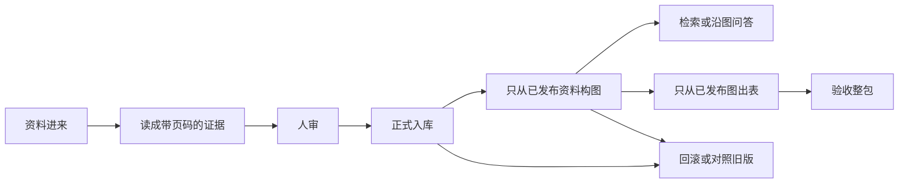

# PowerRAG 技术链路与接口

日期：2026-09-23  
独立文件：`D:\虚拟C盘\PowerRAG技术链路与接口0923.md`  
现网入口：`http://127.0.0.1:8000`  
接口文档：`http://127.0.0.1:8000/docs`  
权威清单：`http://127.0.0.1:8000/openapi.json`  
实扫条数：**218**（`api_server/current_console` 的 `create_app`，应用版本 2.1.0）  
本文按现网 OpenAPI 展开请求字段和成功返回体。服务以后如果改了合同，以正在跑的 `/openapi.json` 为准。

目录

- [项目是什么](#项目是什么)
- [怎么打开](#怎么打开)
- [仓库分层](#仓库分层)
- [两套编号](#两套编号)
- [全项目一条线](#全项目一条线)
- [三套库为什么分开](#三套库为什么分开)
- [界面五页怎么对接口](#界面五页怎么对接口)
- [典型调用顺序](#典型调用顺序)
- [怎么调接口](#怎么调接口)
- [先走哪条链路](#先走哪条链路)
- [Skill 和模型槽](#skill-和模型槽)
- [部署与运行时](#部署与运行时)
- [共享对象](#共享对象)
- [治理库表](#治理库表)
- [出表字段和图谱最小链](#出表字段和图谱最小链)
- [HTTP 状态](#http-状态)
- [有内容就不能直接删](#有内容就不能直接删)
- [程序目录清单](#程序目录清单)
- [界面全部页面](#界面全部页面)
- [作废撤回和删除怎么留痕](#作废撤回和删除怎么留痕)
- [现网全部接口](#现网全部接口)
  - [打开与文档](#打开与文档)
  - [工作台入库检索](#工作台入库检索)
  - [检索策略与登录](#检索策略与登录)
  - [交付 · 项目与任务](#交付--项目与任务)
  - [交付 · 资料](#交付--资料)
  - [交付 · 图谱](#交付--图谱)
  - [交付 · 出表](#交付--出表)
  - [交付 · 验收](#交付--验收)
  - [运行图与质检](#运行图与质检)
  - [对话记忆](#对话记忆)
  - [版本化问答](#版本化问答)
  - [出表治理 v1](#出表治理-v1)
- [受控失败](#受控失败)
- [术语](#术语)

## 项目是什么

PowerRAG 是面向燃气轮机和动力装备资料的**本地**工作台。手册、扫描件、表格进来以后，先读成带页码的证据，再检索、构图、问答，最后出可审核的故障分析表。

产品就是这一个工作台。浏览器打开。不是多租户网上服务。仓库里的 Electron 目录只保留，现网不启动、不打包、不演示。Windows 可执行文件 `PowerRAG.exe` 只是把同一套 FastAPI 拉起来，再打开系统浏览器。

相对“把整本资料丢给大模型让它直接答”，这里多了一条硬约束：**图上的关系和表上的字段必须能回到手册页码**。回不到原页，就不能当正式结论发布。百科里成立、书里没写的事，只能标成书中未记载，不能写进图。

`RAG交付/` 是历史快照，接口是子集，不是现网。现网入口只有 `api_server/current_console`。

## 怎么打开

1. 客户包：拷贝 `desktop_launcher/dist/PowerRAG/` 整个目录（必须带 `_internal`），双击 `PowerRAG.exe`。关掉状态窗口即停服务。默认 `http://127.0.0.1:8000`，端口被占用时看状态窗口。
2. 源码：在仓库根目录执行 `python api_server/current_console/server.py`，或双击 `api_server/current_console/start_local.bat`。
3. 数据目录：向量库、上传、日志在 `%LOCALAPPDATA%\PowerRAG\current_console\`（`chroma` / `uploads` / `logs`）。可执行文件不会另起第二套库。

## 仓库分层

| 层 | 目录 | 管什么 | 和接口的关系 |
|---|---|---|---|
| 界面 | `frontend_app/current_console` | 五页工作台、抽屉、整页审核 | 浏览器只打下面这些 HTTP |
| 接口 | `api_server/current_console` | FastAPI，现网 218 条 | `/api/*` 全部挂在这里 |
| 解析 | `data_pipeline` | 读 PDF / DOCX / 图，识图取字，保住页码和表 | `/api/process`、`/api/delivery/documents/intake` |
| 入库 | `knowledge_base`、`storage_layer` | 正式版本、切块、向量、治理账本 | `/api/ingest`、`/api/delivery/documents*` |
| 图谱 | `kg_pipeline`、`storage_layer/graph_store.py` | 抽关系、社区、运行图库 | `/api/delivery/graphs*`、`/api/graphrag*` |
| 问答 | `rag_orchestrator` | 普通检索、沿边回答、对照、拒绝空答 | `/api/query`、`/api/v1/query`、图上的 `/query` |
| 出表 | `rag_orchestrator/fmea.py`、`fmea_application`、`fmea_infrastructure` | 从已发布图出表，导出 Office | `/api/delivery/fmea*`、`/api/v1/fmea*` |
| 验收 | `evaluation` | 门禁材料、金标、验收包 | `/api/delivery/acceptance*` |
| 启动 | `desktop_launcher` | Windows 可执行文件 | 不新增接口，只拉起 :8000 |

## 两套编号

界面从左到右是值班流水线：

1. **M1 资料接入**：上传、解析、写入检索库。
2. **M2 知识组织**：构图、社区、导入导出运行图。
3. **M3 图谱问答**：提问、多轮、对照。
4. **M4 可信交付**：项目、审核、发布、出表。这是治理全段的操作台。
5. **M5 验收**：门禁材料和验收包。

交付治理是另一套，按证据状态往下传，**后一段只吃前一段已经发布的结果**：

1. **解析**：文件 → 带页码的块和证据号。
2. **入库**：审核通过才成为正式资料，并投影到检索。
3. **构图**：只从正式资料抽关系，每条绑回原页。
4. **出表**：只从正式图生成故障分析表，每个字段带证据。

不要把界面 M2 和治理“解析”当成同一个东西。界面 M4 才覆盖治理的解析到出表。界面 M5 不是出表，是验收台。

## 全项目一条线



1. **进来。** 工作台 `POST /api/upload` 只落盘；治理 `POST /api/delivery/projects/{id}/documents/upload` 或 `POST /api/delivery/documents/intake` 会生成候选版本。
2. **读成证据。** 原生 PDF、DOCX 走文本和结构；扫描件走识图。页、块、表、图注都要能定位。缺页、低把握写成质量问题。
3. **人看原页。** `review-package` 把原页和解析放在同一屏。结论写入治理库。改了正文必须 `revise` 出新版本。
4. **发布。** 没有批准不能发布。发布后才允许正式检索和构图。
5. **构图。** `statements` 必须带 `evidence_ids`。类型或关系不在规则里、证据不在所选版本，不能发布图。
6. **问答。** 关键词检索、沿已发布图、同一题对照。原文没有的要能拒绝，不能靠模型补书中没有的情节。
7. **出表。** 设备、故障、原因、措施来自已发布图。空着比编造好。导出三份行数一致。
8. **验收。** 门禁材料、截图、整包。没齐就如实写没齐。
9. **整包进出。** 项目可导出、可恢复。哈希对不上不能装成成功恢复。

## 三套库为什么分开

| 库 | 实现 | 记什么 | 不记什么 |
|---|---|---|---|
| 治理库 | SQLite `GovernanceStore` | 版本、审核、证据号、出表任务、反馈 | 不直接回答问题 |
| 向量库 | Chroma | 已发布或工作台入库的切块向量 | 不代替审核账本 |
| 图库 | SQLite `GraphStore` | 已同步的点和边，供沿边检索 | 没有审核意见 |

发布资料 **不会自动** 保证图库已更新；发布图之后要看是否 `resync`。建一条反馈 **不等于** 已经重跑解析。兼容的导出形状不等于两条链路已经接通，要以实际调用为准。

## 界面五页怎么对接口

| 页 | 人在做什么 | 主要接口 |
|---|---|---|
| M1 资料接入 | 选文件、看进度、写入检索库 | `/api/upload` `/api/uploads` `/api/process` `/api/ingest` `/api/search` `/api/logs` |
| M2 知识组织 | 看图、社区、导入导出 | `/api/graphrag/import` `/community/detect` `/export` `/reset` |
| M3 图谱问答 | 提问、看依据、多轮 | `/api/query` `/api/v1/query` `/api/memory/sessions*` `/api/graphrag/search/global` |
| M4 可信交付 | 建项目、审资料、发图、出表 | `/api/delivery/projects*` `/documents*` `/graphs*` `/fmea*` `/tasks*` |
| M5 验收 | 看门禁、传截图、打验收包 | `/api/delivery/acceptance/*` |
| 抽屉 · 总览 | 看是否健康 | `/api/health` `/api/stats` |
| 抽屉 · 设置 | 集合、策略、身份、日志 | `/api/retrieval/policies*` `/api/collections/{name}` `/api/logs` |

`#page-search`、`#page-kg` 还在 HTML 里，不挂进现网导航，不要当成正式入口。

## 典型调用顺序

治理主路径，按这个顺序打，中间缺一步，后面应被拒绝：

1. `POST /api/delivery/projects` 建项目。
2. `POST /api/delivery/projects/{id}/documents/upload` 或 `POST /api/delivery/documents/intake` 进候选。
3. 如需识图：`POST .../ocr-jobs/{id}/run`，失败页 `retry-pages`。
4. `GET .../documents/{version}/review-package` 对照原页。
5. `POST .../documents/{version}/review`，结论 `approve`。
6. `POST .../documents/{version}/publish`。
7. `POST /api/delivery/graphs/candidates` 提交带证据的关系；或 `POST /graphs/extract`。
8. `POST .../graphs/{id}/review` → `publish` → 需要的话 `resync`。
9. `POST /api/delivery/fmea/tasks` → 逐字段审 → `publish` → `export`。
10. 出问题：`feedback` 然后 `remediate`，不要只留一条评论。
11. 要带走：`POST /api/delivery/projects/{id}/export-package`；换机器 `POST /projects/restore`。

工作台快路径可以只走 `/api/upload` → `/api/process` → `/api/query`。这条快，但没有治理发布账本，不能当成“已经正式入库”。

## 怎么调接口

- 根地址：`http://127.0.0.1:8000`
- JSON：`Content-Type: application/json`
- 上传文件：`multipart/form-data`
- 治理操作人：请求体 `actor` / `reviewer`，默认 `local-user`
- 后台：查询参数 `background=true`，用任务号轮询 `/api/delivery/tasks/{id}`
- 交互文档：`/docs` 可直接试
- 下面每一条都尽量写清：做什么、何时用、路径参数、查询参数、请求体字段、返回码、返回体字段、约束。没有请求体的 GET 会略过请求体段。字段中文来自常见字段表，其余跟 OpenAPI 走。

## 先走哪条链路

客户演示和正式交付只认这一条：

`/api/delivery`：建项目 → 解析进候选 → 整页审 → 发布资料 → 带证据构图 → 审图发布 → 需要时 `resync` → 出故障分析表 → 导出 JSON / CSV / DOCX → 验收包。

其余都是旁边的能力，不要和主路径混成“已经正式入库”。

| 你要做的事 | 走这条 | 不要当成 |
|---|---|---|
| 正式解析、页码、审核、回滚 | `/api/delivery/documents*` | `/api/upload` + `/api/process` |
| 正式图谱、证据边、发布 | `/api/delivery/graphs*` | `/api/graphrag/import` 运行图 |
| 正式故障分析表（跟已发布图绑） | `/api/delivery/fmea*` | 只有 `/api/v1/fmea*` 的修订生命周期 |
| 工作台先看一眼能不能搜 | `/api/upload` → `/api/process` → `/api/query` | 正式验收证据 |
| 浏览器里画的运行图、社区、全局问答 | `/api/graphrag*` | 治理库里的图谱版本 |
| 出表治理 v1 子页：修订、撤回、替换、风险、传播 | `/api/v1/fmea*`、`/fmea.html` | 工作台 M4 出表的唯一入口 |
| 固定字段的版本化问答 | `/api/v1/query` | 和 `/api/query` 并列，不是替代治理 |
| 谁能搜哪类资料 | `/api/retrieval/policies*` | 单机演示可以不配 |

`knowledge_base/` 是资料库的另一套模块实现，现网工作台主路径打的是 `/api/delivery/documents`。两套都留在仓库，对接时不要各写各的版本号。

发布资料之后，检索投影要看 `GET /api/delivery/documents-index/status`，必要时 `rebuild`。发布图之后，沿边问答用的 GraphStore 要看是否 `resync`。只看到“发布成功”不够。

## Skill 和模型槽

对外交的是 Skill：`.agents/skills/govern-graphrag-delivery/`。

- 说明书：`SKILL.md`、`references/`、`assets/`
- 完整实现副本：`code/`（解析、治理库、图谱、问答、出表、`/api/delivery`、测试）
- 刷新副本：`python .agents/skills/govern-graphrag-delivery/scripts/pack_code.py`
- 工作台运行时仍从仓库根目录导入同名模块

Skill 被唤起时，**调用方自己填模型槽**：抽关系、写 FMEA 字段、识图缺口、问答组织。不要向客户要 OpenAI / embedding 钥匙。写回走本地 `/api/delivery`。服务器继续管落盘、审核、版本、发布。

不要用 Skill 填：没有批准政策的 S/O/D、RPN；书里没有的情节；打不开的证据号。

## 部署与运行时

| 项 | 位置或约定 |
|---|---|
| 进程 | `python api_server/current_console/server.py` 或 `PowerRAG.exe` |
| 端口 | 默认 `127.0.0.1:8000`，占用时看启动窗口 |
| 应用版本 | `/api/health` 里的 2.1.0 |
| 向量库 / 上传 / 日志 | `%LOCALAPPDATA%\PowerRAG\current_console\` |
| 治理库 | 项目工作区里的 `governance/delivery.sqlite3`（`GovernanceStore`） |
| 运行图库 | 工作台配置的 GraphStore SQLite，和治理库分开 |
| 默认分类 / 集合 | 领域 `gas_turbine`；快路径集合 `power_equipment` |
| 默认操作人 | `local-user` |
| 出表模板 | `configs/fmea/gas_turbine_minimum_v1.yaml`（1.1.0，已批准）。电动机模板未单独验收 |
| DOCX 精确页 | 本机 Office 或 LibreOffice；没有就只能看渲染页或原图 |
| 识图 | 本机引擎；没有且页图已在上下文，由调用方认字再 `ocr-result` |
| Electron | 仓里保留，现网不启动 |
| 客户包 | `desktop_launcher/dist/PowerRAG/` 必须带 `_internal` |

本机冒烟（不代替现场资料验收）：

```powershell
python -m pytest tests/unit/test_governed_delivery_workflow.py tests/unit/test_delivery_api.py -q
```

## 共享对象

这些结构在 `core_domain/delivery.py`，接口来回都是它们。

**证据号 `EvidenceLocator`**：`evidence_id`、`document_version_id`、`chunk_id`、`text`、`source_file`，以及可选的 `page`、`block_id`、`table_id`、`image_id`。图上的边和表上的字段最后都要能 `GET /api/delivery/evidence/{id}/open`。

**资料版本状态**：`candidate` → `needs_review` → `published` / `retired`。没有证据、最近一次审核不是批准，不能 `publish`。改正文走 `revise`，出新版本号，旧版可对照。

**审核结论**：`approve` / `confirm` / `reject` / `modify` / `rollback`。只增记录，不改历史行。

**图谱关系 `GraphStatement`**：`subject`、`predicate`、`object`（库里列名 `object_name`）、`subject_type`、`object_type`、`evidence_ids`（至少一条）、可选 `confidence`、`knowledge_type`（默认 FACT）。类型和关系必须在已批准 Schema 里。

**故障分析表一行 `FMEAItem`**：字段只能是下面七个；每个字段另存 `field_evidence`。未知字段直接拒绝。空着比编造好。

## 治理库表

文件：项目工作区 `governance/delivery.sqlite3`。只记账，不回答问题。

| 表 | 记什么 |
|---|---|
| `document_versions` | 资料版本、状态、哈希、替代谁 |
| `evidence_locators` | 证据号到页、块、原文 |
| `source_assets` | 原文件字节和页数 |
| `ocr_jobs` | 识图任务、失败页、重试次数 |
| `document_review_tasks` | 整页待审 |
| `graph_versions` | 图谱版本、所用资料版本、Schema |
| `graph_statements` | 每一条带证据的关系 |
| `reviews` | 对资料 / 图 / 表的审核 |
| `fmea_tasks` | 出表任务、行 JSON、状态 |
| `fmea_task_events` | 出表状态迁移 |
| `feedback` | 问题指回哪个模块 |
| `feedback_runs` | 是不是真的重跑了上游 |

向量在 Chroma。运行图在 `GraphStore`。三套对不上时，先看索引状态和是否 `resync`，不要只清向量。

## 出表字段和图谱最小链

模板 `gas_turbine_minimum_v1` / 1.1.0：

| 字段 | 中文 | 必填 |
|---|---|---|
| `equipment` | 设备 | 是 |
| `component` | 部件/系统 | 是 |
| `failure_mode` | 故障模式 | 是 |
| `cause` | 原因 | 是 |
| `effect` | 影响 | 是 |
| `detection_method` | 检测方法 | 是 |
| `recommended_action` | 建议措施 | 是 |

每字段必须带证据。`scoring_policy.automatic_s_o_d_scores` 为 false，不写严重度、频度、探测度，不编风险优先数。

图谱最小故障链（关系必须在已批准规则里）：

- `HAS_FAILURE_MODE`：设备/系统/部件 → 故障模式
- `CAUSED_BY`：故障模式 → 原因
- `HAS_EFFECT`：故障模式 → 影响
- `DETECTED_BY`：故障模式 → 检测方法
- `MITIGATED_BY`：故障模式 → 措施

导出 JSON / CSV / DOCX 之后打 `export-verify`，三份行数必须一致。

## HTTP 状态

| 码 | 意思 | 常见原因 |
|---|---|---|
| 200 / 201 / 202 | 成功 / 已创建 / 已接受后台任务 | 202 时拿任务号轮询 |
| 404 | 找不到 | 版本号、任务号、项目号写错 |
| 409 | 状态不允许或版本冲突 | 没批准就发布；`expected_version` 对不上 |
| 413 | 太大 | 上传或整包超限 |
| 415 | 类型不支持 | 文件类型不在解析器里 |
| 422 | 参数不合法 | 缺字段、枚举不对、缺证据号 |
| 500 | 程序失败 | 先看日志，不当成治理拒绝 |
| 503 | 模型或依赖不可用 | 没配提供方还打了 `/extract`、全局问答 |

治理拒绝（缺证据、未发布、类型不在规则里）应是 4xx 和返回体里的错误码，不要改数据假装成功。


## 有内容就不能直接删

程序里只要已经写下东西，就不能当没发生过。正式资料、图、表、审核、反馈、验收材料，都不走“直接从库里抹掉”。能退回、能作废、能撤回、能被新版替换，但旧版、意见、时间、操作人要留在治理库或审计表里。

这份说明同样遵守这一条：仓库里有内容的程序面，不管现网导航还在不在用，都记在下面。空缓存、临时扫描目录除外。

不能直接抹掉的，包括：

- 已发布资料版本。只能回滚到更早的正式版，或再出新稿。旧正式版还在，能对照。
- 已发布图谱。只能回滚或再发新版。边上的证据号还要能打开。
- 已发布故障分析表。v1 线用撤回、替换；工作台线用新任务和反馈。发布体和生命周期事件留下。
- 审核结论、字段修改、反馈、整改跑次。只增不改历史。
- 验收材料。改写必须带当前哈希，旧哈希进审计日志。
- 项目整包。导出带清单和哈希；恢复失败不能装成成功。
- 图谱规则、出表模板。状态是草案 / 已批准 / 已退役，退役不是从磁盘抹掉。
- 检索策略。有历史、能退回上一版。
- 对话记忆。可以清会话，但那是会话自己的删除接口，不是治理正式版。
- 仓库源码和历史成果。`archive/`、`electron/`、`RAG交付/`、隐藏页、旧前端，有内容就留着，现网不用也不删仓。

工作台上传文件、检索集合可以删，那是快路径上的落盘和向量，不是治理正式版。删上传会写操作日志。删集合是真的拿掉向量，打之前先导出。

## 程序目录清单

现网跑起来必用的，和仓里有内容但现网不挂导航的，都列在这里。处置列的是“能不能从仓库删”，不是“现网开不开”。

| 目录或入口 | 有什么 | 现网 | 处置 |
|---|---|---|---|
| `api_server/current_console/` | FastAPI 现网，218 条接口 | 用 | 主入口，不能删 |
| `api_server/current_console/legacy/` | 旧控制台、旧向量封装 | 不用 | 有代码，归档参考，不删 |
| `frontend_app/current_console/` | 工作台 HTML/JS/CSS | 用 | 主界面，不能删 |
| `frontend_app/current_console/fmea/` 与 `fmea.html` | 出表治理 v1 子工作台 | 用，另开一页 | 有完整页面，不能删 |
| `desktop_launcher/` | Windows 可执行文件打包 | 客户用 | 不能删。`dist/` 不进 git，给客户另附 |
| `electron/` | 旧桌面壳 | 交付不用 | 有主进程和预加载，仓里保留，不删、不启动 |
| `RAG交付/` | 历史快照，接口是子集 | 不用 | 有前后端，不删、不当现网 |
| `data_pipeline/` | 解析、识图、公开书目、数据集 | 被接口调用 | 不能删 |
| `knowledge_base/` | M3 规范库：不可变修订、快照、作废、回滚、带校验备份 | 模块在 | 不能删。和 `/api/delivery/documents` 是同一段能力的另一套实现 |
| `storage_layer/` | 治理库、向量、图库、项目工作区、对话记忆 | 用 | 不能删 |
| `kg_pipeline/` | 抽关系、社区、受控抽取 | 用 | 不能删 |
| `rag_orchestrator/` | 问答编排、沿图、出表、整改 | 用 | 不能删 |
| `retrieval_engine/` | 稠密 / 稀疏 / 图 / 混合检索 | 用 | 不能删 |
| `core_domain/` | 资料、块、证据、出表等共享结构 | 用 | 不能删 |
| `fmea_application/`、`fmea_infrastructure/` | 出表组装、Office 包 | 用 | 不能删 |
| `workflow_runtime/` | M6 单机编排：DAG、重试、取消、检查点、运行报告 | 模块在 | 不能删。不替代解析到出表的专业实现 |
| `model_adapters/` | 模型客户端 | 按配置 | 不能删 |
| `configs/` | 出表模板、书目过滤 | 用 | `gas_turbine_minimum_v1.yaml` 现网用。`electric_motor_minimum_v1.yaml` 是扩展，未单独验收，文件留下 |
| `templates/`、`domain_packs/` | 出表和领域模板 | 有内容 | 不删 |
| `structured_generation_*`、`structured_output_*` | 结构化生成 / 输出 | 有代码和例子 | 不删 |
| `evaluation/` | 门禁、金标、评测报告 | 验收用 | 不删 |
| `tests/` | 单测、集成、浏览器测 | 质量用 | 不删 |
| `scripts/` | 启动、验收、演练脚本 | 用 | 不删 |
| `docs/` | PRD、接口契约、阶段成果 | 有内容 | 不删。`docs/project_deliverables/` 是早期到现在的材料包 |
| `observability/` | 运行记录说明 | 有内容 | 不删 |
| `examples/` | 出表和结构化生成例子 | 有内容 | 不删 |
| `skills/`、`.agents/skills/` | 代理技能和代码副本 | 有内容 | 不删。改模块后用 `scripts/pack_code.py` 刷新副本，不要只改一份 |
| `archive/` | 郭老师早期实验、旧子仓快照 | 不用 | 只读参考，不删、不往里堆新功能 |
| `mooncake-material-studio/`、`mooncake-redesign-references/` | 原型和视觉参考 | 不是产品线 | 有内容，不删 |
| `design_concepts/`、`html_ppt/`、`rag_history_papers/` | 设计稿、页、论文材料 | 不是现网 | 有内容，不删 |
| `experiments/`、`external_repos/`、`integrations/`、`tools/` | 实验、外部仓、集成、工具 | 按需 | 有内容就留着 |
| `build/` | 当前验收包输出 | 生成物 | 可重建，但已生成的验收包不要随手抹 |
| `storage_layer/runtime/` 与 `%LOCALAPPDATA%\PowerRAG\current_console\` | 运行时向量、上传、日志 | 运行数据 | 不是源码。清库等于丢掉现场资料，先导出 |

下面这些**可以**不写进产品说明的正文，因为没有要保留的程序内容：`.pytest_cache/`、`tmp_route_scan/`、`tmp_prd_extract/` 这类临时扫描。

## 界面全部页面

`frontend_app/current_console/index.html` 里挂着的页面，包括现网导航不展示的，都记在这里。HTML 还在，模块还在，不能当废文件删。

| 页面 id | 文件 | 现网导航 | 做什么 |
|---|---|---|---|
| `page-data` | `modules/pages/data-page.js` | M1 资料接入 | 上传、解析、写入检索库 |
| `page-kg_data` | `modules/pages/kg-data-page.js` | M2 知识组织 | 构图、社区、导入导出运行图 |
| `page-kg_search` | `modules/pages/kg-search-page.js` | M3 图谱问答 | 提问、多轮 |
| `page-delivery` | `modules/pages/delivery-page.js` | M4 可信交付 | 项目、审核、发布、出表 |
| `page-acceptance` | `modules/pages/acceptance-page.js` | M5 验收 | 门禁和验收包 |
| `page-overview` | `modules/pages/overview-page.js` | 抽屉 · 总览 | 运行状态 |
| `page-admin` | `modules/pages/admin-page.js` | 抽屉 · 设置 | 集合、策略、身份、日志 |
| `page-search` | `modules/pages/search-page.js` | **不挂导航** | 旧语义检索页，代码还在 |
| `page-kg` | `modules/pages/kg-page.js` | **不挂导航** | 旧图谱页，代码还在 |

另开一页，不在五页导航里，但程序完整：

| 入口 | 文件 | 做什么 |
|---|---|---|
| `/fmea.html` | `fmea/app.js` 及 `fmea/views/*.js` | 出表治理 v1：分析、证据、审核、风险、传播、模板、导出、发布 |

`fmea/views/` 现有：`analysis.js`、`evidence.js`、`review.js`、`risk.js`、`propagation.js`、`templates.js`、`exports.js`、`governance.js`。每一页都打 `/api/v1/fmea/*`，不能只记工作台 `/api/delivery/fmea`。

共用脚本也留下：`modules/console-app.js`、`delivery-api.js`、`delivery-state.js`、`delivery-components.js`、`page-registry.js`。样式 `styles/console.css`、`styles/industrial-ops.css`。本机库 `libs/`（PDF、DOCX、Tesseract、D3 等）是界面能力，不删。

`RAG交付/frontend_app/index.html` 是历史界面副本，不接现网 218 条，文件留下。

## 作废撤回和删除怎么留痕

正式对象不提供“从治理库物理抹掉”的接口。能做的是退回、作废、撤回、替换，并且记账。

| 动作 | 接口 | 留下什么 | 不能做什么 |
|---|---|---|---|
| 资料退回旧正式版 | `POST /api/delivery/documents/{document_id}/rollback` | 新旧版本都在，审计可查 | 不能把已发布版当成从没存在过 |
| 图谱退回旧正式版 | `POST /api/delivery/graphs/rollback` | 旧图版本仍可对照 | 不能只删边上的证据号 |
| 检索策略退回 | `POST /api/retrieval/policies/rollback` | 历史仍在 `/history` | 不能无记录改正式策略 |
| 批准撤回 | `POST /api/v1/fmea/approvals/{id}/withdrawals` | 审批事件 | 不能悄悄改已批结论 |
| 发布撤回 | `POST /api/v1/fmea/publications/{id}/withdrawals` | 生命周期事件 | 不能当这份发布没出过 |
| 新发布替换旧发布 | `POST /api/v1/fmea/publications/{id}/supersessions` | 新旧发布都在 | 不能覆盖写掉旧快照 |
| 规则或模板退役 | 项目里状态改为 `retired` | 记录仍在，不能再批准使用 | 不能从项目表抹行 |
| 出表反馈 | `POST /api/delivery/fmea/tasks/{id}/feedback` | 反馈和整改跑次 | 不能只改表上的字不记账 |
| 改验收材料 | `PUT /api/delivery/acceptance/artifacts/{key}` | 旧哈希、新哈希进 `acceptance_audit.jsonl` | 不带当前哈希不能覆盖 |

下面这些是**真删除**，只作用于非治理正式版，仍应先看日志或先导出：

| 动作 | 接口 | 说明 |
|---|---|---|
| 删一份上传 | `DELETE /api/uploads/{filename}` | 删工作台落盘，写操作日志。不影响已发布治理版本 |
| 批量删上传 | `POST /api/uploads/delete` | 同上 |
| 删检索集合 | `DELETE /api/collections/{name}` | 真的拿掉向量。打之前先 `/api/export/{name}` |
| 清空运行图库 | `POST /api/graphrag/reset` | 删运行投影文件。治理库里的图谱版本还在 |
| 清对话消息 | `DELETE /api/memory/sessions/{id}/messages` | 只清会话 |
| 删对话 | `DELETE /api/memory/sessions/{id}` | 只清会话 |
| 注销登录会话 | `DELETE /api/retrieval/policies/identity-provider/sessions/{id}` | 只关登录，不动资料 |

项目审计：`GET /api/delivery/projects/{project_id}/audit`。任务评论、心跳、取消、重试都进任务中心，不覆盖旧行。


## 现网全部接口

合计 218 条。

- 打开与文档：6 条
- 工作台入库检索：19 条
- 检索策略与登录：24 条
- 交付 · 项目与任务：35 条
- 交付 · 资料：19 条
- 交付 · 图谱：20 条
- 交付 · 出表：16 条
- 交付 · 验收：10 条
- 运行图与质检：14 条
- 对话记忆：8 条
- 版本化问答：2 条
- 出表治理 v1：45 条

### 打开与文档

这一组不改业务数据。浏览器打开 `/` 就是工作台。`/api/health` 用来确认进程还活着，返回里有版本号 2.1.0。`/docs`、`/redoc`、`/openapi.json` 是同一份接口的三种看法：点着试、排版读、给程序读。权威清单以正在跑的服务为准，本文件按 2026-09-23 实扫写成。

本族 6 条。

### `GET /`

**做什么**  打开控台首页

**何时用**  打开工作台或查接口合同时用。

**返回**
- `200` 成功

**返回体**  `200` JSON 对象，字段以 `/openapi.json` 该条为准。

**约束**  参数不合法返回 422。对象不存在返回 404。状态不允许返回 409。

### `GET /api/health`

**做什么**  健康检查，版本号 2.1.0

**何时用**  启动后先打这一条，确认端口和版本。

**返回**
- `200` 成功

**返回体**  `200` JSON 对象，字段以 `/openapi.json` 该条为准。

**约束**  参数不合法返回 422。对象不存在返回 404。状态不允许返回 409。

### `GET /docs`

**做什么**  交互式接口文档

**何时用**  打开工作台或查接口合同时用。

**返回**
- 以实际返回为准

**约束**  参数不合法返回 422。对象不存在返回 404。状态不允许返回 409。

### `GET /docs/oauth2-redirect`

**做什么**  文档页登录回跳

**何时用**  打开工作台或查接口合同时用。

**返回**
- 以实际返回为准

**约束**  参数不合法返回 422。对象不存在返回 404。状态不允许返回 409。

### `GET /openapi.json`

**做什么**  机器可读接口清单

**何时用**  打开工作台或查接口合同时用。

**返回**
- 以实际返回为准

**约束**  参数不合法返回 422。对象不存在返回 404。状态不允许返回 409。

### `GET /redoc`

**做什么**  另一套接口文档页

**何时用**  打开工作台或查接口合同时用。

**返回**
- 以实际返回为准

**约束**  参数不合法返回 422。对象不存在返回 404。状态不允许返回 409。

### 工作台入库检索

对应界面 M1。文件先 `POST /api/upload` 落到上传目录，再 `POST /api/process` 或 `POST /api/ingest` 切块、向量化、写入 Chroma。`/api/search` 只找段落，`/api/query` 会组答案：能走图就沿边，图不够就退回普通检索。这是快路径，不管治理库里的审核发布。要页码证据、版本、回滚，走后面的 `/api/delivery`。集合默认 `power_equipment`。导出、删集合、看日志、跑评测都在这一组。

本族 19 条。

### `POST /api/benchmark`

**做什么**  检索评测

**何时用**  按界面按钮或脚本编排调用。

**请求体字段**
- `collection`，string，可选，默认 `benchmark_power_equipment`，检索集合名
- `document_count`，integer，可选，默认 `500`，最小 50.0，最大 5000.0
- `batch_size`，integer，可选，默认 `100`，最小 10.0，最大 1000.0
- `query_count`，integer，可选，默认 `50`，最小 10.0，最大 1000.0
- `top_k`，integer，可选，默认 `5`，最小 1.0，最大 100.0，最多返回几条
- `backend`，string，可选，默认 `sentence-transformer`
- `model_name`，string，可选，默认 `Qwen/Qwen3-Embedding-0.6B`
- `cleanup`，boolean，可选，默认 `True`

**返回**
- `200` 成功
- `422` 参数不合法

**返回体**  `200` JSON 对象，字段以 `/openapi.json` 该条为准。

**约束**  参数不合法返回 422。对象不存在返回 404。状态不允许返回 409。

### `GET /api/chroma/export`

**做什么**  打包向量库目录

**何时用**  要把正式结果拿出去时用。未发布通常不给正式文件。

**返回**
- `200` 成功

**返回体**  `200` JSON 对象，字段以 `/openapi.json` 该条为准。

**约束**  参数不合法返回 422。对象不存在返回 404。状态不允许返回 409。

### `DELETE /api/collections/{name}`

**做什么**  删除一个检索集合

**何时用**  确认要删对象时用。不可恢复的要先导出。

**路径参数**
- `name` string 必填，显示名

**返回**
- `200` 成功
- `422` 参数不合法

**返回体**  `200` JSON 对象，字段以 `/openapi.json` 该条为准。

**约束**  参数不合法返回 422。对象不存在返回 404。状态不允许返回 409。

### `GET /api/export`

**做什么**  导出全部集合

**何时用**  要把正式结果拿出去时用。未发布通常不给正式文件。

**返回**
- `200` 成功

**返回体**  `200` JSON 对象，字段以 `/openapi.json` 该条为准。

**约束**  参数不合法返回 422。对象不存在返回 404。状态不允许返回 409。

### `GET /api/export/{collection_name}`

**做什么**  导出指定集合

**何时用**  要把正式结果拿出去时用。未发布通常不给正式文件。

**路径参数**
- `collection_name` string 必填

**返回**
- `200` 成功
- `422` 参数不合法

**返回体**  `200` JSON 对象，字段以 `/openapi.json` 该条为准。

**约束**  参数不合法返回 422。对象不存在返回 404。状态不允许返回 409。

### `POST /api/ingest`

**做什么**  按统一入库规则写入检索库

**何时用**  按界面按钮或脚本编排调用。

**请求体字段**
- `files`，array，必填
- `collection`，string，可选，默认 `power_equipment`，检索集合名
- `chunk_size`，integer，可选，默认 `500`，切块长度
- `overlap`，integer，可选，默认 `50`，相邻块重叠字数
- `backend`，string，可选，默认 `sentence-transformer`
- `model_name`，string，可选，默认 `Qwen/Qwen3-Embedding-0.6B`
- `parser_backend`，string，可选，默认 `auto`，解析器：auto / native / deepdoc / mineru / docling / unstructured

**返回**
- `200` 成功
- `422` 参数不合法

**返回体**  `200` JSON 对象，字段以 `/openapi.json` 该条为准。

**约束**  参数不合法返回 422。对象不存在返回 404。状态不允许返回 409。

### `GET /api/logs`

**做什么**  列出操作日志

**何时用**  只看现状，不改正式版本。

**查询参数**
- `limit` integer 可选，默认 `50`，最多返回几条

**返回**
- `200` 成功
- `422` 参数不合法

**返回体**  `200` JSON 对象，字段以 `/openapi.json` 该条为准。

**约束**  参数不合法返回 422。对象不存在返回 404。状态不允许返回 409。

### `GET /api/logs/{filename}`

**做什么**  读一份日志

**何时用**  只看现状，不改正式版本。

**路径参数**
- `filename` string 必填，文件名

**返回**
- `200` 成功
- `422` 参数不合法

**返回体**  `200` JSON 对象，字段以 `/openapi.json` 该条为准。

**约束**  参数不合法返回 422。对象不存在返回 404。状态不允许返回 409。

### `GET /api/logs/{filename}/progress`

**做什么**  看处理进度

**何时用**  只看现状，不改正式版本。

**路径参数**
- `filename` string 必填，文件名

**查询参数**
- `recent_limit` integer 可选，默认 `40`

**返回**
- `200` 成功
- `422` 参数不合法

**返回体**  `200` JSON 对象，字段以 `/openapi.json` 该条为准。

**约束**  参数不合法返回 422。对象不存在返回 404。状态不允许返回 409。

### `POST /api/process`

**做什么**  解析已上传资料并写入向量库

**何时用**  按界面按钮或脚本编排调用。

**查询参数**
- `mode` string 可选，默认 `replace`，问答或检索模式

**请求体字段**
- `filenames`，array，可选，文件名列表
- `collection`，string，可选，默认 `power_equipment`，检索集合名
- `parser_backend`，string，可选，默认 `auto`，解析器：auto / native / deepdoc / mineru / docling / unstructured

**返回**
- `200` 成功
- `422` 参数不合法

**返回体**  `200` JSON 对象，字段以 `/openapi.json` 该条为准。

**约束**  参数不合法返回 422。对象不存在返回 404。状态不允许返回 409。

### `POST /api/public-books-json/ingest`

**做什么**  从公开书目 JSON 入库

**何时用**  按界面按钮或脚本编排调用。

**请求体字段**
- `input_dir`，string，必填
- `collection`，string，可选，默认 `public_books_labelstudio`，检索集合名
- `mode`，string，可选，默认 `append`，问答或检索模式
- `chunk_size`，integer，可选，默认 `900`，最小 100.0，最大 4000.0，切块长度
- `overlap`，integer，可选，默认 `120`，最小 0.0，最大 1000.0，相邻块重叠字数

**返回**
- `200` 成功
- `422` 参数不合法

**返回体**  `200` JSON 对象，字段以 `/openapi.json` 该条为准。

**约束**  参数不合法返回 422。对象不存在返回 404。状态不允许返回 409。

### `POST /api/query`

**做什么**  统一问答：普通检索或沿图回答

**何时用**  已经有可检索资料或已发布图，要提问时用。

**请求体字段**
- `question`，string，必填，问句
- `collection`，string，可选，检索集合名
- `top_k`，integer，可选，默认 `8`，最小 1.0，最大 100.0，最多返回几条
- `mode`，string，可选，默认 `auto`，问答或检索模式
- `graph_db_path`，string，可选，图库 SQLite 路径
- `llm_api_key`，string，可选，模型钥匙。现网治理路径尽量不走这一项
- `llm_base_url`，string，可选，默认 `https://api.openai.com/v1`
- `llm_model`，string，可选，默认 `gpt-4.1-mini`
- `temperature`，number，可选，默认 `0.7`，最小 0.0，最大 2.0
- `max_tokens`，integer，可选，默认 `8192`，最小 64.0，最大 131072.0
- `llm_timeout_seconds`，number，可选，默认 `20.0`，最大 60.0
- `global_community_limit`，integer，可选，默认 `12`，最小 1.0，最大 30.0
- `context_only`，boolean，可选，默认 `False`
- `allow_unsafe_graph`，boolean，可选，默认 `False`

**返回**
- `200` 成功
- `422` 参数不合法

**返回体**  `200` JSON 对象，字段以 `/openapi.json` 该条为准。

**约束**  参数不合法返回 422。对象不存在返回 404。状态不允许返回 409。

### `GET /api/search`

**做什么**  关键词检索

**何时用**  已经有可检索资料或已发布图，要提问时用。

**查询参数**
- `q` string 可选，默认 ``，检索词
- `top_k` integer 可选，默认 `5`，最多返回几条
- `collection` string 可选，默认 ``，检索集合名
- `query_rewrite` boolean 可选，默认 `False`
- `reranker` string 可选，默认 `none`
- `graph_db_path` string 可选，默认 ``，图库 SQLite 路径

**返回**
- `200` 成功
- `422` 参数不合法

**返回体**  `200` JSON 对象，字段以 `/openapi.json` 该条为准。

**约束**  参数不合法返回 422。对象不存在返回 404。状态不允许返回 409。

### `POST /api/search`

**做什么**  带条件的检索

**何时用**  已经有可检索资料或已发布图，要提问时用。

**请求体字段**
- `collection`，string，可选，默认 `power_equipment`，检索集合名
- `query`，string，必填
- `top_k`，integer，可选，默认 `5`，最小 1.0，最大 100.0，最多返回几条
- `query_rewrite`，boolean，可选
- `reranker`，string，可选
- `graph_db_path`，string，可选，图库 SQLite 路径
- `filters`，object，可选
- `no_answer_min_score`，number，可选，最小 0.0
- `no_answer_min_results`，integer，可选，最小 1.0

**返回**
- `200` 成功
- `422` 参数不合法

**返回体**  `200` JSON 对象，字段以 `/openapi.json` 该条为准。

**约束**  参数不合法返回 422。对象不存在返回 404。状态不允许返回 409。

### `GET /api/stats`

**做什么**  看库规模和集合统计

**何时用**  只看现状，不改正式版本。

**查询参数**
- `collection` string 可选，检索集合名

**返回**
- `200` 成功
- `422` 参数不合法

**返回体**  `200` JSON 对象，字段以 `/openapi.json` 该条为准。

**约束**  参数不合法返回 422。对象不存在返回 404。状态不允许返回 409。

### `POST /api/upload`

**做什么**  上传一份资料到工作台

**何时用**  手里有文件、还没进解析时用。

**请求体字段**
- `file`，string，必填
- `relative_path`，string，可选

**返回**
- `200` 成功
- `422` 参数不合法

**返回体**  `200` JSON 对象，字段以 `/openapi.json` 该条为准。

**约束**  参数不合法返回 422。对象不存在返回 404。状态不允许返回 409。

### `GET /api/uploads`

**做什么**  列出已上传资料

**何时用**  只看现状，不改正式版本。

**返回**
- `200` 成功

**返回体**  `200` JSON 对象，字段以 `/openapi.json` 该条为准。

**约束**  参数不合法返回 422。对象不存在返回 404。状态不允许返回 409。

### `POST /api/uploads/delete`

**做什么**  批量删除上传

**何时用**  手里有文件、还没进解析时用。

**请求体字段**
- `filenames`，array，可选，文件名列表
- `purge_vectors`，boolean，可选，默认 `False`

**返回**
- `200` 成功
- `422` 参数不合法

**返回体**  `200` JSON 对象，字段以 `/openapi.json` 该条为准。

**约束**  参数不合法返回 422。对象不存在返回 404。状态不允许返回 409。

### `DELETE /api/uploads/{filename}`

**做什么**  删除一份上传

**何时用**  确认要删对象时用。不可恢复的要先导出。

**路径参数**
- `filename` string 必填，文件名

**查询参数**
- `purge_vectors` boolean 可选，默认 `False`

**返回**
- `200` 成功
- `422` 参数不合法

**返回体**  `200` JSON 对象，字段以 `/openapi.json` 该条为准。

**约束**  参数不合法返回 422。对象不存在返回 404。状态不允许返回 409。

### 检索策略与登录

管“谁能搜哪一类资料”。策略本身也有草案、批准、推正式、退回，和资料版本一样留痕。角色、通知人、人员目录、身份源、会话、密钥轮换都在这里。单机演示可以不配身份源。一旦配了，检索前要先有有效会话。前缀一律 `/api/retrieval/policies`。

本族 24 条。

### `POST /api/retrieval/policies/approve`

**做什么**  批准检索策略

**何时用**  要改谁能检索、通知谁、如何登录时用。

**请求体字段**
- `proposal_id`，string，必填
- `approver`，string，可选
- `approver_role`，string，可选
- `approval_note`，string，可选

**返回**
- `200` 成功
- `422` 参数不合法

**返回体**  `200` JSON 对象，字段以 `/openapi.json` 该条为准。

**约束**  参数不合法返回 422。对象不存在返回 404。状态不允许返回 409。

### `POST /api/retrieval/policies/directory/sync`

**做什么**  同步人员目录

**何时用**  要改谁能检索、通知谁、如何登录时用。

**请求体字段**
- `source_type`，string，可选，默认 `scim`
- `users`，array，可选
- `groups`，array，可选
- `role_group_mappings`，object，可选
- `recipient_defaults`，object，可选
- `updated_by`，string，可选
- `note`，string，可选
- `dry_run`，boolean，可选，默认 `False`

**返回**
- `200` 成功
- `422` 参数不合法

**返回体**  `200` JSON 对象，字段以 `/openapi.json` 该条为准。

**约束**  参数不合法返回 422。对象不存在返回 404。状态不允许返回 409。

### `GET /api/retrieval/policies/history`

**做什么**  策略变更历史

**何时用**  要改谁能检索、通知谁、如何登录时用。

**查询参数**
- `collection` string 可选，默认 `power_equipment`，检索集合名

**返回**
- `200` 成功
- `422` 参数不合法

**返回体**  `200` JSON 对象，字段以 `/openapi.json` 该条为准。

**约束**  参数不合法返回 422。对象不存在返回 404。状态不允许返回 409。

### `GET /api/retrieval/policies/identity-provider`

**做什么**  读身份源配置

**何时用**  要改谁能检索、通知谁、如何登录时用。

**返回**
- `200` 成功

**返回体**  `200` JSON 对象，字段以 `/openapi.json` 该条为准。

**约束**  参数不合法返回 422。对象不存在返回 404。状态不允许返回 409。

### `GET /api/retrieval/policies/identity-provider/callback`

**做什么**  登录回跳

**何时用**  要改谁能检索、通知谁、如何登录时用。

**查询参数**
- `code` string 可选，默认 ``
- `state` string 可选，默认 ``

**返回**
- `200` 成功
- `422` 参数不合法

**返回体**  `200` JSON 对象，字段以 `/openapi.json` 该条为准。

**约束**  参数不合法返回 422。对象不存在返回 404。状态不允许返回 409。

### `POST /api/retrieval/policies/identity-provider/login-url`

**做什么**  取登录地址

**何时用**  要改谁能检索、通知谁、如何登录时用。

**请求体字段**
- `redirect_uri`，string，可选
- `state`，string，可选
- `nonce`，string，可选

**返回**
- `200` 成功
- `422` 参数不合法

**返回体**  `200` JSON 对象，字段以 `/openapi.json` 该条为准。

**约束**  参数不合法返回 422。对象不存在返回 404。状态不允许返回 409。

### `POST /api/retrieval/policies/identity-provider/logout`

**做什么**  退出登录

**何时用**  要改谁能检索、通知谁、如何登录时用。

**返回**
- `200` 成功

**返回体**  `200` JSON 对象，字段以 `/openapi.json` 该条为准。

**约束**  参数不合法返回 422。对象不存在返回 404。状态不允许返回 409。

### `POST /api/retrieval/policies/identity-provider/session`

**做什么**  建立登录会话

**何时用**  要改谁能检索、通知谁、如何登录时用。

**返回**
- `200` 成功

**返回体**  `200` JSON 对象，字段以 `/openapi.json` 该条为准。

**约束**  参数不合法返回 422。对象不存在返回 404。状态不允许返回 409。

### `POST /api/retrieval/policies/identity-provider/session/refresh`

**做什么**  刷新会话

**何时用**  要改谁能检索、通知谁、如何登录时用。

**返回**
- `200` 成功

**返回体**  `200` JSON 对象，字段以 `/openapi.json` 该条为准。

**约束**  参数不合法返回 422。对象不存在返回 404。状态不允许返回 409。

### `GET /api/retrieval/policies/identity-provider/sessions`

**做什么**  列出会话

**何时用**  要改谁能检索、通知谁、如何登录时用。

**返回**
- `200` 成功

**返回体**  `200` JSON 对象，字段以 `/openapi.json` 该条为准。

**约束**  参数不合法返回 422。对象不存在返回 404。状态不允许返回 409。

### `GET /api/retrieval/policies/identity-provider/sessions/key-status`

**做什么**  看密钥状态

**何时用**  要改谁能检索、通知谁、如何登录时用。

**返回**
- `200` 成功

**返回体**  `200` JSON 对象，字段以 `/openapi.json` 该条为准。

**约束**  参数不合法返回 422。对象不存在返回 404。状态不允许返回 409。

### `POST /api/retrieval/policies/identity-provider/sessions/rotate-key`

**做什么**  轮换会话密钥

**何时用**  要改谁能检索、通知谁、如何登录时用。

**返回**
- `200` 成功

**返回体**  `200` JSON 对象，字段以 `/openapi.json` 该条为准。

**约束**  参数不合法返回 422。对象不存在返回 404。状态不允许返回 409。

### `DELETE /api/retrieval/policies/identity-provider/sessions/{session_id}`

**做什么**  注销一个会话

**何时用**  要改谁能检索、通知谁、如何登录时用。

**路径参数**
- `session_id` string 必填，对话编号

**返回**
- `200` 成功
- `422` 参数不合法

**返回体**  `200` JSON 对象，字段以 `/openapi.json` 该条为准。

**约束**  参数不合法返回 422。对象不存在返回 404。状态不允许返回 409。

### `POST /api/retrieval/policies/identity-provider/token`

**做什么**  换登录令牌

**何时用**  要改谁能检索、通知谁、如何登录时用。

**请求体字段**
- `code`，string，必填
- `code_verifier`，string，必填
- `redirect_uri`，string，可选

**返回**
- `200` 成功
- `422` 参数不合法

**返回体**  `200` JSON 对象，字段以 `/openapi.json` 该条为准。

**约束**  参数不合法返回 422。对象不存在返回 404。状态不允许返回 409。

### `POST /api/retrieval/policies/identity-provider/upsert`

**做什么**  写身份源配置

**何时用**  要改谁能检索、通知谁、如何登录时用。

**请求体字段**
- `provider`，string，可选，默认 `oidc`
- `enabled`，boolean，可选，默认 `False`
- `issuer`，string，可选
- `audience`，string，可选
- `jwks_url`，string，可选
- `authorization_endpoint`，string，可选
- `token_endpoint`，string，可选
- `client_id`，string，可选
- `client_secret_env`，string，可选
- `redirect_uri`，string，可选
- `scopes`，array，可选
- `subject_claim`，string，可选，默认 `email`
- `groups_claim`，string，可选，默认 `groups`
- `algorithms`，array，可选
- `updated_by`，string，可选
- `note`，string，可选

**返回**
- `200` 成功
- `422` 参数不合法

**返回体**  `200` JSON 对象，字段以 `/openapi.json` 该条为准。

**约束**  参数不合法返回 422。对象不存在返回 404。状态不允许返回 409。

### `GET /api/retrieval/policies/notification-recipients`

**做什么**  列出通知接收人

**何时用**  要改谁能检索、通知谁、如何登录时用。

**返回**
- `200` 成功

**返回体**  `200` JSON 对象，字段以 `/openapi.json` 该条为准。

**约束**  参数不合法返回 422。对象不存在返回 404。状态不允许返回 409。

### `POST /api/retrieval/policies/notification-recipients/upsert`

**做什么**  写入通知接收人

**何时用**  要改谁能检索、通知谁、如何登录时用。

**请求体字段**
- `subject`，string，必填，关系主语
- `email`，string，可选
- `webhook_url`，string，可选
- `webhook_template`，string，可选
- `webhook_signing_secret_env`，string，可选
- `webhook_routing_key_env`，string，可选
- `webhook_auth_header_name`，string，可选
- `webhook_auth_token_env`，string，可选
- `webhook_auth_scheme`，string，可选
- `preferred_delivery_mode`，string，可选
- `updated_by`，string，可选
- `note`，string，可选

**返回**
- `200` 成功
- `422` 参数不合法

**返回体**  `200` JSON 对象，字段以 `/openapi.json` 该条为准。

**约束**  参数不合法返回 422。对象不存在返回 404。状态不允许返回 409。

### `GET /api/retrieval/policies/notifications`

**做什么**  列出策略通知

**何时用**  要改谁能检索、通知谁、如何登录时用。

**查询参数**
- `recipient` string 可选，默认 ``
- `status` string 可选，默认 ``，状态

**返回**
- `200` 成功
- `422` 参数不合法

**返回体**  `200` JSON 对象，字段以 `/openapi.json` 该条为准。

**约束**  参数不合法返回 422。对象不存在返回 404。状态不允许返回 409。

### `POST /api/retrieval/policies/notifications/dispatch`

**做什么**  发出策略通知

**何时用**  要改谁能检索、通知谁、如何登录时用。

**请求体字段**
- `recipient`，string，可选
- `status`，string，可选，默认 `pending`，状态
- `delivery_mode`，string，可选，默认 `outbox_file`
- `outbox_path`，string，可选
- `webhook_url`，string，可选
- `webhook_timeout_seconds`，number，可选，默认 `5.0`，最大 30.0
- `webhook_template`，string，可选，默认 `generic`
- `webhook_signing_secret_env`，string，可选
- `webhook_routing_key_env`，string，可选
- `webhook_auth_header_name`，string，可选
- `webhook_auth_token_env`，string，可选
- `webhook_auth_scheme`，string，可选
- `smtp_host`，string，可选
- `smtp_port`，integer，可选，默认 `25`，最小 1.0，最大 65535.0
- `smtp_from`，string，可选
- `smtp_to`，string，可选
- `smtp_subject`，string，可选，默认 `RAG retrieval policy review notification`
- `smtp_timeout_seconds`，number，可选，默认 `10.0`，最大 60.0
- `smtp_use_tls`，boolean，可选，默认 `True`
- `smtp_username_env`，string，可选
- `smtp_password_env`，string，可选
- `dispatched_by`，string，可选

**返回**
- `200` 成功
- `422` 参数不合法

**返回体**  `200` JSON 对象，字段以 `/openapi.json` 该条为准。

**约束**  参数不合法返回 422。对象不存在返回 404。状态不允许返回 409。

### `POST /api/retrieval/policies/promote`

**做什么**  把策略推到正式

**何时用**  要改谁能检索、通知谁、如何登录时用。

**请求体字段**
- `collection`，string，可选，默认 `power_equipment`，检索集合名
- `settings`，object，可选
- `reviewer`，string，可选，审核人姓名或角色
- `review_note`，string，可选
- `source_report`，string，可选

**返回**
- `200` 成功
- `422` 参数不合法

**返回体**  `200` JSON 对象，字段以 `/openapi.json` 该条为准。

**约束**  参数不合法返回 422。对象不存在返回 404。状态不允许返回 409。

### `POST /api/retrieval/policies/propose`

**做什么**  提出检索策略草案

**何时用**  要改谁能检索、通知谁、如何登录时用。

**请求体字段**
- `collection`，string，可选，默认 `power_equipment`，检索集合名
- `settings`，object，可选
- `reviewer`，string，可选，审核人姓名或角色
- `reviewer_role`，string，可选
- `review_note`，string，可选
- `source_report`，string，可选
- `assigned_to`，string，可选
- `due_at`，string，可选

**返回**
- `200` 成功
- `422` 参数不合法

**返回体**  `200` JSON 对象，字段以 `/openapi.json` 该条为准。

**约束**  参数不合法返回 422。对象不存在返回 404。状态不允许返回 409。

### `POST /api/retrieval/policies/reject`

**做什么**  驳回检索策略

**何时用**  要改谁能检索、通知谁、如何登录时用。

**请求体字段**
- `proposal_id`，string，必填
- `approver`，string，可选
- `approver_role`，string，可选
- `rejection_note`，string，可选

**返回**
- `200` 成功
- `422` 参数不合法

**返回体**  `200` JSON 对象，字段以 `/openapi.json` 该条为准。

**约束**  参数不合法返回 422。对象不存在返回 404。状态不允许返回 409。

### `POST /api/retrieval/policies/roles/upsert`

**做什么**  写入角色权限

**何时用**  要改谁能检索、通知谁、如何登录时用。

**请求体字段**
- `subject`，string，必填，关系主语
- `roles`，array，可选
- `assigned_collections`，array，可选
- `updated_by`，string，可选
- `note`，string，可选

**返回**
- `200` 成功
- `422` 参数不合法

**返回体**  `200` JSON 对象，字段以 `/openapi.json` 该条为准。

**约束**  参数不合法返回 422。对象不存在返回 404。状态不允许返回 409。

### `POST /api/retrieval/policies/rollback`

**做什么**  策略退回上一版

**何时用**  正式版有问题、要退回旧正式版时用。

**请求体字段**
- `collection`，string，可选，默认 `power_equipment`，检索集合名
- `reviewer`，string，可选，审核人姓名或角色
- `review_note`，string，可选

**返回**
- `200` 成功
- `422` 参数不合法

**返回体**  `200` JSON 对象，字段以 `/openapi.json` 该条为准。

**约束**  参数不合法返回 422。对象不存在返回 404。状态不允许返回 409。

### 交付 · 项目与任务

治理链路的外壳。先有项目，才有资料版本、图、出表。项目能按模板复制、整包导出、整包恢复。恢复会核哈希，空文件也按 0 字节认，不再误判丢失。图谱规则和出表模板按项目登记，批准后才能用。模型提供方写在项目上，健康检查单独看。治理路径也可以不配钥匙，由调用方自己把关系、字段填进来。后台任务有心跳、取消、重试、指派、评论。待审队列和原始页图也挂在这一组边上。

本族 35 条。

### `GET /api/delivery/identity`

**做什么**  当前操作人

**何时用**  只看现状，不改正式版本。

**返回**
- `200` 成功

**返回体**  `200` JSON 对象，字段以 `/openapi.json` 该条为准。

**约束**  操作人默认 `local-user`，可在请求体 `actor` / `reviewer` 或请求头里改。

### `GET /api/delivery/projects`

**做什么**  列出项目

**何时用**  只看现状，不改正式版本。

**查询参数**
- `status` string 可选，默认 ``，状态
- `limit` integer 可选，默认 `50`，最多返回几条
- `cursor` string 可选，默认 ``

**返回**
- `200` 成功
- `422` 参数不合法

**返回体**  `200` JSON 对象，字段以 `/openapi.json` 该条为准。

**约束**  操作人默认 `local-user`，可在请求体 `actor` / `reviewer` 或请求头里改。

### `POST /api/delivery/projects`

**做什么**  新建项目

**何时用**  按界面按钮或脚本编排调用。

**请求体字段**
- `project_id`，string，必填，项目编号
- `name`，string，必填，显示名
- `description`，string，可选，说明
- `domain`，string，可选，默认 `gas_turbine`，领域，默认 gas_turbine
- `created_by`，string，可选，默认 `local-user`，创建人
- `configuration`，object，可选，项目配置
- `data_policy`，object，可选，资料策略
- `acceptance`，object，可选，验收配置

**返回**
- `201` 成功
- `422` 参数不合法

**返回体**  `201` JSON 对象，字段以 `/openapi.json` 该条为准。

**约束**  操作人默认 `local-user`，可在请求体 `actor` / `reviewer` 或请求头里改。

### `POST /api/delivery/projects/restore`

**做什么**  从整包恢复项目

**何时用**  按界面按钮或脚本编排调用。

**请求体字段**
- `file`，string，必填
- `project_id`，string，必填，项目编号
- `name`，string，必填，显示名
- `actor`，string，可选，默认 `local-user`，操作人。本机默认 local-user

**返回**
- `201` 成功
- `422` 参数不合法

**返回体**  `201` JSON 对象，字段以 `/openapi.json` 该条为准。

**约束**  操作人默认 `local-user`，可在请求体 `actor` / `reviewer` 或请求头里改。

### `GET /api/delivery/projects/{project_id}`

**做什么**  读一个项目

**何时用**  只看现状，不改正式版本。

**路径参数**
- `project_id` string 必填，项目编号

**返回**
- `200` 成功
- `422` 参数不合法

**返回体**  `200` JSON 对象，字段以 `/openapi.json` 该条为准。

**约束**  操作人默认 `local-user`，可在请求体 `actor` / `reviewer` 或请求头里改。

### `PATCH /api/delivery/projects/{project_id}`

**做什么**  改项目信息

**何时用**  按界面按钮或脚本编排调用。

**路径参数**
- `project_id` string 必填，项目编号

**请求体字段**
- `expected_version`，string，必填，乐观锁。对不上说明别人刚改过
- `actor`，string，可选，默认 `local-user`，操作人。本机默认 local-user
- `reason`，string，可选，原因
- `name`，string，可选，显示名
- `description`，string，可选，说明
- `status`，string，可选，状态
- `configuration`，object，可选，项目配置
- `data_policy`，object，可选，资料策略
- `acceptance`，object，可选，验收配置

**返回**
- `200` 成功
- `422` 参数不合法

**返回体**  `200` JSON 对象，字段以 `/openapi.json` 该条为准。

**约束**  操作人默认 `local-user`，可在请求体 `actor` / `reviewer` 或请求头里改。

### `GET /api/delivery/projects/{project_id}/audit`

**做什么**  项目审计记录

**何时用**  只看现状，不改正式版本。

**路径参数**
- `project_id` string 必填，项目编号

**查询参数**
- `object_type` string 可选，默认 ``，宾语类型，必须在已批准规则里
- `object_id` string 可选，默认 ``
- `limit` integer 可选，默认 `100`，最多返回几条
- `before_audit_id` integer 可选

**返回**
- `200` 成功
- `422` 参数不合法

**返回体**  `200` JSON 对象，字段以 `/openapi.json` 该条为准。

**约束**  操作人默认 `local-user`，可在请求体 `actor` / `reviewer` 或请求头里改。

### `POST /api/delivery/projects/{project_id}/documents/upload`

**做什么**  往项目上传资料

**何时用**  手里有文件、还没进解析时用。

**路径参数**
- `project_id` string 必填，项目编号

**请求体字段**
- `file`，string，必填
- `document_id`，string，必填，资料编号，同一份资料多个版本共用
- `created_by`，string，可选，默认 `local-user`，创建人
- `idempotency_key`，string，可选，同一把钥匙重复提交，不当成两次
- `parser_backend`，string，可选，默认 `auto`，解析器：auto / native / deepdoc / mineru / docling / unstructured
- `use_ocr`，string，可选，默认 `auto`，识图取字：auto / always / never
- `translation_target`，string，可选，要不要翻译成 zh 或 en
- `chunk_size`，integer，可选，默认 `500`，切块长度
- `overlap`，integer，可选，默认 `50`，相邻块重叠字数
- `allow_duplicate`，boolean，可选，默认 `False`

**返回**
- `202` 成功
- `422` 参数不合法

**返回体**  `202` JSON 对象，字段以 `/openapi.json` 该条为准。

**约束**  操作人默认 `local-user`，可在请求体 `actor` / `reviewer` 或请求头里改。

### `POST /api/delivery/projects/{project_id}/export-package`

**做什么**  导出项目整包

**何时用**  要把正式结果拿出去时用。未发布通常不给正式文件。

**路径参数**
- `project_id` string 必填，项目编号

**返回**
- `200` 成功
- `422` 参数不合法

**返回体**  `200` JSON 对象，字段以 `/openapi.json` 该条为准。

**约束**  操作人默认 `local-user`，可在请求体 `actor` / `reviewer` 或请求头里改。

### `GET /api/delivery/projects/{project_id}/fmea-templates`

**做什么**  列出项目出表模板

**何时用**  只看现状，不改正式版本。

**路径参数**
- `project_id` string 必填，项目编号

**查询参数**
- `status` string 可选，默认 ``，状态

**返回**
- `200` 成功
- `422` 参数不合法

**返回体**  `200` JSON 对象，字段以 `/openapi.json` 该条为准。

**约束**  操作人默认 `local-user`，可在请求体 `actor` / `reviewer` 或请求头里改。

### `POST /api/delivery/projects/{project_id}/fmea-templates`

**做什么**  登记出表模板

**何时用**  按界面按钮或脚本编排调用。

**路径参数**
- `project_id` string 必填，项目编号

**请求体字段**
- `template_id`，string，必填
- `version`，string，必填
- `definition`，object，必填
- `actor`，string，可选，默认 `local-user`，操作人。本机默认 local-user
- `status`，draft / approved，可选，默认 `draft`，状态

**返回**
- `201` 成功
- `422` 参数不合法

**返回体**  `201` JSON 对象，字段以 `/openapi.json` 该条为准。

**约束**  操作人默认 `local-user`，可在请求体 `actor` / `reviewer` 或请求头里改。

### `GET /api/delivery/projects/{project_id}/fmea-templates/{template_id}`

**做什么**  读一个出表模板

**何时用**  只看现状，不改正式版本。

**路径参数**
- `project_id` string 必填，项目编号
- `template_id` string 必填

**查询参数**
- `version` string 可选
- `approved_only` boolean 可选，默认 `True`

**返回**
- `200` 成功
- `422` 参数不合法

**返回体**  `200` JSON 对象，字段以 `/openapi.json` 该条为准。

**约束**  操作人默认 `local-user`，可在请求体 `actor` / `reviewer` 或请求头里改。

### `POST /api/delivery/projects/{project_id}/fmea-templates/{template_id}/{version}/approve`

**做什么**  批准出表模板

**何时用**  按界面按钮或脚本编排调用。

**路径参数**
- `project_id` string 必填，项目编号
- `template_id` string 必填
- `version` string 必填

**请求体字段**
- `actor`，string，可选，默认 `local-user`，操作人。本机默认 local-user

**返回**
- `200` 成功
- `422` 参数不合法

**返回体**  `200` JSON 对象，字段以 `/openapi.json` 该条为准。

**约束**  操作人默认 `local-user`，可在请求体 `actor` / `reviewer` 或请求头里改。

### `GET /api/delivery/projects/{project_id}/graph-schemas`

**做什么**  列出图谱规则

**何时用**  只看现状，不改正式版本。

**路径参数**
- `project_id` string 必填，项目编号

**查询参数**
- `status` string 可选，默认 ``，状态

**返回**
- `200` 成功
- `422` 参数不合法

**返回体**  `200` JSON 对象，字段以 `/openapi.json` 该条为准。

**约束**  操作人默认 `local-user`，可在请求体 `actor` / `reviewer` 或请求头里改。

### `POST /api/delivery/projects/{project_id}/graph-schemas`

**做什么**  登记图谱规则

**何时用**  按界面按钮或脚本编排调用。

**路径参数**
- `project_id` string 必填，项目编号

**请求体字段**
- `schema_id`，string，必填
- `version`，string，必填
- `definition`，object，必填
- `actor`，string，可选，默认 `local-user`，操作人。本机默认 local-user
- `status`，draft / approved，可选，默认 `draft`，状态

**返回**
- `201` 成功
- `422` 参数不合法

**返回体**  `201` JSON 对象，字段以 `/openapi.json` 该条为准。

**约束**  操作人默认 `local-user`，可在请求体 `actor` / `reviewer` 或请求头里改。

### `GET /api/delivery/projects/{project_id}/graph-schemas/{schema_id}`

**做什么**  读一条图谱规则

**何时用**  只看现状，不改正式版本。

**路径参数**
- `project_id` string 必填，项目编号
- `schema_id` string 必填

**查询参数**
- `version` string 可选
- `approved_only` boolean 可选，默认 `True`

**返回**
- `200` 成功
- `422` 参数不合法

**返回体**  `200` JSON 对象，字段以 `/openapi.json` 该条为准。

**约束**  操作人默认 `local-user`，可在请求体 `actor` / `reviewer` 或请求头里改。

### `POST /api/delivery/projects/{project_id}/graph-schemas/{schema_id}/{version}/approve`

**做什么**  批准图谱规则

**何时用**  按界面按钮或脚本编排调用。

**路径参数**
- `project_id` string 必填，项目编号
- `schema_id` string 必填
- `version` string 必填

**请求体字段**
- `actor`，string，可选，默认 `local-user`，操作人。本机默认 local-user

**返回**
- `200` 成功
- `422` 参数不合法

**返回体**  `200` JSON 对象，字段以 `/openapi.json` 该条为准。

**约束**  操作人默认 `local-user`，可在请求体 `actor` / `reviewer` 或请求头里改。

### `GET /api/delivery/projects/{project_id}/health`

**做什么**  项目健康

**何时用**  只看现状，不改正式版本。

**路径参数**
- `project_id` string 必填，项目编号

**返回**
- `200` 成功
- `422` 参数不合法

**返回体**  `200` JSON 对象，字段以 `/openapi.json` 该条为准。

**约束**  操作人默认 `local-user`，可在请求体 `actor` / `reviewer` 或请求头里改。

### `GET /api/delivery/projects/{project_id}/metrics/http`

**做什么**  项目接口耗时

**何时用**  只看现状，不改正式版本。

**路径参数**
- `project_id` string 必填，项目编号

**查询参数**
- `path_prefix` string 可选，默认 ``
- `limit` integer 可选，默认 `10000`，最多返回几条

**返回**
- `200` 成功
- `422` 参数不合法

**返回体**  `200` JSON 对象，字段以 `/openapi.json` 该条为准。

**约束**  操作人默认 `local-user`，可在请求体 `actor` / `reviewer` 或请求头里改。

### `GET /api/delivery/projects/{project_id}/providers`

**做什么**  列出模型提供方

**何时用**  只看现状，不改正式版本。

**路径参数**
- `project_id` string 必填，项目编号

**查询参数**
- `capability` string 可选，默认 ``
- `enabled` boolean 可选

**返回**
- `200` 成功
- `422` 参数不合法

**返回体**  `200` JSON 对象，字段以 `/openapi.json` 该条为准。

**约束**  操作人默认 `local-user`，可在请求体 `actor` / `reviewer` 或请求头里改。

### `POST /api/delivery/projects/{project_id}/providers`

**做什么**  写入模型提供方

**何时用**  按界面按钮或脚本编排调用。

**路径参数**
- `project_id` string 必填，项目编号

**请求体字段**
- `provider_id`，string，必填
- `capability`，document_parsing / ocr / translation / embedding / graph_extraction / answer_generation，必填
- `provider_type`，local / external，可选，默认 `local`
- `model`，string，可选
- `version`，string，可选
- `timeout_seconds`，number，可选，默认 `120.0`，最小 1.0，最大 3600.0
- `cost_class`，string，可选，默认 `local`
- `data_policy`，object，可选，资料策略
- `capabilities`，object，可选
- `health_status`，ready / degraded / failed / unknown / disabled，可选，默认 `unknown`
- `enabled`，boolean，可选，默认 `True`
- `configuration`，object，可选，项目配置
- `actor`，string，可选，默认 `local-user`，操作人。本机默认 local-user

**返回**
- `200` 成功
- `422` 参数不合法

**返回体**  `200` JSON 对象，字段以 `/openapi.json` 该条为准。

**约束**  操作人默认 `local-user`，可在请求体 `actor` / `reviewer` 或请求头里改。

### `GET /api/delivery/projects/{project_id}/providers/health`

**做什么**  提供方是否可用

**何时用**  只看现状，不改正式版本。

**路径参数**
- `project_id` string 必填，项目编号

**返回**
- `200` 成功
- `422` 参数不合法

**返回体**  `200` JSON 对象，字段以 `/openapi.json` 该条为准。

**约束**  操作人默认 `local-user`，可在请求体 `actor` / `reviewer` 或请求头里改。

### `GET /api/delivery/projects/{project_id}/tasks`

**做什么**  列出后台任务

**何时用**  只看现状，不改正式版本。

**路径参数**
- `project_id` string 必填，项目编号

**查询参数**
- `status` string 可选，默认 ``，状态
- `stage` string 可选，默认 ``
- `severity` string 可选，默认 ``
- `task_type` string 可选，默认 ``
- `limit` integer 可选，默认 `50`，最多返回几条
- `cursor` string 可选，默认 ``

**返回**
- `200` 成功
- `422` 参数不合法

**返回体**  `200` JSON 对象，字段以 `/openapi.json` 该条为准。

**约束**  操作人默认 `local-user`，可在请求体 `actor` / `reviewer` 或请求头里改。

### `POST /api/delivery/projects/{project_id}/tasks`

**做什么**  新建后台任务

**何时用**  按界面按钮或脚本编排调用。

**路径参数**
- `project_id` string 必填，项目编号

**请求体字段**
- `task_type`，string，必填
- `stage`，string，必填
- `created_by`，string，可选，默认 `local-user`，创建人
- `payload`，object，可选，正文或材料内容
- `object_type`，string，可选，宾语类型，必须在已批准规则里
- `object_id`，string，可选
- `severity`，string，可选，默认 `info`
- `idempotency_key`，string，可选，同一把钥匙重复提交，不当成两次
- `correlation_id`，string，可选
- `retryable`，boolean，可选，默认 `True`

**返回**
- `201` 成功
- `422` 参数不合法

**返回体**  `201` JSON 对象，字段以 `/openapi.json` 该条为准。

**约束**  操作人默认 `local-user`，可在请求体 `actor` / `reviewer` 或请求头里改。

### `POST /api/delivery/projects/{source_project_id}/copy-template`

**做什么**  按模板复制项目

**何时用**  按界面按钮或脚本编排调用。

**路径参数**
- `source_project_id` string 必填

**请求体字段**
- `project_id`，string，必填，项目编号
- `name`，string，必填，显示名
- `description`，string，可选，说明
- `created_by`，string，可选，默认 `local-user`，创建人

**返回**
- `201` 成功
- `422` 参数不合法

**返回体**  `201` JSON 对象，字段以 `/openapi.json` 该条为准。

**约束**  操作人默认 `local-user`，可在请求体 `actor` / `reviewer` 或请求头里改。

### `GET /api/delivery/review-queue`

**做什么**  待审队列

**何时用**  只看现状，不改正式版本。

**查询参数**
- `project_id` string 可选，默认 ``，项目编号
- `limit` integer 可选，默认 `100`，最多返回几条

**返回**
- `200` 成功
- `422` 参数不合法

**返回体**  `200` JSON 对象，字段以 `/openapi.json` 该条为准。

**约束**  操作人默认 `local-user`，可在请求体 `actor` / `reviewer` 或请求头里改。

### `GET /api/delivery/source-assets`

**做什么**  列出原始页图

**何时用**  只看现状，不改正式版本。

**查询参数**
- `project_id` string 可选，默认 ``，项目编号
- `document_id` string 可选，默认 ``，资料编号，同一份资料多个版本共用
- `source_name` string 可选，默认 ``，原始文件名
- `limit` integer 可选，默认 `50`，最多返回几条
- `before_created_at` string 可选，默认 ``

**返回**
- `200` 成功
- `422` 参数不合法

**返回体**  `200` JSON 对象，字段以 `/openapi.json` 该条为准。

**约束**  操作人默认 `local-user`，可在请求体 `actor` / `reviewer` 或请求头里改。

### `POST /api/delivery/tasks/batch-retry`

**做什么**  批量重试任务

**何时用**  按界面按钮或脚本编排调用。

**请求体字段**
- `task_ids`，array，必填，任务号列表
- `actor`，string，可选，默认 `local-user`，操作人。本机默认 local-user
- `idempotency_key`，string，可选，同一把钥匙重复提交，不当成两次

**返回**
- `200` 成功
- `422` 参数不合法

**返回体**  `200` JSON 对象，字段以 `/openapi.json` 该条为准。

**约束**  操作人默认 `local-user`，可在请求体 `actor` / `reviewer` 或请求头里改。

### `GET /api/delivery/tasks/{task_id}`

**做什么**  读一个任务

**何时用**  只看现状，不改正式版本。

**路径参数**
- `task_id` string 必填

**查询参数**
- `project_id` string 可选，默认 ``，项目编号

**返回**
- `200` 成功
- `422` 参数不合法

**返回体**  `200` JSON 对象，字段以 `/openapi.json` 该条为准。

**约束**  操作人默认 `local-user`，可在请求体 `actor` / `reviewer` 或请求头里改。

### `POST /api/delivery/tasks/{task_id}/assign`

**做什么**  指派任务

**何时用**  按界面按钮或脚本编排调用。

**路径参数**
- `task_id` string 必填

**请求体字段**
- `assignee`，string，必填，指派人
- `actor`，string，可选，默认 `local-user`，操作人。本机默认 local-user

**返回**
- `200` 成功
- `422` 参数不合法

**返回体**  `200` JSON 对象，字段以 `/openapi.json` 该条为准。

**约束**  操作人默认 `local-user`，可在请求体 `actor` / `reviewer` 或请求头里改。

### `POST /api/delivery/tasks/{task_id}/cancel`

**做什么**  取消任务

**何时用**  按界面按钮或脚本编排调用。

**路径参数**
- `task_id` string 必填

**请求体字段**
- `actor`，string，可选，默认 `local-user`，操作人。本机默认 local-user
- `reason`，string，可选，原因
- `idempotency_key`，string，可选，同一把钥匙重复提交，不当成两次

**返回**
- `200` 成功
- `422` 参数不合法

**返回体**  `200` JSON 对象，字段以 `/openapi.json` 该条为准。

**约束**  操作人默认 `local-user`，可在请求体 `actor` / `reviewer` 或请求头里改。

### `GET /api/delivery/tasks/{task_id}/comments`

**做什么**  读任务评论

**何时用**  只看现状，不改正式版本。

**路径参数**
- `task_id` string 必填

**返回**
- `200` 成功
- `422` 参数不合法

**返回体**  `200` JSON 对象，字段以 `/openapi.json` 该条为准。

**约束**  操作人默认 `local-user`，可在请求体 `actor` / `reviewer` 或请求头里改。

### `POST /api/delivery/tasks/{task_id}/comments`

**做什么**  写任务评论

**何时用**  按界面按钮或脚本编排调用。

**路径参数**
- `task_id` string 必填

**请求体字段**
- `message`，string，必填，评论正文
- `actor`，string，可选，默认 `local-user`，操作人。本机默认 local-user

**返回**
- `201` 成功
- `422` 参数不合法

**返回体**  `201` JSON 对象，字段以 `/openapi.json` 该条为准。

**约束**  操作人默认 `local-user`，可在请求体 `actor` / `reviewer` 或请求头里改。

### `POST /api/delivery/tasks/{task_id}/heartbeat`

**做什么**  任务心跳

**何时用**  按界面按钮或脚本编排调用。

**路径参数**
- `task_id` string 必填

**请求体字段**
- `worker_id`，string，必填，后台工人编号
- `progress`，number，必填，最小 0.0，最大 1.0，0 到 1 的进度
- `stage`，string，可选
- `lease_seconds`，integer，可选，默认 `120`，最小 5.0，最大 3600.0

**返回**
- `200` 成功
- `422` 参数不合法

**返回体**  `200` JSON 对象，字段以 `/openapi.json` 该条为准。

**约束**  操作人默认 `local-user`，可在请求体 `actor` / `reviewer` 或请求头里改。

### `POST /api/delivery/tasks/{task_id}/retry`

**做什么**  重试任务

**何时用**  按界面按钮或脚本编排调用。

**路径参数**
- `task_id` string 必填

**请求体字段**
- `actor`，string，可选，默认 `local-user`，操作人。本机默认 local-user
- `reason`，string，可选，原因
- `idempotency_key`，string，可选，同一把钥匙重复提交，不当成两次

**返回**
- `201` 成功
- `422` 参数不合法

**返回体**  `201` JSON 对象，字段以 `/openapi.json` 该条为准。

**约束**  操作人默认 `local-user`，可在请求体 `actor` / `reviewer` 或请求头里改。

### 交付 · 资料

治理链路的第一段：解析 → 候选 → 整页审 → 发布 → 检索投影。入口是 `POST /api/delivery/documents/intake`：文件变 Base64 进来，按页切块，保住页码、标题、表、图注。扫描件走识图。缺页、低把握、版面乱，记成待审问题，不偷偷入库。人可以改稿出新版本。对照两个版本。发布后才能被构图和检索正式使用。回滚按资料号退到旧正式版。索引可重建。证据号能直接开到原页。界面 M4 资料台账主要打这一组。

本族 19 条。

### `GET /api/delivery/documents`

**做什么**  列出资料版本

列出当前项目里的资料版本：候选、待审、已发布、已退役。每条带版本号、页数、质量问题、最近一次审核。界面台账刷新就打这一条。可按项目、状态分页。

**何时用**  只看现状，不改正式版本。

**查询参数**
- `project_id` string 可选，默认 ``，项目编号
- `status` string 可选，默认 ``，状态
- `document_id` string 可选，默认 ``，资料编号，同一份资料多个版本共用
- `source_name` string 可选，默认 ``，原始文件名
- `issue_code` string 可选，默认 ``
- `limit` integer 可选，默认 `50`，最多返回几条
- `before_created_at` string 可选，默认 ``

**返回**
- `200` 成功
- `422` 参数不合法

**返回体**  `200` JSON 对象，字段以 `/openapi.json` 该条为准。

**约束**  操作人默认 `local-user`，可在请求体 `actor` / `reviewer` 或请求头里改。

### `POST /api/delivery/documents-index/rebuild`

**做什么**  重建检索索引

按已发布资料重做检索投影。改过切块、换过向量、发布过新版之后打。可带 background=true，立刻回任务号，避免浏览器卡住。没发布的候选不会进正式索引。

**何时用**  正式版已变、检索库或图库还停在旧投影时用。

**查询参数**
- `background` boolean 可选，默认 `False`，true 时后台跑，立刻返回任务号

**返回**
- `200` 成功
- `422` 参数不合法

**返回体**  `200` JSON 对象，字段以 `/openapi.json` 该条为准。

**约束**  操作人默认 `local-user`，可在请求体 `actor` / `reviewer` 或请求头里改。

### `GET /api/delivery/documents-index/status`

**做什么**  检索索引状态

看索引是否跟上已发布版本：集合名、条数、是否在重建、上次成功时间。检索结果和台账对不上时先看这里。

**何时用**  只看现状，不改正式版本。

**返回**
- `200` 成功

**返回体**  `200` JSON 对象，字段以 `/openapi.json` 该条为准。

**约束**  操作人默认 `local-user`，可在请求体 `actor` / `reviewer` 或请求头里改。

### `GET /api/delivery/documents-search`

**做什么**  在已发布资料里检索

只在已发布资料里搜。query 参数 q 是问句，mode 可选关键词、语义、混合，top_k 默认 10。命中带块号和页码，能再打 open 回到原页。未发布稿搜不到，这是故意的。

**何时用**  只看现状，不改正式版本。

**查询参数**
- `q` string 必填，检索词
- `top_k` integer 可选，默认 `5`，最多返回几条
- `version_ids` string 可选，默认 ``
- `mode` keyword / semantic / hybrid 可选，默认 `hybrid`，问答或检索模式

**返回**
- `200` 成功
- `422` 参数不合法

**返回体**  `200` JSON 对象，字段以 `/openapi.json` 该条为准。

**约束**  操作人默认 `local-user`，可在请求体 `actor` / `reviewer` 或请求头里改。

### `POST /api/delivery/documents/batch-review`

**做什么**  批量审核资料

一次审多份。每份仍要审核人、结论、意见。有一份缺证据或结论不合法，整批按治理错误退回，不会只成功一半还不记账。

**何时用**  按界面按钮或脚本编排调用。

**请求体字段**
- `version_ids`，array，必填
- `decision`，approve / reject，必填，审核结论：approve / reject / modify
- `reviewer`，string，可选，默认 `local-user`，审核人姓名或角色
- `comment`，string，可选，审核或操作说明
- `idempotency_key`，string，可选，同一把钥匙重复提交，不当成两次

**返回**
- `200` 成功
- `422` 参数不合法

**返回体**  `200` JSON 对象，字段以 `/openapi.json` 该条为准。

**约束**  操作人默认 `local-user`，可在请求体 `actor` / `reviewer` 或请求头里改。

### `GET /api/delivery/documents/compare/{left_id}/{right_id}`

**做什么**  对照两个资料版本

对照两个版本的正文、页、块、质量问题。改稿前后、回滚前都看这一条。左右都是版本号，不是资料号。

**何时用**  两个版本要并排看差异时用。

**路径参数**
- `left_id` string 必填
- `right_id` string 必填

**返回**
- `200` 成功
- `422` 参数不合法

**返回体**  `200` JSON 对象，字段以 `/openapi.json` 该条为准。

**约束**  操作人默认 `local-user`，可在请求体 `actor` / `reviewer` 或请求头里改。

### `POST /api/delivery/documents/intake`

**做什么**  解析进候选稿

治理解析入口。文件变 Base64 进来，选出解析器，切块，生成候选版本和证据号。chunk_size 默认 500，overlap 默认 50。parser_backend 默认 auto。扫描件会挂识图任务。缺页、低把握、表被拍扁，写成质量问题，状态停在待审，不会直接变正式版。

**何时用**  文件要变成带页码候选稿时用。这是治理解析的正门。

**请求体字段**
- `document_id`，string，必填，资料编号，同一份资料多个版本共用
- `source_name`，string，必填，原始文件名
- `content_base64`，string，必填，文件字节的 Base64
- `chunk_size`，integer，可选，默认 `500`，最小 80.0，最大 5000.0，切块长度
- `overlap`，integer，可选，默认 `50`，最小 0.0，最大 1000.0，相邻块重叠字数
- `parser_backend`，auto / native / deepdoc / mineru / docling / unstructured，可选，默认 `auto`，解析器：auto / native / deepdoc / mineru / docling / unstructured
- `use_ocr`，auto / always / never，可选，默认 `auto`，识图取字：auto / always / never
- `translation_target`，zh / en，可选，要不要翻译成 zh 或 en
- `auto_run_ocr`，boolean，可选，默认 `True`，解析后是否自动跑识图
- `ocr_page_timeout_seconds`，number，可选，默认 `120.0`，最大 600.0，单页识图超时秒数
- `metadata`，object，可选，附加元数据

**请求示例**

```json
{
  "document_id": "manual-001",
  "source_name": "lube-oil-filter.pdf",
  "content_base64": "<文件字节>",
  "chunk_size": 800,
  "overlap": 100
}
```

**返回**
- `200` 成功
- `422` 参数不合法

**返回体**  `200` JSON 对象，字段以 `/openapi.json` 该条为准。

**约束**  操作人默认 `local-user`，可在请求体 `actor` / `reviewer` 或请求头里改。

### `POST /api/delivery/documents/intake/ocr-result`

**做什么**  回写识图取字结果

把按页识图结果写回候选稿。缺页、空白、低把握、版面风险高，都留成待审，不按成功入库。pages 至少一页。可带 expected_pages、失败页、超时页，方便对账。

**何时用**  扫描件或低质量页需要认字、重试、对原页时用。

**请求体字段**
- `document_id`，string，必填，资料编号，同一份资料多个版本共用
- `source_name`，string，必填，原始文件名
- `pages`，array，必填，按页的识图结果
- `expected_pages`，integer，可选，最小 1.0
- `low_confidence_threshold`，number，可选，默认 `0.6`，最小 0.0，最大 1.0
- `source_asset_id`，string，可选
- `source_content_base64`，string，可选
- `job_id`，string，可选
- `timeout_pages`，array，可选
- `failed_pages`，array，可选
- `metadata`，object，可选，附加元数据

**返回**
- `200` 成功
- `422` 参数不合法

**返回体**  `200` JSON 对象，字段以 `/openapi.json` 该条为准。

**约束**  操作人默认 `local-user`，可在请求体 `actor` / `reviewer` 或请求头里改。失败页要留下来给人看，不能当成成功入库。

### `GET /api/delivery/documents/ocr-jobs/{job_id}`

**做什么**  读识图任务

看识图任务：哪些页成功、失败、超时，把握分布，能不能重试。界面上“重试失败页”先读这一条。

**何时用**  扫描件或低质量页需要认字、重试、对原页时用。

**路径参数**
- `job_id` string 必填

**返回**
- `200` 成功
- `422` 参数不合法

**返回体**  `200` JSON 对象，字段以 `/openapi.json` 该条为准。

**约束**  操作人默认 `local-user`，可在请求体 `actor` / `reviewer` 或请求头里改。失败页要留下来给人看，不能当成成功入库。

### `POST /api/delivery/documents/ocr-jobs/{job_id}/retry-pages`

**做什么**  重试失败页

只重跑指定页，已成功的页不动。要带页号列表和幂等钥匙。仍失败就继续记问题，不会假装过了。

**何时用**  扫描件或低质量页需要认字、重试、对原页时用。

**路径参数**
- `job_id` string 必填

**请求体字段**
- `pages`，array，必填，按页的识图结果
- `idempotency_key`，string，可选，同一把钥匙重复提交，不当成两次

**返回**
- `202` 成功
- `422` 参数不合法

**返回体**  `202` JSON 对象，字段以 `/openapi.json` 该条为准。

**约束**  操作人默认 `local-user`，可在请求体 `actor` / `reviewer` 或请求头里改。失败页要留下来给人看，不能当成成功入库。

### `POST /api/delivery/documents/ocr-jobs/{job_id}/run`

**做什么**  跑识图任务

启动或继续跑识图。本机有引擎就用本机；没有且页图已经在上下文里，可以由调用方自己认字再回写 ocr-result。不要为了这一步去要云端识图钥匙。

**何时用**  扫描件或低质量页需要认字、重试、对原页时用。

**路径参数**
- `job_id` string 必填

**返回**
- `200` 成功
- `422` 参数不合法

**返回体**  `200` JSON 对象，字段以 `/openapi.json` 该条为准。

**约束**  操作人默认 `local-user`，可在请求体 `actor` / `reviewer` 或请求头里改。失败页要留下来给人看，不能当成成功入库。

### `GET /api/delivery/documents/source-assets/{asset_id}/pages/{page}`

**做什么**  打开某一页原图

取出某一页原图或渲染页，给整页对照。DOCX 精确页依赖本机 Office 或 LibreOffice。页号从 1 起。

**何时用**  只看现状，不改正式版本。

**路径参数**
- `asset_id` string 必填
- `page` integer 必填

**返回**
- `200` 成功
- `422` 参数不合法

**返回体**  `200` JSON 对象，字段以 `/openapi.json` 该条为准。

**约束**  操作人默认 `local-user`，可在请求体 `actor` / `reviewer` 或请求头里改。

### `POST /api/delivery/documents/{document_id}/rollback`

**做什么**  资料退回旧版

按资料号退回上一个正式版。候选稿不会被选成正式版。回滚后索引和下游图、表都可能过期，要重发布或重同步。

**何时用**  正式版有问题、要退回旧正式版时用。

**路径参数**
- `document_id` string 必填，资料编号，同一份资料多个版本共用

**请求体字段**
- `target_version_id`，string，必填
- `reviewer`，string，必填，审核人姓名或角色
- `comment`，string，可选，审核或操作说明

**返回**
- `200` 成功
- `422` 参数不合法

**返回体**  `200` JSON 对象，字段以 `/openapi.json` 该条为准。

**约束**  操作人默认 `local-user`，可在请求体 `actor` / `reviewer` 或请求头里改。

### `GET /api/delivery/documents/{version_id}`

**做什么**  读一个资料版本

读一个版本的全文块、页定位、质量问题、审核历史、是否已发布。构图前先确认状态是 published。

**何时用**  只看现状，不改正式版本。

**路径参数**
- `version_id` string 必填

**返回**
- `200` 成功
- `422` 参数不合法

**返回体**  `200` JSON 对象，字段以 `/openapi.json` 该条为准。

**约束**  操作人默认 `local-user`，可在请求体 `actor` / `reviewer` 或请求头里改。

### `POST /api/delivery/documents/{version_id}/publish`

**做什么**  发布正式资料

把已批准的候选变成正式版。没有证据或最近一次审核不是批准，会被拒绝。发布后才允许构图和正式检索。可带 comment、idempotency_key。

**何时用**  审核已通过，要把候选变成正式版时用。

**路径参数**
- `version_id` string 必填

**请求体字段**
- `actor`，string，可选，默认 `local-user`，操作人。本机默认 local-user
- `comment`，string，可选，审核或操作说明
- `idempotency_key`，string，可选，同一把钥匙重复提交，不当成两次
- `expected_version`，string，可选，乐观锁。对不上说明别人刚改过

**返回**
- `200` 成功
- `422` 参数不合法

**返回体**  `200` JSON 对象，字段以 `/openapi.json` 该条为准。

**约束**  操作人默认 `local-user`，可在请求体 `actor` / `reviewer` 或请求头里改。最近一次审核必须是批准，且证据还在。

### `POST /api/delivery/documents/{version_id}/review`

**做什么**  审核资料

对人可见的候选下结论：批准、驳回、改完再来。改了正文要走 revise 出新版本，不要只在评论里改。必须带审核人。结论会进治理库。

**何时用**  人要下结论或看对照材料时用。没审过不能发布。

**路径参数**
- `version_id` string 必填

**请求体字段**
- `reviewer`，string，必填，审核人姓名或角色
- `decision`，string，必填，审核结论：approve / reject / modify
- `comment`，string，可选，审核或操作说明
- `corrections`，object，可选，修改内容。改字段时必须同时带证据号
- `expected_version`，string，可选，乐观锁。对不上说明别人刚改过

**请求示例**

```json
{
  "reviewer": "domain-expert",
  "decision": "approve",
  "comment": "页码和关键字段已对照原页"
}
```

**返回**
- `200` 成功
- `422` 参数不合法

**返回体**  `200` JSON 对象，字段以 `/openapi.json` 该条为准。

**约束**  操作人默认 `local-user`，可在请求体 `actor` / `reviewer` 或请求头里改。

### `GET /api/delivery/documents/{version_id}/review-package`

**做什么**  整页审核包

给整页对照：原页、解析块、质量问题。可带 page 只取一页。界面“进入整页审核”打这一条。大文件可能较慢。

**何时用**  人要下结论或看对照材料时用。没审过不能发布。

**路径参数**
- `version_id` string 必填

**查询参数**
- `page` integer 可选，默认 `1`

**返回**
- `200` 成功
- `422` 参数不合法

**返回体**  `200` JSON 对象，字段以 `/openapi.json` 该条为准。

**约束**  操作人默认 `local-user`，可在请求体 `actor` / `reviewer` 或请求头里改。

### `POST /api/delivery/documents/{version_id}/revise`

**做什么**  改稿出新版本

在已有版本上改稿，生成新版本号，旧版保留可对照。改过的块要能指回原页。新版仍是候选，还要再审再发。

**何时用**  按界面按钮或脚本编排调用。

**路径参数**
- `version_id` string 必填

**请求体字段**
- `reviewer`，string，必填，审核人姓名或角色
- `comment`，string，可选，审核或操作说明
- `corrections`，object，必填，修改内容。改字段时必须同时带证据号
- `expected_version`，string，可选，乐观锁。对不上说明别人刚改过

**返回**
- `200` 成功
- `422` 参数不合法

**返回体**  `200` JSON 对象，字段以 `/openapi.json` 该条为准。

**约束**  操作人默认 `local-user`，可在请求体 `actor` / `reviewer` 或请求头里改。

### `GET /api/delivery/evidence/{evidence_id}/open`

**做什么**  按证据号回到原页

凭证据号打开资料版本、页、块、原文摘录。图上的边、表上的字段，最后都要能打到这一条。打不开就说明绑证据断了。

**何时用**  只看现状，不改正式版本。

**路径参数**
- `evidence_id` string 必填

**返回**
- `200` 成功
- `422` 参数不合法

**返回体**  `200` JSON 对象，字段以 `/openapi.json` 该条为准。

**约束**  操作人默认 `local-user`，可在请求体 `actor` / `reviewer` 或请求头里改。

### 交付 · 图谱

只吃已发布资料。候选关系必须带 `evidence_ids`，且证据落在所选版本的页上。类型、关系不在已批准规则里，不能发布。缺证据、证据跑到别的版本，也不能发布。`POST /graphs/candidates` 是把已经写好的关系交进去校验、落库。`POST /graphs/extract` 是服务端抽，需要已登记提供方；没配钥匙时，由调用方读正文自己写 `statements`。发布后可同步进 GraphStore，供沿边问答。也能对照普通检索、查路径、导出三元组、退回旧图。

本族 20 条。

### `GET /api/delivery/graphs`

**做什么**  列出图谱版本

**何时用**  只看现状，不改正式版本。

**查询参数**
- `status` string 可选，默认 ``，状态

**返回**
- `200` 成功
- `422` 参数不合法

**返回体**  `200` JSON 对象，字段以 `/openapi.json` 该条为准。

**约束**  操作人默认 `local-user`，可在请求体 `actor` / `reviewer` 或请求头里改。

### `GET /api/delivery/graphs-active/status`

**做什么**  当前生效图状态

**何时用**  只看现状，不改正式版本。

**返回**
- `200` 成功

**返回体**  `200` JSON 对象，字段以 `/openapi.json` 该条为准。

**约束**  操作人默认 `local-user`，可在请求体 `actor` / `reviewer` 或请求头里改。

### `POST /api/delivery/graphs/candidates`

**做什么**  提交图谱候选，必须带证据

**何时用**  已发布资料要抽成关系时用。关系必须能回到原页。

**请求体字段**
- `source_document_version_ids`，array，必填，构图用的已发布资料版本
- `statements`，array，必填，图谱关系列表，每条必须带 evidence_ids
- `schema_id`，string，可选
- `schema_version`，string，可选
- `schema`，object，可选
- `metadata`，object，可选，附加元数据

**请求示例**

```json
{
  "source_document_version_ids": ["manual-001:v1"],
  "statements": [
    {
      "subject": "润滑油系统",
      "predicate": "故障模式",
      "object": "过滤器堵塞",
      "subject_type": "COMPONENT",
      "object_type": "FAILURE_MODE",
      "evidence_ids": ["EV-..."],
      "confidence": 0.9
    }
  ]
}
```

**返回**
- `200` 成功
- `422` 参数不合法

**返回体**  `200` JSON 对象，字段以 `/openapi.json` 该条为准。

**约束**  操作人默认 `local-user`，可在请求体 `actor` / `reviewer` 或请求头里改。源资料必须已发布。关系类型必须在已批准规则里。

### `GET /api/delivery/graphs/compare/{left_id}/{right_id}`

**做什么**  对照两个图谱版本

**何时用**  两个版本要并排看差异时用。

**路径参数**
- `left_id` string 必填
- `right_id` string 必填

**返回**
- `200` 成功
- `422` 参数不合法

**返回体**  `200` JSON 对象，字段以 `/openapi.json` 该条为准。

**约束**  操作人默认 `local-user`，可在请求体 `actor` / `reviewer` 或请求头里改。

### `POST /api/delivery/graphs/extract`

**做什么**  服务端抽图，需已登记提供方

**何时用**  已发布资料要抽成关系时用。关系必须能回到原页。

**查询参数**
- `background` boolean 可选，默认 `False`，true 时后台跑，立刻返回任务号

**请求体字段**
- `source_document_version_ids`，array，必填，构图用的已发布资料版本
- `backend`，rules / small-model / llm，可选，默认 `rules`
- `model`，string，可选
- `provider_id`，string，可选
- `prompt_version`，string，可选，默认 `graph-extraction-v1`
- `temperature`，number，可选，默认 `0.0`，最小 0.0，最大 2.0
- `timeout_seconds`，number，可选，最大 3600.0
- `retries`，integer，可选，默认 `0`，最小 0.0，最大 5.0
- `schema_id`，string，可选
- `schema_version`，string，可选
- `schema`，object，可选
- `metadata`，object，可选，附加元数据

**返回**
- `200` 成功
- `422` 参数不合法

**返回体**  `200` JSON 对象，字段以 `/openapi.json` 该条为准。

**约束**  操作人默认 `local-user`，可在请求体 `actor` / `reviewer` 或请求头里改。源资料必须已发布。关系类型必须在已批准规则里。

### `POST /api/delivery/graphs/rollback`

**做什么**  图谱退回旧版

**何时用**  正式版有问题、要退回旧正式版时用。

**请求体字段**
- `target_graph_version_id`，string，必填
- `reviewer`，string，必填，审核人姓名或角色
- `comment`，string，可选，审核或操作说明

**返回**
- `200` 成功
- `422` 参数不合法

**返回体**  `200` JSON 对象，字段以 `/openapi.json` 该条为准。

**约束**  操作人默认 `local-user`，可在请求体 `actor` / `reviewer` 或请求头里改。

### `GET /api/delivery/graphs/{graph_version_id}`

**做什么**  读一个图谱版本

**何时用**  只看现状，不改正式版本。

**路径参数**
- `graph_version_id` string 必填，图谱版本号

**返回**
- `200` 成功
- `422` 参数不合法

**返回体**  `200` JSON 对象，字段以 `/openapi.json` 该条为准。

**约束**  操作人默认 `local-user`，可在请求体 `actor` / `reviewer` 或请求头里改。

### `GET /api/delivery/graphs/{graph_version_id}/community-summaries`

**做什么**  读社区摘要

**何时用**  只看现状，不改正式版本。

**路径参数**
- `graph_version_id` string 必填，图谱版本号

**查询参数**
- `level` integer 可选，默认 `0`

**返回**
- `200` 成功
- `422` 参数不合法

**返回体**  `200` JSON 对象，字段以 `/openapi.json` 该条为准。

**约束**  操作人默认 `local-user`，可在请求体 `actor` / `reviewer` 或请求头里改。

### `POST /api/delivery/graphs/{graph_version_id}/community-summaries`

**做什么**  写社区摘要

**何时用**  按界面按钮或脚本编排调用。

**路径参数**
- `graph_version_id` string 必填，图谱版本号

**请求体字段**
- `actor`，string，可选，默认 `local-user`，操作人。本机默认 local-user
- `level`，integer，可选，默认 `0`，最小 0.0，最大 10.0

**返回**
- `202` 成功
- `422` 参数不合法

**返回体**  `202` JSON 对象，字段以 `/openapi.json` 该条为准。

**约束**  操作人默认 `local-user`，可在请求体 `actor` / `reviewer` 或请求头里改。

### `POST /api/delivery/graphs/{graph_version_id}/compare-rag`

**做什么**  同一题对照普通检索

**何时用**  同一题对照沿图回答和普通检索时用。

**路径参数**
- `graph_version_id` string 必填，图谱版本号

**查询参数**
- `background` boolean 可选，默认 `False`，true 时后台跑，立刻返回任务号

**请求体字段**
- `questions`，array，必填
- `top_k`，integer，可选，默认 `8`，最小 1.0，最大 50.0，最多返回几条

**返回**
- `200` 成功
- `422` 参数不合法

**返回体**  `200` JSON 对象，字段以 `/openapi.json` 该条为准。

**约束**  操作人默认 `local-user`，可在请求体 `actor` / `reviewer` 或请求头里改。

### `GET /api/delivery/graphs/{graph_version_id}/evidence-audit`

**做什么**  核对关系是否绑回原页

**何时用**  只看现状，不改正式版本。

**路径参数**
- `graph_version_id` string 必填，图谱版本号

**返回**
- `200` 成功
- `422` 参数不合法

**返回体**  `200` JSON 对象，字段以 `/openapi.json` 该条为准。

**约束**  操作人默认 `local-user`，可在请求体 `actor` / `reviewer` 或请求头里改。

### `GET /api/delivery/graphs/{graph_version_id}/export`

**做什么**  导出三元组

**何时用**  要把正式结果拿出去时用。未发布通常不给正式文件。

**路径参数**
- `graph_version_id` string 必填，图谱版本号

**返回**
- `200` 成功
- `422` 参数不合法

**返回体**  `200` JSON 对象，字段以 `/openapi.json` 该条为准。

**约束**  操作人默认 `local-user`，可在请求体 `actor` / `reviewer` 或请求头里改。

### `GET /api/delivery/graphs/{graph_version_id}/path`

**做什么**  查两点之间的路径

**何时用**  只看现状，不改正式版本。

**路径参数**
- `graph_version_id` string 必填，图谱版本号

**查询参数**
- `source` string 必填
- `target` string 必填
- `max_hops` integer 可选，默认 `4`

**返回**
- `200` 成功
- `422` 参数不合法

**返回体**  `200` JSON 对象，字段以 `/openapi.json` 该条为准。

**约束**  操作人默认 `local-user`，可在请求体 `actor` / `reviewer` 或请求头里改。

### `POST /api/delivery/graphs/{graph_version_id}/publish`

**做什么**  发布正式图

**何时用**  审核已通过，要把候选变成正式版时用。

**路径参数**
- `graph_version_id` string 必填，图谱版本号

**请求体字段**
- `actor`，string，可选，默认 `local-user`，操作人。本机默认 local-user
- `comment`，string，可选，审核或操作说明
- `idempotency_key`，string，可选，同一把钥匙重复提交，不当成两次
- `expected_version`，string，可选，乐观锁。对不上说明别人刚改过

**返回**
- `200` 成功
- `422` 参数不合法

**返回体**  `200` JSON 对象，字段以 `/openapi.json` 该条为准。

**约束**  操作人默认 `local-user`，可在请求体 `actor` / `reviewer` 或请求头里改。最近一次审核必须是批准，且证据还在。

### `POST /api/delivery/graphs/{graph_version_id}/query`

**做什么**  在已发布图上提问

**何时用**  已经有可检索资料或已发布图，要提问时用。

**路径参数**
- `graph_version_id` string 必填，图谱版本号

**请求体字段**
- `question`，string，必填，问句
- `top_k`，integer，可选，默认 `8`，最小 1.0，最大 50.0，最多返回几条
- `max_hops`，integer，可选，默认 `4`，最小 1.0，最大 10.0
- `allow_fallback`，boolean，可选，默认 `True`

**返回**
- `200` 成功
- `422` 参数不合法

**返回体**  `200` JSON 对象，字段以 `/openapi.json` 该条为准。

**约束**  操作人默认 `local-user`，可在请求体 `actor` / `reviewer` 或请求头里改。

### `POST /api/delivery/graphs/{graph_version_id}/resync`

**做什么**  把已发布图同步进图库

**何时用**  正式版已变、检索库或图库还停在旧投影时用。

**路径参数**
- `graph_version_id` string 必填，图谱版本号

**返回**
- `200` 成功
- `422` 参数不合法

**返回体**  `200` JSON 对象，字段以 `/openapi.json` 该条为准。

**约束**  操作人默认 `local-user`，可在请求体 `actor` / `reviewer` 或请求头里改。

### `POST /api/delivery/graphs/{graph_version_id}/review`

**做什么**  审核整张图

**何时用**  人要下结论或看对照材料时用。没审过不能发布。

**路径参数**
- `graph_version_id` string 必填，图谱版本号

**请求体字段**
- `reviewer`，string，必填，审核人姓名或角色
- `decision`，string，必填，审核结论：approve / reject / modify
- `comment`，string，可选，审核或操作说明
- `corrections`，object，可选，修改内容。改字段时必须同时带证据号
- `expected_version`，string，可选，乐观锁。对不上说明别人刚改过

**返回**
- `200` 成功
- `422` 参数不合法

**返回体**  `200` JSON 对象，字段以 `/openapi.json` 该条为准。

**约束**  操作人默认 `local-user`，可在请求体 `actor` / `reviewer` 或请求头里改。

### `POST /api/delivery/graphs/{graph_version_id}/statement-reviews`

**做什么**  逐条审关系

**何时用**  人要下结论或看对照材料时用。没审过不能发布。

**路径参数**
- `graph_version_id` string 必填，图谱版本号

**请求体字段**
- `reviewer`，string，可选，默认 `local-user`，审核人姓名或角色
- `decisions`，object，必填
- `comment`，string，可选，审核或操作说明
- `expected_version`，string，可选，乐观锁。对不上说明别人刚改过

**返回**
- `200` 成功
- `422` 参数不合法

**返回体**  `200` JSON 对象，字段以 `/openapi.json` 该条为准。

**约束**  操作人默认 `local-user`，可在请求体 `actor` / `reviewer` 或请求头里改。

### `GET /api/delivery/graphs/{graph_version_id}/statements`

**做什么**  列出图上每条关系

**何时用**  只看现状，不改正式版本。

**路径参数**
- `graph_version_id` string 必填，图谱版本号

**查询参数**
- `relationship` string 可选，默认 ``
- `subject_type` string 可选，默认 ``，主语类型，必须在已批准规则里
- `object_type` string 可选，默认 ``，宾语类型，必须在已批准规则里
- `model` string 可选，默认 ``
- `min_confidence` number 可选
- `evidence_status`  / bound / missing 可选，默认 ``
- `issue_code` string 可选，默认 ``
- `limit` integer 可选，默认 `100`，最多返回几条
- `cursor` string 可选，默认 ``

**返回**
- `200` 成功
- `422` 参数不合法

**返回体**  `200` JSON 对象，字段以 `/openapi.json` 该条为准。

**约束**  操作人默认 `local-user`，可在请求体 `actor` / `reviewer` 或请求头里改。

### `GET /api/delivery/graphs/{graph_version_id}/view`

**做什么**  看图节点和边

**何时用**  只看现状，不改正式版本。

**路径参数**
- `graph_version_id` string 必填，图谱版本号

**返回**
- `200` 成功
- `422` 参数不合法

**返回体**  `200` JSON 对象，字段以 `/openapi.json` 该条为准。

**约束**  操作人默认 `local-user`，可在请求体 `actor` / `reviewer` 或请求头里改。

### 交付 · 出表

只吃已发布图。生成设备、部件、故障、原因、后果、探测、措施。对不上的字段保持空，并挂证据号。没有批准的评分政策，不写严重度、频度、探测度，不编风险优先数。逐字段审、整表审、发布、导出 JSON / CSV / DOCX，三份行数必须一致。反馈要指回上游是资料、图还是模板。记下反馈和真的重跑上游，不是同一件事。

本族 16 条。

### `POST /api/delivery/fmea/feedback/{feedback_id}/remediate`

**做什么**  按反馈重跑上游

**何时用**  按界面按钮或脚本编排调用。

**路径参数**
- `feedback_id` string 必填

**查询参数**
- `background` boolean 可选，默认 `False`，true 时后台跑，立刻返回任务号

**请求体字段**
- `actor`，string，必填，操作人。本机默认 local-user
- `document_version_id`，string，可选
- `graph_version_id`，string，可选，图谱版本号
- `corrections`，object，可选，修改内容。改字段时必须同时带证据号

**返回**
- `200` 成功
- `422` 参数不合法

**返回体**  `200` JSON 对象，字段以 `/openapi.json` 该条为准。

**约束**  操作人默认 `local-user`，可在请求体 `actor` / `reviewer` 或请求头里改。

### `GET /api/delivery/fmea/feedback/{feedback_id}/runs`

**做什么**  看整改跑次

**何时用**  只看现状，不改正式版本。

**路径参数**
- `feedback_id` string 必填

**返回**
- `200` 成功
- `422` 参数不合法

**返回体**  `200` JSON 对象，字段以 `/openapi.json` 该条为准。

**约束**  操作人默认 `local-user`，可在请求体 `actor` / `reviewer` 或请求头里改。

### `GET /api/delivery/fmea/tasks`

**做什么**  列出出表任务

**何时用**  只看现状，不改正式版本。

**查询参数**
- `project_id` string 可选，默认 ``，项目编号
- `status` string 可选，默认 ``，状态
- `limit` integer 可选，默认 `50`，最多返回几条
- `before_created_at` string 可选，默认 ``

**返回**
- `200` 成功
- `422` 参数不合法

**返回体**  `200` JSON 对象，字段以 `/openapi.json` 该条为准。

**约束**  操作人默认 `local-user`，可在请求体 `actor` / `reviewer` 或请求头里改。

### `POST /api/delivery/fmea/tasks`

**做什么**  从已发布图生成表

**何时用**  已发布图要出故障分析表时用。

**查询参数**
- `background` boolean 可选，默认 `False`，true 时后台跑，立刻返回任务号

**请求体字段**
- `requested_by`，string，必填，谁发起出表
- `graph_version_id`，string，必填，图谱版本号
- `document_version_ids`，array，必填，出表用的资料版本
- `template`，string，可选，默认 `gas_turbine_minimum_v1`，出表模板，例如 gas_turbine_minimum_v1
- `template_version`，string，可选
- `metadata`，object，可选，附加元数据

**请求示例**

```json
{
  "requested_by": "reviewer",
  "graph_version_id": "graph:v1",
  "document_version_ids": ["manual-001:v1"],
  "template": "gas_turbine_minimum_v1"
}
```

**返回**
- `200` 成功
- `422` 参数不合法

**返回体**  `200` JSON 对象，字段以 `/openapi.json` 该条为准。

**约束**  操作人默认 `local-user`，可在请求体 `actor` / `reviewer` 或请求头里改。图谱必须已发布。对不上的字段保持空，不编评分。

### `GET /api/delivery/fmea/tasks/{task_id}`

**做什么**  读一张表

**何时用**  只看现状，不改正式版本。

**路径参数**
- `task_id` string 必填

**返回**
- `200` 成功
- `422` 参数不合法

**返回体**  `200` JSON 对象，字段以 `/openapi.json` 该条为准。

**约束**  操作人默认 `local-user`，可在请求体 `actor` / `reviewer` 或请求头里改。

### `GET /api/delivery/fmea/tasks/{task_id}/export`

**做什么**  导出 JSON / CSV / DOCX

**何时用**  要把正式结果拿出去时用。未发布通常不给正式文件。

**路径参数**
- `task_id` string 必填

**查询参数**
- `format` string 可选，默认 `json`，导出格式 json / csv / docx

**返回**
- `200` 成功
- `422` 参数不合法

**返回体**  `200` JSON 对象，字段以 `/openapi.json` 该条为准。

**约束**  操作人默认 `local-user`，可在请求体 `actor` / `reviewer` 或请求头里改。

### `GET /api/delivery/fmea/tasks/{task_id}/export-verify`

**做什么**  核对三份导出行数

**何时用**  要把正式结果拿出去时用。未发布通常不给正式文件。

**路径参数**
- `task_id` string 必填

**返回**
- `200` 成功
- `422` 参数不合法

**返回体**  `200` JSON 对象，字段以 `/openapi.json` 该条为准。

**约束**  操作人默认 `local-user`，可在请求体 `actor` / `reviewer` 或请求头里改。

### `GET /api/delivery/fmea/tasks/{task_id}/feedback`

**做什么**  列出反馈

**何时用**  只看现状，不改正式版本。

**路径参数**
- `task_id` string 必填

**返回**
- `200` 成功
- `422` 参数不合法

**返回体**  `200` JSON 对象，字段以 `/openapi.json` 该条为准。

**约束**  操作人默认 `local-user`，可在请求体 `actor` / `reviewer` 或请求头里改。

### `POST /api/delivery/fmea/tasks/{task_id}/feedback`

**做什么**  记下问题并指回上游

**何时用**  按界面按钮或脚本编排调用。

**路径参数**
- `task_id` string 必填

**请求体字段**
- `code`，string，必填
- `message`，string，必填，评论正文
- `created_by`，string，必填，创建人
- `item_id`，string，可选

**返回**
- `200` 成功
- `422` 参数不合法

**返回体**  `200` JSON 对象，字段以 `/openapi.json` 该条为准。

**约束**  操作人默认 `local-user`，可在请求体 `actor` / `reviewer` 或请求头里改。

### `POST /api/delivery/fmea/tasks/{task_id}/field-reviews`

**做什么**  逐字段审核

**何时用**  人要下结论或看对照材料时用。没审过不能发布。

**路径参数**
- `task_id` string 必填

**请求体字段**
- `reviewer`，string，可选，默认 `local-user`，审核人姓名或角色
- `decisions`，object，必填
- `corrections`，object，可选，修改内容。改字段时必须同时带证据号
- `comment`，string，可选，审核或操作说明
- `expected_version`，string，可选，乐观锁。对不上说明别人刚改过

**返回**
- `200` 成功
- `422` 参数不合法

**返回体**  `200` JSON 对象，字段以 `/openapi.json` 该条为准。

**约束**  操作人默认 `local-user`，可在请求体 `actor` / `reviewer` 或请求头里改。

### `POST /api/delivery/fmea/tasks/{task_id}/publish`

**做什么**  发布正式表

**何时用**  审核已通过，要把候选变成正式版时用。

**路径参数**
- `task_id` string 必填

**请求体字段**
- `actor`，string，可选，默认 `local-user`，操作人。本机默认 local-user
- `comment`，string，可选，审核或操作说明
- `idempotency_key`，string，可选，同一把钥匙重复提交，不当成两次
- `expected_version`，string，可选，乐观锁。对不上说明别人刚改过

**返回**
- `200` 成功
- `422` 参数不合法

**返回体**  `200` JSON 对象，字段以 `/openapi.json` 该条为准。

**约束**  操作人默认 `local-user`，可在请求体 `actor` / `reviewer` 或请求头里改。最近一次审核必须是批准，且证据还在。

### `POST /api/delivery/fmea/tasks/{task_id}/review`

**做什么**  整表审核

**何时用**  人要下结论或看对照材料时用。没审过不能发布。

**路径参数**
- `task_id` string 必填

**请求体字段**
- `reviewer`，string，必填，审核人姓名或角色
- `decision`，string，必填，审核结论：approve / reject / modify
- `comment`，string，可选，审核或操作说明
- `corrections`，object，可选，修改内容。改字段时必须同时带证据号
- `expected_version`，string，可选，乐观锁。对不上说明别人刚改过

**返回**
- `200` 成功
- `422` 参数不合法

**返回体**  `200` JSON 对象，字段以 `/openapi.json` 该条为准。

**约束**  操作人默认 `local-user`，可在请求体 `actor` / `reviewer` 或请求头里改。

### `GET /api/delivery/fmea/tasks/{task_id}/reviews`

**做什么**  读审核记录

**何时用**  只看现状，不改正式版本。

**路径参数**
- `task_id` string 必填

**返回**
- `200` 成功
- `422` 参数不合法

**返回体**  `200` JSON 对象，字段以 `/openapi.json` 该条为准。

**约束**  操作人默认 `local-user`，可在请求体 `actor` / `reviewer` 或请求头里改。

### `GET /api/delivery/fmea/tasks/{task_id}/status-history`

**做什么**  读状态历史

**何时用**  只看现状，不改正式版本。

**路径参数**
- `task_id` string 必填

**返回**
- `200` 成功
- `422` 参数不合法

**返回体**  `200` JSON 对象，字段以 `/openapi.json` 该条为准。

**约束**  操作人默认 `local-user`，可在请求体 `actor` / `reviewer` 或请求头里改。

### `GET /api/delivery/fmea/templates`

**做什么**  列出出表模板

**何时用**  只看现状，不改正式版本。

**返回**
- `200` 成功

**返回体**  `200` JSON 对象，字段以 `/openapi.json` 该条为准。

**约束**  操作人默认 `local-user`，可在请求体 `actor` / `reviewer` 或请求头里改。

### `GET /api/delivery/fmea/templates/{template_id}`

**做什么**  读一个出表模板

**何时用**  只看现状，不改正式版本。

**路径参数**
- `template_id` string 必填

**查询参数**
- `version` string 可选

**返回**
- `200` 成功
- `422` 参数不合法

**返回体**  `200` JSON 对象，字段以 `/openapi.json` 该条为准。

**约束**  操作人默认 `local-user`，可在请求体 `actor` / `reviewer` 或请求头里改。

### 交付 · 验收

对应界面 M5。门禁材料、候选稿、截图附件、验收包、交接说明。写材料要带当前哈希，对不上就是别人刚改过。门禁没齐时，验收包仍能生成，总状态不会写成通过。需要验收管理员身份。

本族 10 条。

### `GET /api/delivery/acceptance/artifacts/{artifact_key}`

**做什么**  读一份验收材料

**何时用**  核门禁、交材料、打验收包时用。

**路径参数**
- `artifact_key` string 必填，验收材料键

**返回**
- `200` 成功
- `422` 参数不合法

**返回体**  `200` JSON 对象，字段以 `/openapi.json` 该条为准。

**约束**  操作人默认 `local-user`，可在请求体 `actor` / `reviewer` 或请求头里改。需要验收管理员。改材料必须带当前哈希。

### `PUT /api/delivery/acceptance/artifacts/{artifact_key}`

**做什么**  写入验收材料

**何时用**  核门禁、交材料、打验收包时用。

**路径参数**
- `artifact_key` string 必填，验收材料键

**请求体字段**
- `payload`，可选类型，必填，正文或材料内容
- `expected_sha256`，string，可选

**返回**
- `200` 成功
- `422` 参数不合法

**返回体**  `200` JSON 对象，字段以 `/openapi.json` 该条为准。

**约束**  操作人默认 `local-user`，可在请求体 `actor` / `reviewer` 或请求头里改。需要验收管理员。改材料必须带当前哈希。

### `POST /api/delivery/acceptance/build-package`

**做什么**  生成验收包

**何时用**  核门禁、交材料、打验收包时用。

**返回**
- `200` 成功

**返回体**  `200` JSON 对象，字段以 `/openapi.json` 该条为准。

**约束**  操作人默认 `local-user`，可在请求体 `actor` / `reviewer` 或请求头里改。需要验收管理员。改材料必须带当前哈希。

### `GET /api/delivery/acceptance/candidates/{gate_id}`

**做什么**  读某门禁候选材料

**何时用**  核门禁、交材料、打验收包时用。

**路径参数**
- `gate_id` string 必填，验收门禁编号

**返回**
- `200` 成功
- `422` 参数不合法

**返回体**  `200` JSON 对象，字段以 `/openapi.json` 该条为准。

**约束**  操作人默认 `local-user`，可在请求体 `actor` / `reviewer` 或请求头里改。需要验收管理员。改材料必须带当前哈希。

### `POST /api/delivery/acceptance/evidence`

**做什么**  上传验收截图或附件

**何时用**  核门禁、交材料、打验收包时用。

**请求体字段**
- `gate_id`，string，必填，验收门禁编号
- `file`，string，必填

**返回**
- `201` 成功
- `422` 参数不合法

**返回体**  `201` JSON 对象，字段以 `/openapi.json` 该条为准。

**约束**  操作人默认 `local-user`，可在请求体 `actor` / `reviewer` 或请求头里改。需要验收管理员。改材料必须带当前哈希。

### `GET /api/delivery/acceptance/evidence/{reference:path}`

**做什么**  下载验收附件

**何时用**  核门禁、交材料、打验收包时用。

**返回**
- 以实际返回为准

**约束**  操作人默认 `local-user`，可在请求体 `actor` / `reviewer` 或请求头里改。需要验收管理员。改材料必须带当前哈希。

### `GET /api/delivery/acceptance/handoff`

**做什么**  读交接说明

**何时用**  核门禁、交材料、打验收包时用。

**返回**
- `200` 成功

**返回体**  `200` JSON 对象，字段以 `/openapi.json` 该条为准。

**约束**  操作人默认 `local-user`，可在请求体 `actor` / `reviewer` 或请求头里改。需要验收管理员。改材料必须带当前哈希。

### `GET /api/delivery/acceptance/package-files/{package_file}`

**做什么**  下载验收包文件

**何时用**  核门禁、交材料、打验收包时用。

**路径参数**
- `package_file` string 必填

**返回**
- `200` 成功
- `422` 参数不合法

**返回体**  `200` JSON 对象，字段以 `/openapi.json` 该条为准。

**约束**  操作人默认 `local-user`，可在请求体 `actor` / `reviewer` 或请求头里改。需要验收管理员。改材料必须带当前哈希。

### `GET /api/delivery/acceptance/schema`

**做什么**  验收材料格式

**何时用**  核门禁、交材料、打验收包时用。

**返回**
- `200` 成功

**返回体**  `200` JSON 对象，字段以 `/openapi.json` 该条为准。

**约束**  操作人默认 `local-user`，可在请求体 `actor` / `reviewer` 或请求头里改。需要验收管理员。改材料必须带当前哈希。

### `GET /api/delivery/acceptance/status`

**做什么**  验收门禁总状态

**何时用**  核门禁、交材料、打验收包时用。

**返回**
- `200` 成功

**返回体**  `200` JSON 对象，字段以 `/openapi.json` 该条为准。

**约束**  操作人默认 `local-user`，可在请求体 `actor` / `reviewer` 或请求头里改。需要验收管理员。改材料必须带当前哈希。

### 运行图与质检

对应界面 M2 / M3 边上的运行图库：导入浏览器里画的图、社区划分、社区摘要、全局问答、导出、清空。社区摘要和全局问答要模型钥匙。质检记录问答质量，可审、可升成回归题。和 `/api/delivery/graphs` 不是同一套：那边有版本和审核，这边是运行投影。

本族 14 条。

### `GET /api/graphrag/communities`

**做什么**  列出图社区

**何时用**  只看现状，不改正式版本。

**查询参数**
- `graph_db_path` string 必填，图库 SQLite 路径
- `level` integer 可选，默认 `0`

**返回**
- `200` 成功
- `422` 参数不合法

**返回体**  `200` JSON 对象，字段以 `/openapi.json` 该条为准。

**约束**  参数不合法返回 422。对象不存在返回 404。状态不允许返回 409。

### `POST /api/graphrag/community/detect`

**做什么**  做社区划分

**何时用**  按界面按钮或脚本编排调用。

**请求体字段**
- `graph_db_path`，string，必填，图库 SQLite 路径
- `resolution`，number，可选，默认 `1.0`，Leiden resolution (higher = more communities)
- `level`，integer，可选，默认 `0`，Hierarchical level for the detection

**返回**
- `200` 成功
- `422` 参数不合法

**返回体字段**  `200` `application/json`
- `total_nodes`，integer，必填
- `total_edges`，integer，必填
- `num_communities`，integer，必填
- `level`，integer，必填
- `community_sizes`，object，必填

**约束**  参数不合法返回 422。对象不存在返回 404。状态不允许返回 409。

### `POST /api/graphrag/community/summarize`

**做什么**  给社区写摘要，需模型

**何时用**  按界面按钮或脚本编排调用。

**请求体字段**
- `question`，string，必填，问句
- `graph_db_path`，string，必填，图库 SQLite 路径
- `llm_api_key`，string，可选，模型钥匙。现网治理路径尽量不走这一项
- `llm_base_url`，string，可选，默认 `https://api.openai.com/v1`，LLM base URL
- `llm_model`，string，可选，默认 `gpt-4.1-mini`，LLM model name
- `level`，integer，可选，默认 `0`，Community hierarchy level to search
- `max_communities`，integer，可选，默认 `100`，最小 1.0，最大 100.0，Maximum communities to include

**返回**
- `200` 成功
- `422` 参数不合法

**返回体**  `200` JSON 对象，字段以 `/openapi.json` 该条为准。

**约束**  这条要模型钥匙。治理主路径可以不走它。

### `GET /api/graphrag/export`

**做什么**  导出图库 JSON

**何时用**  要把正式结果拿出去时用。未发布通常不给正式文件。

**查询参数**
- `graph_db_path` string 必填，图库 SQLite 路径

**返回**
- `200` 成功
- `422` 参数不合法

**返回体**  `200` JSON 对象，字段以 `/openapi.json` 该条为准。

**约束**  参数不合法返回 422。对象不存在返回 404。状态不允许返回 409。

### `POST /api/graphrag/import`

**做什么**  把浏览器里的图写入图库

**何时用**  按界面按钮或脚本编排调用。

**请求体字段**
- `graph_db_path`，string，可选，图库 SQLite 路径
- `graph`，object，可选，Browser graph snapshot with nodes and links
- `nodes`，array，可选
- `links`，array，可选
- `reset`，boolean，可选，默认 `True`
- `preserve_isolated_nodes`，boolean，可选，默认 `False`，Keep nodes that are not connected by an imported edge

**返回**
- `200` 成功
- `422` 参数不合法

**返回体**  `200` JSON 对象，字段以 `/openapi.json` 该条为准。

**约束**  参数不合法返回 422。对象不存在返回 404。状态不允许返回 409。

### `POST /api/graphrag/reset`

**做什么**  清空运行图库

**何时用**  按界面按钮或脚本编排调用。

**请求体字段**
- `graph_db_path`，string，可选，图库 SQLite 路径

**返回**
- `200` 成功
- `422` 参数不合法

**返回体**  `200` JSON 对象，字段以 `/openapi.json` 该条为准。

**约束**  参数不合法返回 422。对象不存在返回 404。状态不允许返回 409。

### `POST /api/graphrag/search/global`

**做什么**  按社区摘要做全局问答，需模型

**何时用**  按界面按钮或脚本编排调用。

**请求体字段**
- `question`，string，必填，问句
- `graph_db_path`，string，必填，图库 SQLite 路径
- `llm_api_key`，string，可选，模型钥匙。现网治理路径尽量不走这一项
- `llm_base_url`，string，可选，默认 `https://api.openai.com/v1`，LLM base URL
- `llm_model`，string，可选，默认 `gpt-4.1-mini`，LLM model name
- `level`，integer，可选，默认 `0`，Community hierarchy level to search
- `max_communities`，integer，可选，默认 `100`，最小 1.0，最大 100.0，Maximum communities to include

**返回**
- `200` 成功
- `422` 参数不合法

**返回体**  `200` JSON 对象，字段以 `/openapi.json` 该条为准。

**约束**  这条要模型钥匙。治理主路径可以不走它。

### `POST /api/graphrag/stats`

**做什么**  图库统计

**何时用**  按界面按钮或脚本编排调用。

**请求体字段**
- `graph_db_path`，string，必填，图库 SQLite 路径

**返回**
- `200` 成功
- `422` 参数不合法

**返回体**  `200` JSON 对象，字段以 `/openapi.json` 该条为准。

**约束**  参数不合法返回 422。对象不存在返回 404。状态不允许返回 409。

### `GET /api/graphrag/triage`

**做什么**  列出问答质检记录

**何时用**  只看现状，不改正式版本。

**查询参数**
- `limit` integer 可选，默认 `50`，最多返回几条
- `graph_quality_status` string 可选，默认 ``
- `review_status` string 可选，默认 ``
- `route_strategy` string 可选，默认 ``

**返回**
- `200` 成功
- `422` 参数不合法

**返回体**  `200` JSON 对象，字段以 `/openapi.json` 该条为准。

**约束**  参数不合法返回 422。对象不存在返回 404。状态不允许返回 409。

### `GET /api/graphrag/triage/analytics`

**做什么**  质检汇总

**何时用**  只看现状，不改正式版本。

**查询参数**
- `graph_quality_status` string 可选，默认 ``
- `review_status` string 可选，默认 ``
- `route_strategy` string 可选，默认 ``

**返回**
- `200` 成功
- `422` 参数不合法

**返回体**  `200` JSON 对象，字段以 `/openapi.json` 该条为准。

**约束**  参数不合法返回 422。对象不存在返回 404。状态不允许返回 409。

### `GET /api/graphrag/triage/export`

**做什么**  导出质检记录

**何时用**  要把正式结果拿出去时用。未发布通常不给正式文件。

**查询参数**
- `limit` integer 可选，默认 `1000`，最多返回几条
- `graph_quality_status` string 可选，默认 ``
- `review_status` string 可选，默认 ``
- `route_strategy` string 可选，默认 ``

**返回**
- `200` 成功
- `422` 参数不合法

**返回体**  `200` JSON 对象，字段以 `/openapi.json` 该条为准。

**约束**  参数不合法返回 422。对象不存在返回 404。状态不允许返回 409。

### `GET /api/graphrag/triage/{triage_id}`

**做什么**  读一条质检

**何时用**  只看现状，不改正式版本。

**路径参数**
- `triage_id` string 必填

**返回**
- `200` 成功
- `422` 参数不合法

**返回体**  `200` JSON 对象，字段以 `/openapi.json` 该条为准。

**约束**  参数不合法返回 422。对象不存在返回 404。状态不允许返回 409。

### `POST /api/graphrag/triage/{triage_id}/promote`

**做什么**  把质检升成回归题

**何时用**  按界面按钮或脚本编排调用。

**路径参数**
- `triage_id` string 必填

**请求体字段**
- `expected_evidence_keywords`，array，可选
- `reference_answer`，string，可选
- `grading_notes`，string，可选

**返回**
- `200` 成功
- `422` 参数不合法

**返回体**  `200` JSON 对象，字段以 `/openapi.json` 该条为准。

**约束**  参数不合法返回 422。对象不存在返回 404。状态不允许返回 409。

### `POST /api/graphrag/triage/{triage_id}/review`

**做什么**  审一条质检

**何时用**  人要下结论或看对照材料时用。没审过不能发布。

**路径参数**
- `triage_id` string 必填

**请求体字段**
- `review_status`，string，必填
- `review_note`，string，可选

**返回**
- `200` 成功
- `422` 参数不合法

**返回体**  `200` JSON 对象，字段以 `/openapi.json` 该条为准。

**约束**  参数不合法返回 422。对象不存在返回 404。状态不允许返回 409。

### 对话记忆

多轮问答的会话、消息、上下文。近期消息加摘要，给 `/api/query` 当上文。删消息或删会话会连带清向量侧写。

本族 8 条。

### `GET /api/memory/sessions`

**做什么**  列出对话

**何时用**  问答要带着上一轮上下文时用。

**查询参数**
- `limit` integer 可选，默认 `20`，最多返回几条

**返回**
- `200` 成功
- `422` 参数不合法

**返回体**  `200` JSON 对象，字段以 `/openapi.json` 该条为准。

**约束**  参数不合法返回 422。对象不存在返回 404。状态不允许返回 409。

### `POST /api/memory/sessions`

**做什么**  建立或复用对话

**何时用**  问答要带着上一轮上下文时用。

**请求体字段**
- `session_id`，string，可选，对话编号
- `title`，string，可选，标题

**返回**
- `200` 成功
- `422` 参数不合法

**返回体**  `200` JSON 对象，字段以 `/openapi.json` 该条为准。

**约束**  参数不合法返回 422。对象不存在返回 404。状态不允许返回 409。

### `DELETE /api/memory/sessions/{session_id}`

**做什么**  删除对话

**何时用**  问答要带着上一轮上下文时用。

**路径参数**
- `session_id` string 必填，对话编号

**返回**
- `200` 成功
- `422` 参数不合法

**返回体**  `200` JSON 对象，字段以 `/openapi.json` 该条为准。

**约束**  参数不合法返回 422。对象不存在返回 404。状态不允许返回 409。

### `GET /api/memory/sessions/{session_id}/context`

**做什么**  取多轮上下文

**何时用**  问答要带着上一轮上下文时用。

**路径参数**
- `session_id` string 必填，对话编号

**查询参数**
- `query` string 可选，默认 ``
- `recent_limit` integer 可选，默认 `8`

**返回**
- `200` 成功
- `422` 参数不合法

**返回体**  `200` JSON 对象，字段以 `/openapi.json` 该条为准。

**约束**  参数不合法返回 422。对象不存在返回 404。状态不允许返回 409。

### `DELETE /api/memory/sessions/{session_id}/messages`

**做什么**  清空对话消息

**何时用**  问答要带着上一轮上下文时用。

**路径参数**
- `session_id` string 必填，对话编号

**返回**
- `200` 成功
- `422` 参数不合法

**返回体**  `200` JSON 对象，字段以 `/openapi.json` 该条为准。

**约束**  参数不合法返回 422。对象不存在返回 404。状态不允许返回 409。

### `GET /api/memory/sessions/{session_id}/messages`

**做什么**  读对话消息

**何时用**  问答要带着上一轮上下文时用。

**路径参数**
- `session_id` string 必填，对话编号

**查询参数**
- `limit` integer 可选，默认 `20`，最多返回几条

**返回**
- `200` 成功
- `422` 参数不合法

**返回体**  `200` JSON 对象，字段以 `/openapi.json` 该条为准。

**约束**  参数不合法返回 422。对象不存在返回 404。状态不允许返回 409。

### `POST /api/memory/sessions/{session_id}/messages`

**做什么**  追加一条消息

**何时用**  问答要带着上一轮上下文时用。

**路径参数**
- `session_id` string 必填，对话编号

**请求体字段**
- `role`，string，必填，消息角色 user / assistant / system
- `content`，string，必填，正文
- `metadata`，object，可选，附加元数据

**返回**
- `200` 成功
- `422` 参数不合法

**返回体**  `200` JSON 对象，字段以 `/openapi.json` 该条为准。

**约束**  参数不合法返回 422。对象不存在返回 404。状态不允许返回 409。

### `POST /api/memory/sessions/{session_id}/turns`

**做什么**  追加一轮问答

**何时用**  问答要带着上一轮上下文时用。

**路径参数**
- `session_id` string 必填，对话编号

**请求体字段**
- `user`，string，必填
- `assistant`，string，必填
- `user_metadata`，object，可选
- `assistant_metadata`，object，可选

**返回**
- `200` 成功
- `422` 参数不合法

**返回体**  `200` JSON 对象，字段以 `/openapi.json` 该条为准。

**约束**  参数不合法返回 422。对象不存在返回 404。状态不允许返回 409。

### 版本化问答

稳定合同的问答。`/api/v1/query` 一次返回，`/api/v1/query/stream` 按事件往外推。错误用统一信封：工作区不存在、索引未就绪、模式不可用、模型不可用。和 `/api/query` 并列，给要固定字段的调用方。

本族 2 条。

### `POST /api/v1/query`

**做什么**  版本化问答，一次返回

**何时用**  已经有可检索资料或已发布图，要提问时用。

**请求体字段**
- `query`，string，必填
- `workspace_id`，string，必填
- `mode`，auto / vector / local / global / hybrid，可选，默认 `auto`，问答或检索模式
- `top_k`，integer，可选，默认 `5`，最小 1.0，最大 100.0，最多返回几条
- `include_context`，boolean，可选，默认 `False`
- `include_debug`，boolean，可选，默认 `False`
- `evidence_only`，boolean，可选，默认 `False`
- `evidence_profile`，auto / rag_only / graphrag_local_only / graphrag_global_only / graphrag_only / combined / custom，可选，默认 `auto`
- `evidence_types`，array，可选，默认 `[]`

**返回**
- `200` 成功
- `404` 找不到
- `409` 版本冲突或状态不允许
- `422` 参数不合法
- `500` 失败
- `503` 模型或依赖不可用

**返回体字段**  `200` `application/json`
- `schema_version`，string，可选，默认 `graphrag.query.v1`
- `request_id`，string，必填
- `trace_id`，string，必填
- `status`，ok / partial，必填，状态
- `mode`，object，必填，问答或检索模式
- `answer`，object，必填
- `citations`，array，可选
- `context`，object，可选
- `retrieval`，object，必填
- `usage`，object，必填
- `warnings`，array，可选
- `debug`，object，可选

**约束**  参数不合法返回 422。对象不存在返回 404。状态不允许返回 409。

### `POST /api/v1/query/stream`

**做什么**  版本化问答，边生成边推

**何时用**  已经有可检索资料或已发布图，要提问时用。

**请求体字段**
- `query`，string，必填
- `workspace_id`，string，必填
- `mode`，auto / vector / local / global / hybrid，可选，默认 `auto`，问答或检索模式
- `top_k`，integer，可选，默认 `5`，最小 1.0，最大 100.0，最多返回几条
- `include_context`，boolean，可选，默认 `False`
- `include_debug`，boolean，可选，默认 `False`
- `evidence_only`，boolean，可选，默认 `False`
- `evidence_profile`，auto / rag_only / graphrag_local_only / graphrag_global_only / graphrag_only / combined / custom，可选，默认 `auto`
- `evidence_types`，array，可选，默认 `[]`

**返回**
- `200` 成功
- `404` 找不到
- `409` 版本冲突或状态不允许
- `422` 参数不合法
- `500` 失败
- `503` 模型或依赖不可用

**返回体**  `200` JSON 对象，字段以 `/openapi.json` 该条为准。

**约束**  参数不合法返回 422。对象不存在返回 404。状态不允许返回 409。

### 出表治理 v1

另一条出表线，前缀 `/api/v1/fmea`。管分析稿修订、审批、发布、撤回、替换，模板草稿和补丁，迁移试跑，导出行，逐行审核建议，风险分确认，故障传播路径，分析范围建议。和工作台 `/api/delivery/fmea` 并行：那边跟已发布图绑得紧，这边把修订和发布生命周期拆得更细。界面里的 FMEA 子页主要打这一组。

本族 45 条。

### `POST /api/v1/fmea/analyses/{analysis_id}/propagation-runs`

**做什么**  做故障传播分析

**何时用**  按界面按钮或脚本编排调用。

**路径参数**
- `analysis_id` string 必填

**请求体字段**
- `source_row_ids`，array，必填
- `evidence_pack_id`，string，必填

**返回**
- `200` 成功
- `422` 参数不合法

**返回体**  `200` JSON 对象，字段以 `/openapi.json` 该条为准。

**约束**  参数不合法返回 422。对象不存在返回 404。状态不允许返回 409。

### `POST /api/v1/fmea/analyses/{analysis_id}/revisions`

**做什么**  组装一版分析稿

**何时用**  按界面按钮或脚本编排调用。

**路径参数**
- `analysis_id` string 必填

**请求体字段**
- `parent_revision_id`，string，可选
- `parent_revision_hash`，string，可选
- `confirm_human_approval`，boolean，可选，默认 `False`

**返回**
- `200` 成功
- `422` 参数不合法

**返回体**  `200` JSON 对象，字段以 `/openapi.json` 该条为准。

**约束**  参数不合法返回 422。对象不存在返回 404。状态不允许返回 409。

### `POST /api/v1/fmea/approval-submissions/{submission_id}/approvals`

**做什么**  批准分析稿

**何时用**  按界面按钮或脚本编排调用。

**路径参数**
- `submission_id` string 必填

**请求体字段**
- `revision_id`，string，必填
- `revision_hash`，string，必填
- `reason`，string，必填，原因
- `confirm_human_approval`，boolean，可选，默认 `False`

**返回**
- `200` 成功
- `422` 参数不合法

**返回体**  `200` JSON 对象，字段以 `/openapi.json` 该条为准。

**约束**  参数不合法返回 422。对象不存在返回 404。状态不允许返回 409。

### `POST /api/v1/fmea/approval-submissions/{submission_id}/rejections`

**做什么**  驳回分析稿

**何时用**  按界面按钮或脚本编排调用。

**路径参数**
- `submission_id` string 必填

**请求体字段**
- `revision_id`，string，必填
- `revision_hash`，string，必填
- `reason`，string，必填，原因
- `confirm_human_approval`，boolean，可选，默认 `False`

**返回**
- `200` 成功
- `422` 参数不合法

**返回体**  `200` JSON 对象，字段以 `/openapi.json` 该条为准。

**约束**  参数不合法返回 422。对象不存在返回 404。状态不允许返回 409。

### `POST /api/v1/fmea/approvals/{approval_id}/withdrawals`

**做什么**  撤回批准

**何时用**  按界面按钮或脚本编排调用。

**路径参数**
- `approval_id` string 必填

**请求体字段**
- `revision_hash`，string，必填
- `reason`，string，必填，原因
- `confirm_approval_withdrawal`，boolean，可选，默认 `False`

**返回**
- `200` 成功
- `422` 参数不合法

**返回体**  `200` JSON 对象，字段以 `/openapi.json` 该条为准。

**约束**  参数不合法返回 422。对象不存在返回 404。状态不允许返回 409。

### `POST /api/v1/fmea/assistance/analysis-scope-runs`

**做什么**  建议分析范围

**何时用**  按界面按钮或脚本编排调用。

**请求体字段**
- `target_id`，string，必填
- `target_record_version`，integer，必填，最小 1.0
- `evidence_pack_ids`，array，必填
- `payload`，object，必填，正文或材料内容
- `domain_pack_id`，string，必填
- `domain_pack_version`，string，必填
- `template_id`，string，必填
- `template_version`，string，必填
- `rule_pack_id`，string，必填
- `rule_pack_version`，string，必填

**返回**
- `200` 成功
- `422` 参数不合法

**返回体**  `200` JSON 对象，字段以 `/openapi.json` 该条为准。

**约束**  参数不合法返回 422。对象不存在返回 404。状态不允许返回 409。

### `GET /api/v1/fmea/assistance/suggestions/{suggestion_id}`

**做什么**  读一条辅助建议

**何时用**  只看现状，不改正式版本。

**路径参数**
- `suggestion_id` string 必填

**返回**
- `200` 成功
- `422` 参数不合法

**返回体**  `200` JSON 对象，字段以 `/openapi.json` 该条为准。

**约束**  参数不合法返回 422。对象不存在返回 404。状态不允许返回 409。

### `POST /api/v1/fmea/assistance/suggestions/{suggestion_id}/decisions`

**做什么**  采纳或驳回辅助建议

**何时用**  按界面按钮或脚本编排调用。

**路径参数**
- `suggestion_id` string 必填

**请求体字段**
- `action`，adopt / partial_adopt / edit_and_adopt / reject / defer / request_evidence，必填
- `target_record_version`，integer，必填，最小 1.0
- `reason`，string，必填，原因
- `edits`，array，可选

**返回**
- `200` 成功
- `422` 参数不合法

**返回体**  `200` JSON 对象，字段以 `/openapi.json` 该条为准。

**约束**  参数不合法返回 422。对象不存在返回 404。状态不允许返回 409。

### `GET /api/v1/fmea/export-artifacts/{artifact_id}`

**做什么**  取导出文件

**何时用**  要把正式结果拿出去时用。未发布通常不给正式文件。

**路径参数**
- `artifact_id` string 必填

**返回**
- `200` 成功
- `422` 参数不合法

**返回体**  `200` JSON 对象，字段以 `/openapi.json` 该条为准。

**约束**  参数不合法返回 422。对象不存在返回 404。状态不允许返回 409。

### `GET /api/v1/fmea/export-runs/{run_id}`

**做什么**  读导出任务

**何时用**  要把正式结果拿出去时用。未发布通常不给正式文件。

**路径参数**
- `run_id` string 必填

**返回**
- `200` 成功
- `422` 参数不合法

**返回体**  `200` JSON 对象，字段以 `/openapi.json` 该条为准。

**约束**  参数不合法返回 422。对象不存在返回 404。状态不允许返回 409。

### `POST /api/v1/fmea/migration-reports/{report_id}/confirmations`

**做什么**  确认模板迁移

**何时用**  按界面按钮或脚本编排调用。

**路径参数**
- `report_id` string 必填

**请求体字段**
- `migration_id`，string，必填
- `report_hash`，string，必填
- `source_revision_id`，string，必填
- `source_revision_hash`，string，必填
- `target_domain_pack_id`，string，必填
- `target_domain_pack_version`，string，必填
- `target_domain_pack_hash`，string，必填
- `dry_run`，object，必填
- `dry_run_idempotency_key`，string，必填
- `dry_run_source_version`，integer，必填
- `confirm_migration`，boolean，必填

**返回**
- `200` 成功
- `422` 参数不合法

**返回体**  `200` JSON 对象，字段以 `/openapi.json` 该条为准。

**约束**  参数不合法返回 422。对象不存在返回 404。状态不允许返回 409。

### `GET /api/v1/fmea/propagation-graphs/{graph_revision_id}`

**做什么**  读传播图

**何时用**  只看现状，不改正式版本。

**路径参数**
- `graph_revision_id` string 必填

**返回**
- `200` 成功
- `422` 参数不合法

**返回体**  `200` JSON 对象，字段以 `/openapi.json` 该条为准。

**约束**  参数不合法返回 422。对象不存在返回 404。状态不允许返回 409。

### `GET /api/v1/fmea/propagation-graphs/{graph_revision_id}/paths`

**做什么**  列传播路径

**何时用**  只看现状，不改正式版本。

**路径参数**
- `graph_revision_id` string 必填

**查询参数**
- `limit` integer 可选，默认 `50`，最多返回几条
- `cursor` string 可选

**返回**
- `200` 成功
- `422` 参数不合法

**返回体**  `200` JSON 对象，字段以 `/openapi.json` 该条为准。

**约束**  参数不合法返回 422。对象不存在返回 404。状态不允许返回 409。

### `POST /api/v1/fmea/propagation-graphs/{graph_revision_id}/reviews`

**做什么**  审传播图

**何时用**  按界面按钮或脚本编排调用。

**路径参数**
- `graph_revision_id` string 必填

**请求体字段**
- `edge_decisions`，array，必填
- `acknowledgements`，array，可选

**返回**
- `200` 成功
- `422` 参数不合法

**返回体**  `200` JSON 对象，字段以 `/openapi.json` 该条为准。

**约束**  参数不合法返回 422。对象不存在返回 404。状态不允许返回 409。

### `GET /api/v1/fmea/propagation-runs/{run_id}`

**做什么**  读传播任务

**何时用**  只看现状，不改正式版本。

**路径参数**
- `run_id` string 必填

**返回**
- `200` 成功
- `422` 参数不合法

**返回体**  `200` JSON 对象，字段以 `/openapi.json` 该条为准。

**约束**  参数不合法返回 422。对象不存在返回 404。状态不允许返回 409。

### `GET /api/v1/fmea/publications/{publication_id}`

**做什么**  读发布体

**何时用**  只看现状，不改正式版本。

**路径参数**
- `publication_id` string 必填

**返回**
- `200` 成功
- `422` 参数不合法

**返回体**  `200` JSON 对象，字段以 `/openapi.json` 该条为准。

**约束**  参数不合法返回 422。对象不存在返回 404。状态不允许返回 409。

### `GET /api/v1/fmea/publications/{publication_id}/lifecycle-events`

**做什么**  发布生命周期

**何时用**  只看现状，不改正式版本。

**路径参数**
- `publication_id` string 必填

**查询参数**
- `cursor` string 可选
- `limit` integer 可选，默认 `50`，最多返回几条
- `descending` boolean 可选，默认 `False`

**返回**
- `200` 成功
- `422` 参数不合法

**返回体**  `200` JSON 对象，字段以 `/openapi.json` 该条为准。

**约束**  参数不合法返回 422。对象不存在返回 404。状态不允许返回 409。

### `GET /api/v1/fmea/publications/{publication_id}/snapshot`

**做什么**  读发布快照

**何时用**  只看现状，不改正式版本。

**路径参数**
- `publication_id` string 必填

**返回**
- `200` 成功
- `422` 参数不合法

**返回体**  `200` JSON 对象，字段以 `/openapi.json` 该条为准。

**约束**  参数不合法返回 422。对象不存在返回 404。状态不允许返回 409。

### `POST /api/v1/fmea/publications/{publication_id}/supersessions`

**做什么**  用新发布替换旧发布

**何时用**  按界面按钮或脚本编排调用。

**路径参数**
- `publication_id` string 必填

**请求体字段**
- `replacement_publication_id`，string，必填
- `replacement_record_version`，integer，必填，最小 1.0
- `reason`，string，必填，原因
- `confirm_supersession`，boolean，可选，默认 `False`

**返回**
- `200` 成功
- `422` 参数不合法

**返回体**  `200` JSON 对象，字段以 `/openapi.json` 该条为准。

**约束**  参数不合法返回 422。对象不存在返回 404。状态不允许返回 409。

### `POST /api/v1/fmea/publications/{publication_id}/withdrawals`

**做什么**  撤回发布

**何时用**  按界面按钮或脚本编排调用。

**路径参数**
- `publication_id` string 必填

**请求体字段**
- `reason`，string，必填，原因
- `replacement_publication_id`，string，可选
- `confirm_publication_withdrawal`，boolean，可选，默认 `False`

**返回**
- `200` 成功
- `422` 参数不合法

**返回体**  `200` JSON 对象，字段以 `/openapi.json` 该条为准。

**约束**  参数不合法返回 422。对象不存在返回 404。状态不允许返回 409。

### `GET /api/v1/fmea/review-suggestion-runs/{run_id}`

**做什么**  读审核建议任务

**何时用**  只看现状，不改正式版本。

**路径参数**
- `run_id` string 必填

**返回**
- `200` 成功
- `422` 参数不合法

**返回体**  `200` JSON 对象，字段以 `/openapi.json` 该条为准。

**约束**  参数不合法返回 422。对象不存在返回 404。状态不允许返回 409。

### `GET /api/v1/fmea/revisions/{revision_id}`

**做什么**  读分析稿

**何时用**  只看现状，不改正式版本。

**路径参数**
- `revision_id` string 必填

**返回**
- `200` 成功
- `422` 参数不合法

**返回体**  `200` JSON 对象，字段以 `/openapi.json` 该条为准。

**约束**  参数不合法返回 422。对象不存在返回 404。状态不允许返回 409。

### `GET /api/v1/fmea/revisions/{revision_id}/approval-events`

**做什么**  审批事件

**何时用**  只看现状，不改正式版本。

**路径参数**
- `revision_id` string 必填

**查询参数**
- `cursor` string 可选
- `limit` integer 可选，默认 `50`，最多返回几条
- `descending` boolean 可选，默认 `False`

**返回**
- `200` 成功
- `422` 参数不合法

**返回体**  `200` JSON 对象，字段以 `/openapi.json` 该条为准。

**约束**  参数不合法返回 422。对象不存在返回 404。状态不允许返回 409。

### `POST /api/v1/fmea/revisions/{revision_id}/approval-submissions`

**做什么**  提交审批

**何时用**  按界面按钮或脚本编排调用。

**路径参数**
- `revision_id` string 必填

**请求体字段**
- `revision_hash`，string，必填
- `confirm_human_approval`，boolean，可选，默认 `False`

**返回**
- `200` 成功
- `422` 参数不合法

**返回体**  `200` JSON 对象，字段以 `/openapi.json` 该条为准。

**约束**  参数不合法返回 422。对象不存在返回 404。状态不允许返回 409。

### `POST /api/v1/fmea/revisions/{revision_id}/export-narrative-runs`

**做什么**  导出说明文字

**何时用**  要把正式结果拿出去时用。未发布通常不给正式文件。

**路径参数**
- `revision_id` string 必填

**请求体字段**
- `snapshot_id`，string，可选
- `snapshot_hash`，string，可选
- `publication_id`，string，可选

**返回**
- `200` 成功
- `422` 参数不合法

**返回体**  `200` JSON 对象，字段以 `/openapi.json` 该条为准。

**约束**  参数不合法返回 422。对象不存在返回 404。状态不允许返回 409。

### `POST /api/v1/fmea/revisions/{revision_id}/export-runs`

**做什么**  按修订导出

**何时用**  要把正式结果拿出去时用。未发布通常不给正式文件。

**路径参数**
- `revision_id` string 必填

**请求体字段**
- `snapshot_id`，string，必填
- `snapshot_hash`，string，必填
- `format`，json / xlsx / docx，必填，导出格式 json / csv / docx
- `publication_id`，string，可选
- `draft_preview`，boolean，可选，默认 `False`
- `confirm_publication`，boolean，可选，默认 `False`

**返回**
- `200` 成功
- `422` 参数不合法

**返回体**  `200` JSON 对象，字段以 `/openapi.json` 该条为准。

**约束**  参数不合法返回 422。对象不存在返回 404。状态不允许返回 409。

### `POST /api/v1/fmea/revisions/{revision_id}/migration-dry-runs`

**做什么**  模板迁移试跑

**何时用**  按界面按钮或脚本编排调用。

**路径参数**
- `revision_id` string 必填

**请求体字段**
- `migration_id`，string，必填
- `source_revision_hash`，string，必填
- `target_domain_pack_id`，string，必填
- `target_domain_pack_version`，string，必填
- `target_domain_pack_hash`，string，必填

**返回**
- `200` 成功
- `422` 参数不合法

**返回体**  `200` JSON 对象，字段以 `/openapi.json` 该条为准。

**约束**  参数不合法返回 422。对象不存在返回 404。状态不允许返回 409。

### `POST /api/v1/fmea/revisions/{revision_id}/publications`

**做什么**  发布分析稿

**何时用**  按界面按钮或脚本编排调用。

**路径参数**
- `revision_id` string 必填

**请求体字段**
- `approval_id`，string，必填
- `revision_hash`，string，必填
- `confirm_publication`，boolean，可选，默认 `False`

**返回**
- `200` 成功
- `422` 参数不合法

**返回体**  `200` JSON 对象，字段以 `/openapi.json` 该条为准。

**约束**  参数不合法返回 422。对象不存在返回 404。状态不允许返回 409。

### `GET /api/v1/fmea/revisions/{revision_id}/readiness`

**做什么**  看出稿是否齐

**何时用**  只看现状，不改正式版本。

**路径参数**
- `revision_id` string 必填

**返回**
- `200` 成功
- `422` 参数不合法

**返回体**  `200` JSON 对象，字段以 `/openapi.json` 该条为准。

**约束**  参数不合法返回 422。对象不存在返回 404。状态不允许返回 409。

### `POST /api/v1/fmea/revisions/{revision_id}/readiness-suggestion-runs`

**做什么**  给出稿缺口建议

**何时用**  按界面按钮或脚本编排调用。

**路径参数**
- `revision_id` string 必填

**返回**
- `200` 成功
- `422` 参数不合法

**返回体**  `200` JSON 对象，字段以 `/openapi.json` 该条为准。

**约束**  参数不合法返回 422。对象不存在返回 404。状态不允许返回 409。

### `GET /api/v1/fmea/risk-proposal-runs/{run_id}`

**做什么**  读风险建议任务

**何时用**  只看现状，不改正式版本。

**路径参数**
- `run_id` string 必填

**返回**
- `200` 成功
- `422` 参数不合法

**返回体**  `200` JSON 对象，字段以 `/openapi.json` 该条为准。

**约束**  参数不合法返回 422。对象不存在返回 404。状态不允许返回 409。

### `GET /api/v1/fmea/rows/{row_id}/review-context`

**做什么**  一行的审核上下文

**何时用**  只看现状，不改正式版本。

**路径参数**
- `row_id` string 必填

**返回**
- `200` 成功
- `422` 参数不合法

**返回体**  `200` JSON 对象，字段以 `/openapi.json` 该条为准。

**约束**  参数不合法返回 422。对象不存在返回 404。状态不允许返回 409。

### `GET /api/v1/fmea/rows/{row_id}/review-decisions`

**做什么**  读审核决定

**何时用**  只看现状，不改正式版本。

**路径参数**
- `row_id` string 必填

**查询参数**
- `limit` integer 可选，默认 `50`，最多返回几条
- `cursor` string 可选

**返回**
- `200` 成功
- `422` 参数不合法

**返回体**  `200` JSON 对象，字段以 `/openapi.json` 该条为准。

**约束**  参数不合法返回 422。对象不存在返回 404。状态不允许返回 409。

### `POST /api/v1/fmea/rows/{row_id}/review-decisions`

**做什么**  写下审核决定

**何时用**  按界面按钮或脚本编排调用。

**路径参数**
- `row_id` string 必填

**请求体字段**
- `action`，accept / modify_and_accept / reject / request_evidence / defer，必填
- `suggestion_id`，string，可选
- `reason_code`，ACCEPT_AS_IS / FIELD_CORRECTION / UNSUPPORTED_CLAIM / CONFLICT_UNRESOLVED / EVIDENCE_REQUIRED / DEFERRED_FOR_EXPERT / HUMAN_OVERRIDE / OTHER，必填
- `reason`，string，必填，原因
- `edits`，array，可选
- `evidence_requests`，array，可选
- `unresolved_acknowledgements`，array，可选

**返回**
- `200` 成功
- `422` 参数不合法

**返回体**  `200` JSON 对象，字段以 `/openapi.json` 该条为准。

**约束**  参数不合法返回 422。对象不存在返回 404。状态不允许返回 409。

### `POST /api/v1/fmea/rows/{row_id}/review-suggestion-runs`

**做什么**  给一行出审核建议

**何时用**  按界面按钮或脚本编排调用。

**路径参数**
- `row_id` string 必填

**请求体字段**
- `review_policy`，string，可选，默认 `default`
- `focus_fields`，array，可选

**返回**
- `200` 成功
- `422` 参数不合法

**返回体**  `200` JSON 对象，字段以 `/openapi.json` 该条为准。

**约束**  参数不合法返回 422。对象不存在返回 404。状态不允许返回 409。

### `GET /api/v1/fmea/rows/{row_id}/review-suggestions`

**做什么**  列出一行的建议

**何时用**  只看现状，不改正式版本。

**路径参数**
- `row_id` string 必填

**查询参数**
- `limit` integer 可选，默认 `50`，最多返回几条
- `cursor` string 可选

**返回**
- `200` 成功
- `422` 参数不合法

**返回体**  `200` JSON 对象，字段以 `/openapi.json` 该条为准。

**约束**  参数不合法返回 422。对象不存在返回 404。状态不允许返回 409。

### `GET /api/v1/fmea/rows/{row_id}/risk`

**做什么**  读一行风险

**何时用**  只看现状，不改正式版本。

**路径参数**
- `row_id` string 必填

**返回**
- `200` 成功
- `422` 参数不合法

**返回体**  `200` JSON 对象，字段以 `/openapi.json` 该条为准。

**约束**  参数不合法返回 422。对象不存在返回 404。状态不允许返回 409。

### `POST /api/v1/fmea/rows/{row_id}/risk-confirmations`

**做什么**  确认风险分

**何时用**  按界面按钮或脚本编排调用。

**路径参数**
- `row_id` string 必填

**请求体字段**
- `proposal_id`，string，必填

**返回**
- `200` 成功
- `422` 参数不合法

**返回体**  `200` JSON 对象，字段以 `/openapi.json` 该条为准。

**约束**  参数不合法返回 422。对象不存在返回 404。状态不允许返回 409。

### `POST /api/v1/fmea/rows/{row_id}/risk-proposal-runs`

**做什么**  提出风险分

**何时用**  按界面按钮或脚本编排调用。

**路径参数**
- `row_id` string 必填

**请求体字段**
- `evidence_pack_id`，string，必填
- `domain_pack_id`，string，必填
- `domain_pack_version`，string，必填
- `template_id`，string，必填
- `template_version`，string，必填
- `rule_pack_id`，string，必填
- `rule_pack_version`，string，必填

**返回**
- `200` 成功
- `422` 参数不合法

**返回体**  `200` JSON 对象，字段以 `/openapi.json` 该条为准。

**约束**  参数不合法返回 422。对象不存在返回 404。状态不允许返回 409。

### `POST /api/v1/fmea/rows/{row_id}/risk-rejections`

**做什么**  驳回风险分

**何时用**  按界面按钮或脚本编排调用。

**路径参数**
- `row_id` string 必填

**请求体字段**
- `proposal_id`，string，必填
- `reason`，string，必填，原因

**返回**
- `200` 成功
- `422` 参数不合法

**返回体**  `200` JSON 对象，字段以 `/openapi.json` 该条为准。

**约束**  参数不合法返回 422。对象不存在返回 404。状态不允许返回 409。

### `POST /api/v1/fmea/template-drafts`

**做什么**  新建模板草稿

**何时用**  按界面按钮或脚本编排调用。

**请求体字段**
- `file`，string，必填

**返回**
- `200` 成功
- `422` 参数不合法

**返回体**  `200` JSON 对象，字段以 `/openapi.json` 该条为准。

**约束**  参数不合法返回 422。对象不存在返回 404。状态不允许返回 409。

### `POST /api/v1/fmea/template-drafts/{draft_id}/patch-runs`

**做什么**  试改模板

**何时用**  按界面按钮或脚本编排调用。

**路径参数**
- `draft_id` string 必填

**请求体字段**
- `input_template_version`，string，必填
- `target_template_id`，string，必填
- `target_template_version`，string，必填
- `target_template_hash`，string，必填
- `domain_pack_id`，string，必填
- `domain_pack_version`，string，必填
- `domain_pack_hash`，string，必填
- `evidence_pack_id`，string，必填
- `evidence_pack_hash`，string，必填

**返回**
- `200` 成功
- `422` 参数不合法

**返回体**  `200` JSON 对象，字段以 `/openapi.json` 该条为准。

**约束**  参数不合法返回 422。对象不存在返回 404。状态不允许返回 409。

### `GET /api/v1/fmea/template-patches/{patch_id}`

**做什么**  读模板改动

**何时用**  只看现状，不改正式版本。

**路径参数**
- `patch_id` string 必填

**返回**
- `200` 成功
- `422` 参数不合法

**返回体**  `200` JSON 对象，字段以 `/openapi.json` 该条为准。

**约束**  参数不合法返回 422。对象不存在返回 404。状态不允许返回 409。

### `POST /api/v1/fmea/template-patches/{patch_id}/acceptance`

**做什么**  接受模板改动

**何时用**  按界面按钮或脚本编排调用。

**路径参数**
- `patch_id` string 必填

**请求体字段**
- `suggestion_id`，string，必填
- `patch_id`，string，必填
- `draft_id`，string，必填
- `draft_sha256`，string，必填
- `target_template_version`，string，必填
- `target_template_hash`，string，必填
- `new_template_version`，string，必填
- `domain_pack_hash`，string，必填
- `evidence_pack_hash`，string，必填
- `confirm_template_change`，boolean，必填

**返回**
- `200` 成功
- `422` 参数不合法

**返回体**  `200` JSON 对象，字段以 `/openapi.json` 该条为准。

**约束**  参数不合法返回 422。对象不存在返回 404。状态不允许返回 409。

### `POST /api/v1/fmea/template-patches/{patch_id}/rejection`

**做什么**  拒绝模板改动

**何时用**  按界面按钮或脚本编排调用。

**路径参数**
- `patch_id` string 必填

**请求体字段**
- `suggestion_id`，string，必填
- `patch_id`，string，必填
- `reason`，string，必填，原因

**返回**
- `200` 成功
- `422` 参数不合法

**返回体**  `200` JSON 对象，字段以 `/openapi.json` 该条为准。

**约束**  参数不合法返回 422。对象不存在返回 404。状态不允许返回 409。

## 受控失败

这些是治理结果，不是要绕开的程序错。

- 扫描件缺字、缺页码、识图失败：停在待审，不能发布正式资料。
- 没有批准：不能发布资料，也不能构图。
- 未发布资料：不能作为构图来源。
- 类型或关系不在已批准规则里：不能发布图。
- 证据缺失，或证据不在所选版本：不能发布图。
- 未发布图：不能出表。
- 字段对不上或互相打架：保持空，挂上证据号，不编严重度、频度、探测度。
- 没有批准的评分政策：不写风险优先数。
- 未发布的表：不能当正式导出。
- 只建反馈记录：不等于已经重跑解析、重建索引或重发图。
- 验收门禁没齐：验收包可以生成，总状态不能写成通过。
- 同一账号签两个角色：端到端验收不认。
- 已发布资料、图、表：不能从治理库直接抹掉。只允许回滚、作废、撤回、替换，并且记账。
- 隐藏页、旧桌面壳、历史快照、归档实验：仓里有内容就保留，不从仓库直接删。

## 术语

- **FMEA**：故障模式与影响分析。把设备、故障、原因、措施做成一张表。
- **OCR**：光学字符识别，也就是识图取字。
- **证据号**：能打开到资料版本、页、块的稳定编号。
- **正式版 / 已发布**：审核通过后才允许下游使用的版本。
- **治理库**：记审核和版本的账本，不是向量库。
- **向量库**：按切块做相似检索的 Chroma。
- **图库**：点和边的 SQLite，给沿边问答用。
- **Schema**：允许出现的实体类型和关系类型。
- **S / O / D**：严重度、频度、探测度。没有批准政策就不写。
- **RPN**：风险优先数，一般由上面三项算出来。这里禁止空算。
- **GraphRAG**：先沿图上的边取证，再组织回答；取不够就退回普通检索。
- **OpenAPI**：机器可读的接口清单，现网在 `/openapi.json`。
- **Skill**：`.agents/skills/govern-graphrag-delivery`，说明书加 `code/` 里的实现副本。
