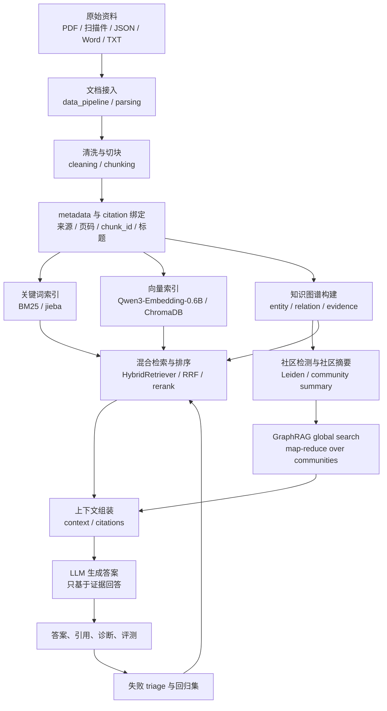

# PowerRAG 完整实现文稿

> 本稿回答的不是“这个网页有什么功能”，而是“这个 RAG / GraphRAG 系统到底是怎样实现出来的”。  
> 适用场景：给老师、评审、后续接手开发的人说明项目主线；也可以作为答辩、论文、项目说明书的底稿。

## 目录

第一章  项目的本质：不是问大模型，而是把资料变成可追溯答案  
第二章  几十 GB 项目目录里到底放了什么  
第三章  总体架构：离线建库、在线检索、图谱增强、评测闭环  
第四章  资料入口：真实文档先被接入和规范化  
第五章  文档解析：PDF、扫描件、JSON、Word 各走各的通道  
第六章  证据构建：清洗、切块、metadata 和 citation 是 RAG 的底座  
第七章  索引入库：关键词、向量、图谱三套索引同时服务检索  
第八章  普通 RAG 问答：问题如何变成证据，再变成答案  
第九章  GraphRAG：实体、关系、社区摘要和全局搜索如何接入  
第十章  评测闭环：为什么这个项目不是只靠演示证明效果  
第十一章  控制台和工程边界：前端只是入口，能力在后端流水线  
第十二章  本地模型、离线运行和部署约束  
第十三章  当前完成度、真实不足和下一步方向  

---

## 第一章  项目的本质：不是问大模型，而是把资料变成可追溯答案

PowerRAG 的核心不是做一个聊天网页，也不是把用户的问题直接丢给 ChatGPT 或其他大模型。它真正要解决的问题是：清华燃气轮机、动力装备、能源系统这类专业资料很多，格式复杂，内容专业，直接靠大模型通用知识回答不可靠；系统必须先把这些资料整理成可以检索、可以引用、可以评测的知识资产，再让模型基于证据回答。

所以这个项目本质上是一条知识生产线。

原始资料进来时，可能是 PDF、扫描 PDF、OCR 结果、JSON 标注、Word、TXT、Markdown、CSV，也可能是后续从外部 benchmark 或开源项目下载来的评测数据。系统不会把它们直接塞给大模型，而是先做解析、清洗、切块、metadata 绑定、向量化、关键词索引、图谱构建和评测记录。等用户提问时，系统先找证据，再组织上下文，最后才调用模型生成答案。

一句话概括：

> PowerRAG 是一个面向动力装备资料的本地优先 RAG / GraphRAG 工作台，它把真实文档加工成可检索证据、可追溯引用、可构建图谱、可评测优化的知识库。

普通 RAG 解决的是“从文本片段里找证据再回答”。GraphRAG 解决的是“当一个问题需要实体关系、跨文档综合、社区摘要和全局推理时，不能只靠几个 chunk，需要先把资料组织成图”。评测系统解决的是“不能只演示一两个好看的回答，而要知道失败在哪里，下一轮怎么改”。

---

## 第二章  几十 GB 项目目录里到底放了什么

这个项目之所以看起来很大，不是因为核心代码本身有几十 GB，而是因为 RAG 项目的工程体积主要来自资料、模型、索引、OCR 中间产物、评测集、外部仓库和运行输出。

仓库大致可以分成下面几类：

| 目录 | 作用 |
| --- | --- |
| `api_server/` | 当前可运行后端，FastAPI 服务、文件上传、入库、搜索、问答、GraphRAG API 都在这里 |
| `frontend_app/` | 当前控制台前端，提供上传、处理、集合管理、搜索、GraphRAG、评测、日志入口 |
| `electron/` | 桌面壳，让本地控制台可以像桌面应用一样启动 |
| `data_pipeline/` | 文档接入层，负责把不同来源资料变成统一文档对象 |
| `retrieval_engine/` | 检索层，包含 Chroma 向量检索、关键词检索、图检索、混合检索 |
| `kg_pipeline/` | 知识图谱构建层，包含实体关系抽取、社区检测、社区摘要 |
| `rag_orchestrator/` | 问答编排层，负责路由、GraphRAG 问答、全局搜索、失败 triage |
| `storage_layer/` | 存储抽象层，负责图数据库、向量库、会话记忆等持久化 |
| `model_adapters/` | 模型适配层，统一 embedding、reranker、LLM 的调用方式 |
| `evaluation/` | 评测层，包含本地评测集、外部 benchmark、质量门禁、GraphRAG 回归集 |
| `models/`、`local_models/` | 本地模型目录，例如当前小型语义模型 `Qwen/Qwen3-Embedding-0.6B` |
| `outputs/` | 运行输出，包括 Chroma 数据库、smoke 结果、评测报告、临时产物 |
| `docs/`、`html_ppt/` | 项目说明、阶段交付、答辩稿、架构图、评测指南 |
| `external_repos/` | 下载的开源项目或对标项目，用于参考和评测体系吸收 |
| `evaluation/external_benchmarks/` | 下载的公开评测集和评测脚本 |
| `RAG_JSON_Files/`、`RAG交付/`、`rag_history_papers/` | 原始资料、交付包、RAG 发展论文资料等 |

所以“几十 GB”不是一个单体程序，而是一套本地知识库工程环境：里面既有源码，也有资料、模型、索引、评测集、运行缓存和交付材料。

---

## 第三章  总体架构：离线建库、在线检索、图谱增强、评测闭环

PowerRAG 的主线可以拆成四条：

1. 离线资料处理：把真实资料变成干净、可追溯的 chunk。
2. 在线 RAG 检索问答：用户提问后，从关键词索引、向量库和可选图索引中找证据。
3. GraphRAG 增强：把实体、关系、社区摘要和全局搜索接入复杂问题。
4. 评测闭环：用统一问题集、外部 benchmark、失败归因和回归集持续检查系统。

整体流程可以理解成下面这张图：



这里最重要的是：资料处理和问答生成不是一条直线，而是一个闭环。答案不好时，不是简单换一个模型，而要回头判断失败来自哪里：是 OCR 错了、chunk 切坏了、embedding 不够好、关键词没召回、reranker 排错、图谱证据缺失、community summary 没绑定来源，还是评测问题本身设计不完整。

---

## 第四章  资料入口：真实文档先被接入和规范化

RAG 的第一步不是生成答案，而是让资料能进入系统。

当前后端的主入口在：

- `api_server/current_console/chroma_rag_poc/src/chroma_rag_poc/api.py`
- `api_server/current_console/chroma_rag_poc/src/chroma_rag_poc/pipeline.py`
- `data_pipeline/document_intake.py`
- `data_pipeline/external_document_parsers.py`

控制台上传文件后，后端会把文件放到本地受控目录，并通过 `/api/process`、`/api/ingest`、`/api/public-books-json/ingest` 等接口进入处理流程。这个过程会记录 operation log，前端能查看日志和进度，避免“大文件卡住但不知道发生了什么”。

资料入口要解决三个问题：

第一，不同文件格式不能用同一种方式粗暴处理。JSON 标注本来就有结构，PDF 可能有文字层，扫描件本质上是图片，Word 和 Markdown 又是另一种结构。如果全部当纯文本，页码、来源、标题、表格边界、标注框都会丢。

第二，资料需要保留来源。RAG 不是只要一段文本，而是要知道这段文本来自哪份文件、哪一页、哪个 chunk、哪个集合。否则答案生成后无法引用，也无法追责。

第三，入库过程必须可重复。后续评测要比较不同检索策略，如果每次入库切块不一致、metadata 不一致，评测结果就没有意义。

---

## 第五章  文档解析：PDF、扫描件、JSON、Word 各走各的通道

真实动力装备资料不是干净的网页文本。项目早期很大一部分工作其实是在补“文档理解”这一层。

文档解析层的目标不是简单把文件读成字符串，而是尽量恢复“文档结构”。对 RAG 来说，文档结构至少包括：

- 文件名和资料来源；
- 页码；
- 标题、段落、列表；
- 表格或图表附近的说明；
- OCR 文本和版面顺序；
- JSON 标注中的 bbox、label、source、page 等字段；
- 后续可以挂 citation 的 chunk_id。

不同资料大致这样处理：

| 资料类型 | 处理思路 |
| --- | --- |
| 文本型 PDF | 尽量直接抽取文字层，同时保留页码和来源 |
| 扫描型 PDF | 先走 OCR，把图片页变成文本，再进入清洗和切块 |
| JSON 标注 | 直接读取结构化字段，保留 bbox、label、source、page 等信息 |
| Word / DOCX | 解析段落、标题、表格文本，再转成统一文档对象 |
| TXT / Markdown | 读取文本并尽量保留标题层级 |
| CSV / 表格类资料 | 转换成行记录或结构化文本，避免直接丢掉字段名 |

这里借鉴了 RAGFlow 这类成熟 RAG 项目的一个核心思路：文档解析不是 RAG 的外围功能，而是 RAG 质量的上限。解析错了，后面 embedding、BM25、GraphRAG 做得再复杂，也只是在错误文本上做检索。

当前项目已经把“资料入口”和“解析入库”从页面按钮里拆到后端模块中，但也要明确边界：这不是一个已经全面超越 RAGFlow 的文档理解系统。它已经具备多格式接入、OCR 结果整理、metadata 绑定和入库链路，但对复杂表格、公式、图文混排、跨页表格的精细恢复，还需要继续加强。

---

## 第六章  证据构建：清洗、切块、metadata 和 citation 是 RAG 的底座

资料解析出来以后，还不能直接回答问题。一本书可能几百页，一份维修手册可能很长，大模型上下文窗口装不下，检索系统也不能把整本书当一个检索单元。所以必须切成 chunk。

但 chunk 不是随便每 500 个字切一刀。切块质量会直接影响检索质量。

一个好的 chunk 要同时满足几件事：

- 语义不能被切碎，关键定义、因果关系、步骤说明尽量在同一块里；
- chunk 不能太长，否则检索出来后噪声太多；
- chunk 不能太短，否则缺少上下文；
- 要保留页码、文件名、标题、段落位置；
- 要有稳定的 chunk_id，方便引用、评测和回归；
- 前后 chunk 可以有 overlap，减少切断语义造成的漏召回。

项目里相关模块主要是：

- `api_server/current_console/chroma_rag_poc/src/chroma_rag_poc/cleaning.py`
- `api_server/current_console/chroma_rag_poc/src/chroma_rag_poc/chunking.py`
- `api_server/current_console/chroma_rag_poc/src/chroma_rag_poc/parsing.py`
- `api_server/current_console/chroma_rag_poc/src/chroma_rag_poc/pipeline.py`

PowerRAG 最终想要的不是“一堆文本”，而是一批证据块。每个证据块至少应该知道：

```json
{
  "chunk_id": "stable chunk id",
  "text": "可检索的正文片段",
  "source": "原始文件或资料名",
  "page": "页码或位置",
  "title": "标题或章节",
  "collection": "所在知识库集合",
  "metadata": {
    "parser": "解析来源",
    "citation_anchor": "引用锚点",
    "source_scope": "资料范围"
  }
}
```

有了这些信息，系统后面才能回答“证据来自哪里”。如果没有 metadata 和 citation，RAG 会退化成“看起来参考了文档，但无法检查”的问答系统。

---

## 第七章  索引入库：关键词、向量、图谱三套索引同时服务检索

证据块生成以后，系统会把它们写入不同的检索空间。

第一套是向量索引。当前项目的向量库使用 ChromaDB，本地持久化，适合桌面和离线优先场景。embedding 默认已经切换到小巧但语义能力更强的 `Qwen/Qwen3-Embedding-0.6B`，本地模型目录在 `models/Qwen/Qwen3-Embedding-0.6B`。如果环境没有模型或依赖不可用，系统还有 hashing embedding 兜底用于 smoke 和离线基线，但这只能作为可运行基线，不能代表最终语义检索质量。

相关文件：

- `api_server/current_console/chroma_rag_poc/src/chroma_rag_poc/embeddings.py`
- `model_adapters/embedding.py`
- `model_adapters/local_models.py`
- `retrieval_engine/chroma.py`

第二套是关键词索引。动力装备资料里有大量强术语，比如“压气机”“燃烧室”“涡轮”“余热锅炉”“联合循环”“振动”“喘振”“叶片冷却”。这类问题很多时候关键词非常关键，BM25 和中文分词并不落后，反而经常比弱语义向量更稳定。

相关文件：

- `retrieval_engine/keyword.py`

第三套是图谱索引。图谱不是为了展示好看，而是为了让实体、关系、证据、社区摘要可以被检索和追踪。比如一个问题问“某个故障现象可能和哪些部件、工况、处理动作有关”，普通 chunk 检索可能只能找到几个片段，图谱检索则可以沿着实体和关系扩展。

相关文件：

- `retrieval_engine/graph.py`
- `storage_layer/graph_store.py`
- `kg_pipeline/`

最后是混合检索。系统可以把 Chroma 向量检索、BM25 关键词检索、SQLite 图检索融合起来，使用类似 LlamaIndex 和成熟 RAG 系统里常见的 RRF 思路做结果融合，再配合可选 reranker 和 no-answer gate。

相关文件：

- `retrieval_engine/hybrid.py`
- `model_adapters/reranker.py`
- `rag_orchestrator/production_profile.py`

这部分的正确理解是：不是“向量检索最先进，所以只用向量”，也不是“关键词当前分高，所以只用关键词”。更合理的方式是让系统知道不同问题适合不同召回路径，再通过评测决定默认策略。

---

## 第八章  普通 RAG 问答：问题如何变成证据，再变成答案

用户提问后，普通 RAG 的在线流程大致是：

1. 接收 query；
2. 判断问题类型和检索模式；
3. 走向量检索、关键词检索、混合检索或图检索；
4. 对候选证据去重、融合、排序；
5. 把 Top-K 证据组装成上下文；
6. 调用 LLM；
7. 输出答案、引用、证据、诊断信息；
8. 如果证据不足，触发 no-answer 或失败记录。

当前主要入口包括：

- `GET /api/search`
- `POST /api/search`
- `POST /api/query`
- `POST /api/benchmark`

代码入口主要在：

- `api_server/current_console/chroma_rag_poc/src/chroma_rag_poc/api.py`
- `api_server/current_console/chroma_rag_poc/src/chroma_rag_poc/pipeline.py`
- `rag_orchestrator/query_understanding.py`
- `rag_orchestrator/router.py`
- `rag_orchestrator/advanced_query.py`
- `rag_orchestrator/hallucination_guard.py`

普通 RAG 的关键不是最后那一次 LLM 调用，而是上下文怎么来的。LLM 只负责把已经检索到的证据组织成自然语言。系统应该约束模型：如果证据没有覆盖，就明确说证据不足；如果证据里没有某个数值或因果关系，就不能编。

因此，PowerRAG 的问答返回不应该只看 answer，还要看：

- retrieved evidence 是否覆盖问题；
- citations 是否能回到来源；
- retrieval_diagnostics 里不同路径召回了多少；
- reranker 有没有报错；
- no_answer_reason 是否触发；
- graph_quality 是否允许图谱结果进入答案。

这也是它和普通 demo 的区别：普通 demo 往往只展示一个好看的回答，PowerRAG 要把“为什么这样回答”也暴露出来。

---

## 第九章  GraphRAG：实体、关系、社区摘要和全局搜索如何接入

GraphRAG 不是替代普通 RAG。它解决的是普通 chunk 检索不擅长的问题。

普通 RAG 擅长回答：

- 某个概念是什么；
- 某段资料怎么描述；
- 某个步骤有哪些；
- 某一页或某一章节里有哪些直接证据。

GraphRAG 更适合回答：

- 某个部件和哪些故障、工况、指标有关；
- 多个文档中反复出现的实体关系是什么；
- 一个主题在全库里有哪些社区或知识簇；
- 跨文档综合问题；
- 需要 local graph neighborhood 或 global community summary 的问题。

当前 GraphRAG 线大致分成五步。

第一步，从文本中抽取实体、关系和证据。实体可以是设备、部件、故障、工况、指标、维修动作；关系可以是组成关系、影响关系、因果关系、处理关系。每条关系都应该绑定 evidence，不能只存一个模型生成的三元组。

相关文件：

- `kg_pipeline/llm_extraction/pipeline.py`
- `storage_layer/graph_store.py`
- `api_server/current_console/chroma_rag_poc/src/chroma_rag_poc/routes_graphrag.py`

第二步，导入图数据库。当前项目使用 SQLite-backed GraphStore 作为本地图存储，适合当前本地工作台，不强依赖大型 Neo4j 服务。GraphRAG API 里有 `/api/graphrag/import`、`/api/graphrag/export`、`/api/graphrag/stats` 等接口。

第三步，做社区检测。系统使用 Leiden 社区检测，把实体关系图划分成若干知识社区。社区不是前端展示概念，而是 global search 的基础索引。

相关文件：

- `kg_pipeline/community_detection.py`
- `POST /api/graphrag/community/detect`

第四步，生成社区摘要。每个社区内部有一组实体和关系，系统会让 LLM 生成 community summary，并把摘要句子尽量绑定到原始三元组和 source evidence 上。这样 global search 使用摘要时，不至于完全脱离来源。

相关文件：

- `kg_pipeline/community_summary.py`
- `POST /api/graphrag/community/summarize`

第五步，做 local / global / hybrid / mix 查询。

- local：围绕实体邻域做图检索，适合关系追踪；
- global：在社区摘要上做 map-reduce，适合全局综合；
- hybrid：融合 local graph 和 global summary；
- mix：借鉴 LightRAG 思路，把 naive text、local graph、global community evidence 放在同一条路线里。

相关文件：

- `retrieval_engine/graph.py`
- `rag_orchestrator/graphrag_qa.py`
- `rag_orchestrator/global_search.py`
- `rag_orchestrator/lightrag.py`

这条线借鉴了 Microsoft GraphRAG 的“local to global”和 community summary 思路，也吸收了 LightRAG 对 local/global/mix 检索路径的划分。但当前项目仍要谨慎表达：GraphRAG 链路已经接入，图谱质量门禁、triage 和 global search 都有实现；但要证明它在清华燃气轮机真实资料上全面超过普通 RAG，还必须用同题评测和专家标注来验证。

---

## 第十章  评测闭环：为什么这个项目不是只靠演示证明效果

如果一个 RAG 项目只展示几个成功案例，它很容易显得“能用”，但实际上可能换几个问题就崩。PowerRAG 加评测层，就是为了避免只靠演示判断质量。

当前评测层包括：

- `evaluation/system_eval_questions.jsonl`：本地系统问题集，覆盖普通 RAG、OCR 风险、GraphRAG、结构化数据、评测方法；
- `evaluation/harness.py`：统一评测 harness；
- `evaluation/metrics.py`：faithfulness、relevancy、context recall、answer completeness 等指标实现；
- `evaluation/smoke.py`：一键 smoke，覆盖 ingest、search、evaluation、GraphRAG query/global answer；
- `evaluation/quality_profiles.py`：质量门禁配置；
- `evaluation/benchmark_quality_gate.py`：外部 benchmark 质量门禁；
- `evaluation/external_benchmark_loader.py`：公开 benchmark 数据加载；
- `evaluation/triage_regression.py`：GraphRAG 失败案例回归；
- `evaluation/FULL_CHAIN_EVALUATION_GUIDE.md`：给其他模型或评测代理使用的全链路评测指南。

这里特别要注意：评测指标不能自己拍脑袋造权重。公开 benchmark 有公开 benchmark 的指标，本地项目可以有本地质量门禁，但必须明确它是“本地工程门禁”，不能伪装成行业统一分数。

评测闭环真正要做的是归因。比如一个问题答错了，可能原因包括：

- 原文没有被 OCR 出来；
- chunk 把关键证据切断了；
- metadata 丢了，citation 回不去；
- 向量召回没找到语义相近证据；
- 关键词召回漏了术语变体；
- hybrid 融合稀释了关键词结果；
- reranker 把关键证据排到后面；
- GraphRAG 图里没有这条关系；
- community summary 没绑定 evidence；
- LLM 忽略证据自由发挥；
- 评测题的标准答案或关键词设计不完整。

只有把失败拆成这些类型，下一步优化才有方向。否则“得分低”只是情绪，不是工程问题。

---

## 第十一章  控制台和工程边界：前端只是入口，能力在后端流水线

项目有前端控制台，但它不是系统本体。控制台的作用是把后端流水线暴露出来，让人可以上传文件、处理资料、查看集合、搜索、运行 GraphRAG、看日志、跑评测。

当前可运行产品是：

- 后端：`api_server/current_console/server.py`
- 后端核心包：`api_server/current_console/chroma_rag_poc/src/chroma_rag_poc/`
- 前端：`frontend_app/current_console/index.html`
- 桌面壳：`electron/main.cjs`
- preload bridge：`electron/preload.cjs`

前端入口包括：

- 上传和文件管理；
- process / ingest；
- Chroma collection stats；
- search / query；
- GraphRAG graph build；
- GraphRAG QA；
- community detect / summarize / global search；
- benchmark / evaluation；
- operation logs；
- triage history。

工程上现在还有一个现实边界：当前前端仍然是一个较重的单文件控制台。它方便快速迭代和演示，但长期看需要拆分组件、状态管理和路由。后端能力已经分层，前端还没有完全工程化拆开。

这件事在汇报时要讲清楚：页面不是价值本身，页面只是入口。真正的系统能力在数据管线、检索层、图谱层、编排层、评测层和存储层。

---

## 第十二章  本地模型、离线运行和部署约束

PowerRAG 是 local-first 项目，优先考虑本地资料、本地向量库、本地模型和本地桌面运行。这对清华燃气轮机知识库这类场景很重要，因为资料可能不适合直接上传到公共云服务。

当前模型和运行边界大致如下：

- embedding 默认使用 `Qwen/Qwen3-Embedding-0.6B`，比大模型轻，适合本地运行；
- ChromaDB 使用本地持久化，不依赖远程向量数据库；
- GraphStore 当前走 SQLite-backed 本地存储；
- 完整 LLM-backed GraphRAG 需要配置 OpenAI-compatible API key 或本地兼容模型服务；
- hashing embedding 只适合 smoke 和兜底，不适合作为最终质量依据；
- 大规模 OCR、复杂 PDF、图谱构建和 reranker 都会带来明显计算成本；
- 很大的图谱可视化不一定适合全部在浏览器中渲染，但后端图数据和检索可以保留。

这也是为什么项目里会有 `models/`、`local_models/`、`outputs/`、`evaluation/reports/` 这些目录。它不是一个纯网页项目，而是一个会在本地持续生成索引、报告、缓存和运行结果的知识库系统。

---

## 第十三章  当前完成度、真实不足和下一步方向

现在这个项目已经不是最早的“页面原型”。它已经有一条相对完整的 RAG / GraphRAG 工程链路：

- 文件可以上传、处理、入库；
- 文档解析、清洗、chunk、metadata 绑定已经形成后端路径；
- Chroma 向量检索可以跑；
- 关键词检索和混合检索已经接入；
- GraphRAG 有 graph import、community detection、community summary、global search、local/global/mix 查询；
- query 路由、GraphRAG QA、global map-reduce、LightRAG-style 路线已经在编排层出现；
- graph quality gate、triage history、bad case promote 到回归集已经接入；
- evaluation harness、smoke、外部 benchmark loader、quality gate 已经存在；
- 桌面壳和本地控制台可以作为演示和实验入口。

但是它也不能被夸成“已经行业顶尖成品”。真实不足包括：

- 文档解析还没有达到 RAGFlow 级别的复杂版面、表格、公式、图文混排全覆盖；
- 燃气轮机领域 ontology 还不够正式，实体类型、关系类型、同义词归一需要专家参与；
- GraphRAG 的大规模实体关系抽取还需要更多真实资料和人工抽检；
- community summary 虽然绑定了 evidence，但句级证据质量还需要评测强化；
- reranker 和 no-answer 阈值需要在真实清华资料上校准；
- 公开 benchmark 和本地领域 benchmark 需要分开报告，不能混成一个虚假的总分；
- 前端控制台还需要拆分和产品化；
- 多用户权限、审计、安全部署还不是当前版本重点；
- 真正交付给清华燃气轮机知识库前，需要领域专家问题集、标准答案、证据页标注和验收流程。

下一步最应该做的不是盲目堆功能，而是按质量瓶颈推进：

1. 文档解析：继续补复杂 PDF、表格、图文混排、OCR 质量审计；
2. 检索：用 Qwen3-Embedding-0.6B 跑真实语义检索，再加小型 reranker；
3. GraphRAG：用真实燃气轮机资料抽实体关系，做 local/global 同题评测；
4. 评测：建立清华燃气轮机领域题库，题目要有标准答案、证据页、适用模式；
5. 产品：把前端从演示控制台变成稳定知识库工作台；
6. 部署：明确本地模型、API key、离线包、数据目录、日志和权限边界。

最后，这个项目最准确的表达方式应该是：

> PowerRAG 不是一个简单 RAG demo，而是一个正在走向专业知识库的本地 RAG / GraphRAG 工程系统。它已经把真实资料接入、证据构建、关键词/向量/图检索、GraphRAG local/global、评测闭环和桌面控制台串成了一条链路；但要达到清华燃气轮机知识库的顶尖要求，还需要在文档解析、领域图谱、真实评测和生产部署上继续补强。

