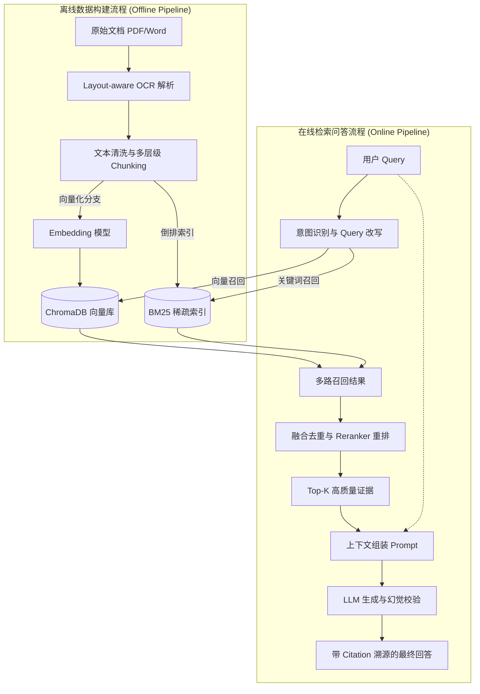
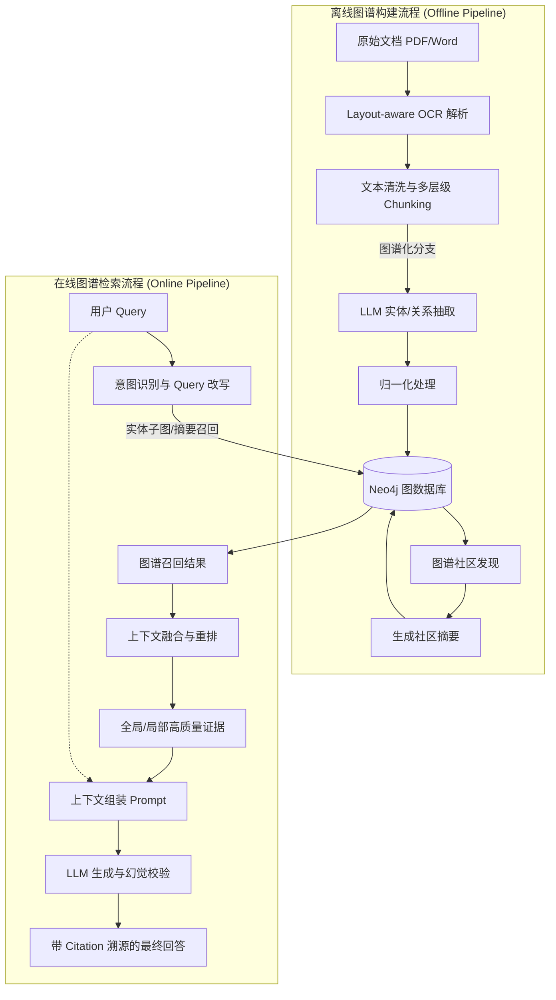

# RAG项目技术架构与背景资料梳理

### 一、目前采用的技术架构情况

咱们的项目整体采用了 **标准RAG + GraphRAG (知识图谱检索增强)** 双线并行的模块化架构设计。为了方便后续做实验评测、支持顶刊级别的指标量化，工程上对两条主线做了深度的模块解耦：

#### A. 普通 RAG 技术架构 (Standard RAG)

**核心技术栈：**
- **开发与框架**：Python 3.11+, FastAPI, Pydantic 
- **文档解析**：PyPDF, python-docx 配合自研 Layout-aware OCR 策略
- **检索与存储引擎**：
  - **向量检索**：ChromaDB (用于 Dense 稠密检索)
  - **稀疏检索**：Jieba + Rank-BM25 (用于 Sparse 关键词匹配)

**系统核心分层设计：**
1. **数据管线层 (`data_pipeline`)**：采用业界成熟的非结构化数据 ETL 范式。结合规则解析与版面感知 OCR (Layout-aware OCR) 进行多模态文档高保真还原；数据切分应用滑动窗口 (Sliding Window) 与层级切块 (Hierarchical Chunking) 策略，在保留上下文语义的同时兼顾精细检索粒度。
2. **检索引擎层 (`retrieval_engine`)**：引入业界标配的“召回+重排 (Retrieve & Rerank)”架构。底层采用 Dense (ChromaDB 稠密向量) 与 Sparse (Rank-BM25 稀疏关键词) 混合融合检索 (Hybrid Search) 确保基础召回率，并通过 Cross-Encoder 模型进行二次语义精排，提取 Top-K 高质量证据。
3. **RAG 编排层 (`rag_orchestrator`)**：基于 Advanced RAG 调度策略。集成前置的查询理解与改写 (Query Rewriting) 以对齐知识库语义，通过动态组装上下文 (In-Context Assembly) 配合严格 Prompt 工程，强制大模型生成带有准确引用 (Citation) 的溯源回答，建立防幻觉屏障。

#### B. 知识图谱与 GraphRAG 技术架构 (KG & GraphRAG)

**核心技术栈：**
- **知识抽取**：基于严格 Schema 约束的信息抽取流（Label Studio 标注 JSON -> 文本块 Chunking -> 候选三元组抽取 -> 证据 Evidence 绑定），配合人工 Review 与数据归一化机制
- **检索与存储引擎**：
  - **图数据库**：Neo4j (用于存储实体关系与社区元数据)
  - **图计算**：基于图谱的高级挖掘与社区发现 (Community Detection)

**系统核心分层设计：**
1. **知识图谱构建层 (`kg_pipeline`)**：对标业界主流的 GraphRAG 建图范式。将文本碎片结构化为三元组图谱后，引入图聚类算法（如 Leiden / Louvain Community Detection）划分知识网络层次，并基于不同层级的图谱社区生成宏观摘要 (Community Summaries)。
2. **图谱检索层 (`retrieval_engine/graph`)**：针对微观与宏观问题分发不同的业界标准查询策略。局部具体问题采用基于起点的子图多跳游走 (N-hop Local Search)；全局宏观问题采用直接并行召回高阶社区摘要的机制 (Global Search)，解决传统向量检索“见树不见林”的痛点。
3. **GraphRAG 编排层 (`rag_orchestrator/graph`)**：执行 Map-Reduce 风格的复杂图谱推理组装流。负责将高密度的结构化子图信息与海量社区摘要，在上下文中进行规约与逻辑拼接，驱动大模型进行全局视角的跨文档深度推理。

#### C. 双引擎公共基座 (Shared Infrastructure)

- **模型适配层 (`model_adapters`)**：底座模型网关。统一封装不同底座的 LLM、Embedding 和 Reranker 调用，自带 Token 成本和延迟追踪。
- **评测实验层 (`evaluation` / `experiments`)**：包含自动化评测指标（如召回覆盖率、生成忠实度）和跨引擎（RAG vs GraphRAG）的消融对比实验矩阵。
- **前端与基础设施**：
  - `frontend_app/current_console` 提供支持双引擎对比的原生前端实验控制台。
  - Numpy, Requests, orjson, Ruff, Mypy, Pytest, MkDocs, tox-uv 构成了极其严格的工程级代码质量体系。

---

### 二、前期看过的架构资料与背景文献

前期做架构调研时，主要吃透了下面四份核心资料（原文件都在仓库的 `docs/GraphRAG阅读材料/` 目录下）：

1. **理论基石与痛点解决**
   - **微软官方论文《From Local to Global: A Graph RAG Approach to Query-Focused Summarization》**：这篇是核心指导。重点借鉴了它为什么适合跨文档、如何利用局部特征解决全局宏观总结类（Global）的问题。
   - **综述《GraphRAG Survey: Retrieval-Augmented Generation with Graphs》**：全面梳理了当前 RAG 系统结合图技术的常见模块划分，帮我们避坑了业界的不同技术路线挑战。

2. **工程落地实操参考**
   - **《Neo4j GraphRAG Python Documentation》**：重型方案参考。重点看了如果要上企业级图数据库，文本、实体、关系、Embedding 是怎么协同落库的。
   - **《LlamaIndex Property Graph Index Documentation》**：轻型方案参考。借鉴了如果不部署重型 Neo4j，在 Python RAG 工程里快速搭建基于属性图（Property Graph）检索的折中方案。

---

### 三、普通 RAG 核心数据与查询流程 (Standard RAG Workflow)

为了更清晰地说明系统的运转过程，我们将技术架构拆分为“普通 RAG”和“知识图谱(KG)”两条主线。以下是普通 RAG 的运作机制：

**1. 离线数据构建流程 (Offline Data Pipeline)**
*   **文档解析**：输入各类格式文档 (PDF, Word 等)，通过自研的 Layout-aware OCR 策略进行精准解析，保留版面结构信息。
*   **分块处理**：对解析后的文本进行清洗，并执行多层级切分 (Hierarchical Chunking)。
*   **向量化入库**：将文本块通过 Embedding 模型向量化，存入 ChromaDB，同时建立倒排索引以支持 BM25 稀疏检索。

**2. 在线检索问答流程 (Online RAG Pipeline)**
*   **意图识别与改写**：接收用户的 Query，通过小模型或规则进行意图识别，并在必要时对 Query 进行扩展或改写。
*   **多路召回**：从 ChromaDB 召回语义相似的文本块，从 BM25 召回关键词匹配的文本块。
*   **融合重排 (Reranking)**：将多路召回的结果进行去重融合，通过 Reranker 模型对证据片段进行重新打分排序，筛选出最相关的 Top-K 证据。
*   **生成与溯源**：将用户的 Query 与精选的 Top-K 证据组装成 Prompt 交给 LLM 生成最终回答，并附带引用 (Citation) 的溯源信息，同时通过内置的校验机制拦截潜在幻觉。

---

### 四、知识图谱与 GraphRAG 核心流程 (KG & GraphRAG Workflow)

知识图谱线（GraphRAG）是独立于普通 RAG 的另一条重型数据管线，主要用于处理需要全局宏观视野、跨文档实体关系推理的复杂问题：

**1. 离线图谱构建流程 (Offline KG Pipeline)**
*   **文档解析与切分**：与普通 RAG 共享底层解析逻辑，通过 OCR 和文本清洗获得干净的 Chunk 数据。
*   **知识抽取与入库**：将文本块输入大模型（LLM），抽取其中的“实体”、“关系”和“断言”三元组，经过人工校验或自动归一化处理后，将结构化数据存入 Neo4j 图数据库。
*   **图谱高级挖掘**：在图数据库中执行图谱社区发现 (Community Detection) 算法，识别局部聚集的网络结构，并利用大模型生成“社区摘要”，反向存入图库，用于支撑宏观总结性问题的回答。

**2. 在线图谱检索流程 (Online GraphRAG Pipeline)**
*   **意图识别与节点映射**：接收用户 Query，提取 Query 中的关键实体，并将其映射到图数据库中的具体节点。
*   **图谱结构召回**：根据问题类型，进行不同维度的图检索。例如针对局部问题，通过实体跳数扩展（N-hop）召回关联子图；针对宏观总结性问题，直接召回相关的图谱社区摘要。
*   **生成与溯源**：将召回的结构化三元组知识或社区摘要拼装为高信息密度的上下文，组装 Prompt 送入大模型，最终生成包含图谱级全局视野的专业回答。
